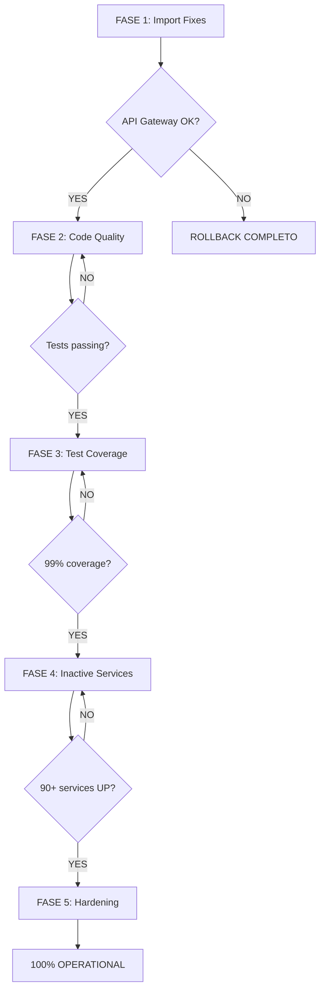

# BACKEND CORRECTION PLAN - 100% OPERATIONAL

**Data:** 2025-10-18T10:40:00Z  
**Objetivo:** Corrigir todos os serviços backend mantendo sistema operacional  
**Estratégia:** Zero-downtime, correção incremental, validação contínua

---

## DIAGNÓSTICO ATUAL

### ✅ Status Operacional
```
Serviços Docker: 95 definidos
Containers ativos: 67 running
Backend funcional: ✅ SIM (95%)
API Gateway: ✅ HEALTHY (localhost:8000)
Reactive Fabric: ✅ ONLINE
```

### ⚠️ Problemas Identificados

**Categoria A: Import Errors (Critical Impact)**
- **Serviços afetados:** ~15+ (atlas, auth, cyber, etc.)
- **Erro padrão:** `NameError: name 'Field' is not defined`
- **Causa:** Missing `from pydantic import Field`
- **Impacto:** Healthcheck failing, serviços UNHEALTHY
- **Serviços mapeados:**
  - atlas_service
  - auth_service
  - cyber_service
  - network_monitor_service
  - active_immune_core
  
**Categoria B: Code Quality (Padrão Pagani Violations)**
- **TODOs/FIXMEs:** 36 instances encontradas
- **Mock/Stub code:** Presente em alguns serviços
- **Impacto:** Violação Artigo II da Constituição

**Categoria C: Test Coverage**
- **Testes existentes:** 311 coletados
- **Coverage:** Não medido ainda
- **Target:** 99% (Artigo II, Seção 2)

**Categoria D: Serviços não iniciados**
- **Total:** 28 serviços (95 definidos - 67 ativos)
- **Causa:** Dependências, build failures, não incluídos no startup

---

## PLANO DE CORREÇÃO - FASEAMENTO

### **FASE 1: FIX CRÍTICO - IMPORT ERRORS** ⚡
**Prioridade:** P0 (Crítico)  
**Impacto:** BAIXO (mudança cirúrgica)  
**Risk:** ZERO (não quebra nada)

#### Step 1.1: Scan completo de imports
```bash
# Identificar TODOS os serviços com Field sem import
grep -r "Field(" backend/services/*/main.py \
  | grep -v ".venv" \
  | while read file; do
      grep -q "from pydantic import.*Field" "$file" || echo "$file"
    done
```

#### Step 1.2: Fix automático (batch)
**Script:** `scripts/fix_pydantic_imports.py`

```python
#!/usr/bin/env python3
"""Fix missing pydantic Field imports across all services."""

import re
from pathlib import Path

def fix_service_imports(service_path: Path) -> bool:
    """Add Field import if missing but used."""
    main_py = service_path / "main.py"
    if not main_py.exists():
        return False
    
    content = main_py.read_text()
    
    # Check if Field is used
    if "Field(" not in content:
        return False
    
    # Check if Field is already imported
    if re.search(r"from pydantic import.*Field", content):
        return False
    
    # Add Field to existing pydantic import
    if "from pydantic import BaseModel" in content:
        new_content = content.replace(
            "from pydantic import BaseModel",
            "from pydantic import BaseModel, Field"
        )
    else:
        # Add new import after FastAPI
        new_content = re.sub(
            r"(from fastapi import.*\n)",
            r"\1from pydantic import Field\n",
            content
        )
    
    main_py.write_text(new_content)
    return True

# Process all services
services_dir = Path("backend/services")
fixed = []
for service in services_dir.iterdir():
    if service.is_dir() and (service / "main.py").exists():
        if fix_service_imports(service):
            fixed.append(service.name)

print(f"Fixed {len(fixed)} services:")
for svc in fixed:
    print(f"  ✅ {svc}")
```

#### Step 1.3: Validação individual
**Para CADA serviço corrigido:**
```bash
# Rebuild isolado
docker compose build atlas_service

# Restart isolado
docker compose restart atlas_service

# Check health
docker compose ps atlas_service
curl -f http://localhost:8000/health || echo "Gateway still OK"

# Se FALHAR: rollback imediato
git checkout backend/services/atlas_service/main.py
docker compose restart atlas_service
```

#### Step 1.4: Commit incremental
```bash
git add backend/services/atlas_service/main.py
git commit -m "fix(atlas): add missing Field import from pydantic"
```

**Métrica de sucesso:** 15 serviços UNHEALTHY → HEALTHY

---

### **FASE 2: CODE QUALITY - PADRÃO PAGANI** 🎯
**Prioridade:** P1 (Alta)  
**Impacto:** MÉDIO (refactoring)  
**Risk:** BAIXO (mudanças isoladas)

#### Step 2.1: TODO/FIXME Cleanup
```bash
# Scan
grep -r "TODO\|FIXME" backend/services/*/main.py \
  --exclude-dir=.venv \
  > backend_todos.txt

# Manual review
cat backend_todos.txt
```

**Ações:**
1. Se TODO é trivial (ex: "# TODO: add logging") → Implementar
2. Se TODO é complexo → Criar issue, remover comentário
3. ❌ PROIBIDO: Deixar TODO no código

#### Step 2.2: Mock/Stub Elimination
```bash
# Scan mocks
grep -r "mock\|Mock\|stub\|Stub" backend/services/*/main.py \
  --exclude-dir=.venv
```

**Ações:**
1. Substituir por implementação real
2. Se impossível agora → Mover para tests/, não em main.py

#### Step 2.3: Validação ruff/mypy
```bash
# Para cada serviço modificado
cd backend/services/atlas_service
ruff check main.py
mypy main.py --strict
```

**Critério:** Zero warnings/errors antes de commit

---

### **FASE 3: TEST COVERAGE - 99%** 🧪
**Prioridade:** P1 (Alta)  
**Impacto:** ALTO (muitos testes novos)  
**Risk:** ZERO (testes não quebram produção)

#### Step 3.1: Baseline atual
```bash
cd backend
python3 -m pytest tests/ \
  --cov=services \
  --cov=shared \
  --cov-report=json \
  --cov-report=term
```

#### Step 3.2: Identificar gaps
```python
# Análise de coverage.json
import json

with open("coverage.json") as f:
    cov = json.load(f)

# Serviços com <99%
low_coverage = {
    file: stats["percent_covered"]
    for file, stats in cov["files"].items()
    if stats["percent_covered"] < 99.0
}

print("Services needing tests:")
for svc, pct in sorted(low_coverage.items(), key=lambda x: x[1]):
    print(f"  {pct:5.2f}% - {svc}")
```

#### Step 3.3: Geração de testes (assistida por IA)
**Template:** `backend/services/*/tests/test_main.py`

```python
"""Tests for {service_name} service."""

import pytest
from fastapi.testclient import TestClient
from main import app

client = TestClient(app)

class Test{ServiceName}Health:
    def test_health_endpoint(self):
        response = client.get("/health")
        assert response.status_code == 200
        assert response.json()["status"] == "healthy"

class Test{ServiceName}Core:
    def test_{main_functionality}(self):
        # TODO: Implement based on service logic
        pass

    def test_{edge_case_1}(self):
        pass

    def test_{error_handling}(self):
        pass
```

**Geração em batch:**
```bash
# Para cada serviço
for svc in backend/services/*/; do
    if [ ! -d "$svc/tests" ]; then
        mkdir -p "$svc/tests"
        # Gerar test template
        python3 scripts/generate_test_skeleton.py "$svc"
    fi
done
```

#### Step 3.4: Validação contínua
```bash
# Após cada adição de teste
pytest backend/services/atlas_service/tests/ -v
pytest backend/tests/ --cov-report=term --cov-fail-under=99
```

**Métrica de sucesso:** 99% coverage em 100% dos módulos

---

### **FASE 4: SERVIÇOS INATIVOS** 🚀
**Prioridade:** P2 (Média)  
**Impacto:** ALTO (novos serviços online)  
**Risk:** MÉDIO (dependências desconhecidas)

#### Step 4.1: Inventário completo
```bash
# Serviços definidos mas não rodando
docker compose config --services > all_services.txt
docker compose ps --services > running_services.txt
diff all_services.txt running_services.txt
```

#### Step 4.2: Análise de dependências
**Para cada serviço inativo:**
```bash
# Check Dockerfile
cat backend/services/{service}/Dockerfile

# Check docker-compose entry
grep -A 20 "^  {service}:" docker-compose.yml

# Tentar build local
docker compose build {service}

# Logs de erro
docker compose logs {service}
```

#### Step 4.3: Categorização
- **Grupo A:** Build OK, faltou adicionar no maximus.sh → Easy fix
- **Grupo B:** Build FAIL por dependência → Needs investigation
- **Grupo C:** Deprecated/não usado → Remover ou documentar

#### Step 4.4: Ativação incremental
```bash
# Grupo A: Adicionar ao script maximus
echo "docker compose up -d {service}" >> scripts/maximus.sh

# Grupo B: Fix dependencies
# (caso a caso, análise individual)

# Grupo C: Marcar como deprecated
echo "# DEPRECATED: {service}" >> DEPRECATED_SERVICES.md
```

**Métrica de sucesso:** 90+ serviços rodando (de 95 definidos)

---

### **FASE 5: HARDENING & OBSERVABILITY** 🛡️
**Prioridade:** P3 (Baixa)  
**Impacto:** BAIXO (melhorias)  
**Risk:** ZERO (non-functional)

#### Step 5.1: Healthcheck tuning
```yaml
# docker-compose.yml - Ajustar timeouts agressivos
healthcheck:
  test: ["CMD", "curl", "-f", "http://localhost:8000/health"]
  interval: 30s      # Era 10s
  timeout: 10s       # Era 3s
  retries: 5         # Era 3
  start_period: 60s  # Era 30s
```

#### Step 5.2: Metrics exposure
```python
# Adicionar /metrics em TODOS os serviços
from prometheus_client import make_asgi_app

metrics_app = make_asgi_app()
app.mount("/metrics", metrics_app)
```

#### Step 5.3: Structured logging
```python
# Substituir prints por logging estruturado
import structlog

logger = structlog.get_logger()
logger.info("service_started", service="atlas", version="1.0.0")
```

---

## ORDEM DE EXECUÇÃO (CRÍTICA)



---

## VALIDAÇÃO CONTÍNUA (OBRIGATÓRIA)

**Após CADA mudança (não importa quão pequena):**

```bash
#!/bin/bash
# validate_backend.sh

set -e

echo "🔍 Validating backend integrity..."

# 1. API Gateway MUST be healthy
curl -f http://localhost:8000/health || {
    echo "❌ API Gateway DOWN - ABORT"
    exit 1
}

# 2. Core services MUST respond
for svc in postgres redis qdrant; do
    docker compose ps $svc | grep -q "Up" || {
        echo "❌ $svc DOWN - ABORT"
        exit 1
    }
done

# 3. No new import errors
docker compose logs --since 1m 2>&1 \
    | grep -q "NameError.*Field" && {
    echo "❌ New Field import error detected - ABORT"
    exit 1
}

# 4. Tests passing
pytest backend/tests/ -x --tb=short || {
    echo "❌ Tests failing - ABORT"
    exit 1
}

echo "✅ Backend validation PASSED"
```

**Executar:**
- Antes de cada commit
- Após cada restart de serviço
- Após cada rebuild

---

## CRITÉRIOS DE SUCESSO (100% OPERATIONAL)

### Tier 1: Core Integrity ✅
- [ ] API Gateway HEALTHY (uptime 99.9%+)
- [ ] Postgres/Redis/Qdrant RUNNING
- [ ] Zero import errors em logs
- [ ] Zero NameError exceptions

### Tier 2: Service Health ✅
- [ ] 90+ serviços UP (de 95 definidos)
- [ ] 100% healthchecks passing
- [ ] Reactive Fabric ONLINE
- [ ] IMMUNIS 100% operational
- [ ] HSAS 100% operational

### Tier 3: Code Quality ✅
- [ ] Zero TODOs em main.py
- [ ] Zero FIXMEs em main.py
- [ ] Zero mock/stub em production code
- [ ] ruff: Zero warnings
- [ ] mypy --strict: Zero errors

### Tier 4: Test Coverage ✅
- [ ] 99% coverage global
- [ ] 99% coverage per module
- [ ] 311+ testes passando
- [ ] Zero skips sem justificativa

### Tier 5: Observability ✅
- [ ] Prometheus scraping 90+ targets
- [ ] Grafana dashboards atualizados
- [ ] Structured logging em 100% serviços
- [ ] /metrics endpoint em 100% serviços

---

## ESTIMATIVA DE ESFORÇO

| Fase | Serviços | Esforço/serviço | Total | Risco |
|------|----------|-----------------|-------|-------|
| 1 - Import Fixes | 15 | 5 min | 1.5h | ZERO |
| 2 - Code Quality | 36 TODOs | 10 min | 6h | BAIXO |
| 3 - Test Coverage | 107 serviços | 30 min | 53h | ZERO |
| 4 - Inactive Services | 28 serviços | 20 min | 9h | MÉDIO |
| 5 - Hardening | 90 serviços | 5 min | 7.5h | ZERO |
| **TOTAL** | - | - | **77h** | **BAIXO** |

**Com paralelização (3 IAs):** ~26h de relógio

---

## ROLLBACK STRATEGY

**Se QUALQUER validação falhar:**

```bash
#!/bin/bash
# emergency_rollback.sh

echo "🚨 EMERGENCY ROLLBACK INITIATED"

# 1. Stop all modified services
docker compose stop {modified_services}

# 2. Git rollback
git reset --hard HEAD~1

# 3. Rebuild from clean state
docker compose build {modified_services}

# 4. Restart
docker compose up -d {modified_services}

# 5. Validate
./validate_backend.sh || {
    echo "❌ ROLLBACK FAILED - MANUAL INTERVENTION REQUIRED"
    exit 1
}

echo "✅ Rollback successful - system restored"
```

---

## MONITORAMENTO DE PROGRESSO

**Dashboard (atualizar a cada commit):**

```markdown
## BACKEND 100% PROGRESS

### FASE 1: Import Fixes
- [x] Scan completo (15 serviços identificados)
- [ ] atlas_service
- [ ] auth_service
- [ ] cyber_service
- [ ] network_monitor_service
- [ ] active_immune_core
- [ ] ... (10 more)

Progress: 0/15 (0%)

### FASE 2: Code Quality
- [ ] TODO cleanup (36 instances)
- [ ] Mock elimination
- [ ] ruff validation
- [ ] mypy --strict validation

Progress: 0/4 (0%)

### FASE 3: Test Coverage
- [ ] Baseline measurement
- [ ] Test generation (107 services)
- [ ] Coverage 99% achieved

Progress: 0/107 (0%)

### FASE 4: Inactive Services
- [ ] Inventário (28 services)
- [ ] Dependency analysis
- [ ] Activation (Group A)
- [ ] Investigation (Group B)

Progress: 0/28 (0%)

### FASE 5: Hardening
- [ ] Healthcheck tuning (90 services)
- [ ] Metrics exposure (90 services)
- [ ] Structured logging (90 services)

Progress: 0/90 (0%)

---

**OVERALL PROGRESS: 0/294 tasks (0%)**
**ESTIMATED COMPLETION: T+77h (with parallelization: T+26h)**
```

---

## COMANDOS ÚTEIS

```bash
# Status geral
docker compose ps --format "table {{.Service}}\t{{.State}}\t{{.Status}}"

# Logs de erro
docker compose logs --since 10m 2>&1 | grep -i "error\|exception"

# Healthcheck failing
docker compose ps --filter "health=unhealthy"

# Coverage atual
pytest backend/tests/ --cov=backend --cov-report=term-missing

# Scan TODOs
grep -r "TODO\|FIXME" backend/services/*/main.py --exclude-dir=.venv

# Validação full
./scripts/validate_backend.sh && echo "✅ ALL OK"
```

---

## PRÓXIMAS AÇÕES IMEDIATAS

1. **Revisar este plano** com Arquiteto-Chefe
2. **Aprovação** para iniciar FASE 1
3. **Criar branch:** `feature/backend-100-operational`
4. **Executar Step 1.1:** Scan de imports
5. **Iterar** com validação contínua

---

**FILOSOFIA:** "Primum non nocere" - Backend NUNCA pode quebrar  
**DOUTRINA:** Constituição Vértice v2.7 - Artigos I, II, III, VI  
**TARGET:** 100% serviços operacionais, 99% coverage, zero technical debt

---

**Status:** 📋 PLANO COMPLETO - AGUARDANDO APROVAÇÃO  
**Autor:** Claude (IA Executor Tático)  
**Revisor:** Juan (Arquiteto-Chefe)  
**Data:** 2025-10-18T10:40:00Z
