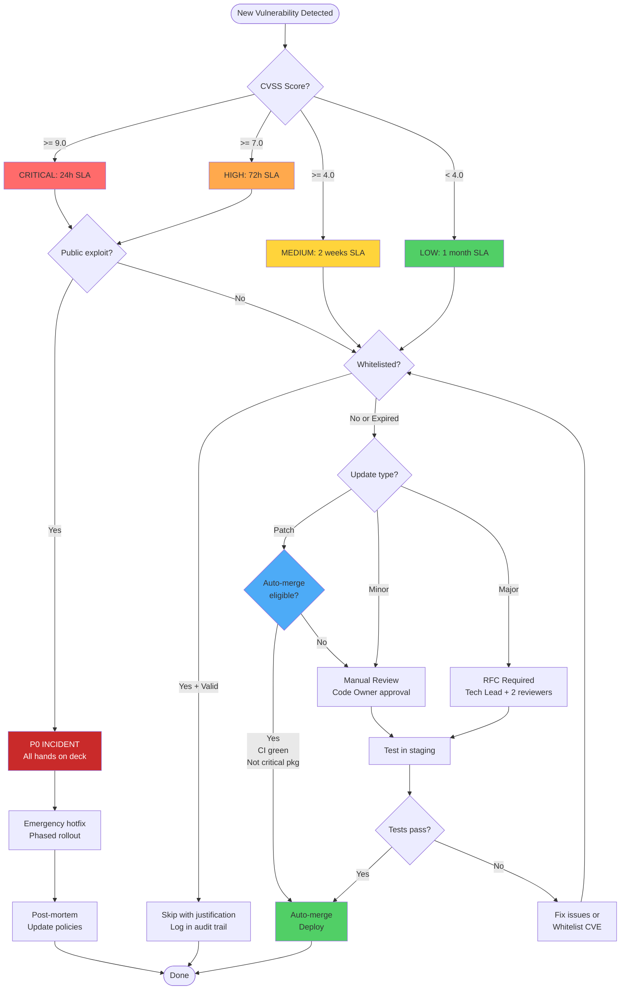

# Dependency Management Policy

**Version**: 1.0.0
**Last Updated**: 2025-10-06
**Owner**: Security & Infrastructure Team
**Enforcement**: Automated (Dependabot + GitHub Actions + Pre-commit Hooks)

---

## Table of Contents

1. [Overview](#overview)
2. [Severity Thresholds & SLAs](#severity-thresholds--slas)
3. [Update Strategy](#update-strategy)
4. [CVE Whitelist Process](#cve-whitelist-process)
5. [Dependabot Configuration](#dependabot-configuration)
6. [Emergency Response Protocol](#emergency-response-protocol)
7. [Audit & Compliance](#audit--compliance)
8. [Decision Flowchart](#decision-flowchart)

---

## Overview

This policy establishes **formal governance** for all Python dependencies in the Active Immune Core service, ensuring:

- ✅ **Security**: CVEs are detected and remediated within defined SLAs
- ✅ **Stability**: Breaking changes are reviewed before merging
- ✅ **Determinism**: All builds are reproducible via lock files
- ✅ **Auditability**: All decisions are logged and traceable

### Scope

**Applies to**:
- All packages in `requirements.txt` (production)
- All packages in `requirements-dev.txt` (development)
- All transitive dependencies in `requirements.txt.lock`

**Does NOT apply to**:
- System packages (apt/yum)
- Docker base images (separate policy)
- npm/yarn dependencies (separate policy)

---

## Severity Thresholds & SLAs

All vulnerability severities follow the **CVSS v3.1** scoring system.

### Remediation SLAs

| Severity | CVSS Score | SLA | Auto-Merge | Approval Required |
|----------|-----------|-----|------------|-------------------|
| **CRITICAL** | >= 9.0 | **24 hours** | ❌ No | Tech Lead + Security |
| **HIGH** | >= 7.0 | **72 hours** | ❌ No | Tech Lead |
| **MEDIUM** | >= 4.0 | **2 weeks** | ⚠️ If patch | Code Owner |
| **LOW** | < 4.0 | **1 month** | ✅ Yes | Auto (CI green) |

### SLA Clock Starts

The SLA clock starts when:
1. Safety or pip-audit detects the CVE in CI/CD
2. GitHub Security Advisory is published
3. Manual report is filed with Security Team

### SLA Exceptions

**CVE can be whitelisted** (SLA waived) if:
- Does not affect our platform (e.g., Windows-only on Linux stack)
- Requires specific attack vector we don't expose
- Already mitigated by network/firewall rules

**Process**: See [CVE Whitelist Process](#cve-whitelist-process)

---

## Update Strategy

Updates follow **semantic versioning** principles: `MAJOR.MINOR.PATCH`

### Patch Updates (x.y.Z)

**Definition**: Bug fixes, security patches, no breaking changes

**Examples**:
- `fastapi==0.115.5` → `fastapi==0.115.6`
- `pytest==7.4.3` → `pytest==7.4.4`

**Process**:
- ✅ **Auto-merge** enabled if:
  - All CI tests pass
  - No CVSS >= 7.0 warnings
  - Dependabot initiated
- ⏱️ **Review time**: None (auto)
- 🔄 **Rollback**: Automated if deployment fails

**Exceptions**: Manually review if package is on **critical list**:
- `fastapi`, `starlette`, `uvicorn` (API framework)
- `sqlalchemy`, `asyncpg` (database)
- `aiohttp`, `httpx` (HTTP clients)

### Minor Updates (x.Y.z)

**Definition**: New features, deprecations, backwards-compatible

**Examples**:
- `pydantic==2.9.0` → `pydantic==2.10.0`
- `sqlalchemy==2.0.23` → `sqlalchemy==2.1.0`

**Process**:
- ⚠️ **Manual review** required
- 🧪 **Testing**: Full test suite + manual smoke tests
- 👥 **Approval**: Code Owner + 1 reviewer
- ⏱️ **Review time**: 48 hours
- 📝 **Changelog**: Review CHANGELOG.md for breaking deprecations

**Checklist**:
```markdown
- [ ] Reviewed CHANGELOG.md
- [ ] Checked for deprecation warnings
- [ ] Ran full test suite locally
- [ ] Tested in staging environment
- [ ] Updated our code if needed
```

### Major Updates (X.y.z)

**Definition**: Breaking changes, API redesigns, major refactors

**Examples**:
- `pydantic==2.10.6` → `pydantic==3.0.0`
- `sqlalchemy==2.0.23` → `sqlalchemy==3.0.0`

**Process**:
- 🚫 **Blocked by Dependabot** (see `.github/dependabot.yml`)
- 📋 **RFC Required**: Create GitHub Issue with impact analysis
- 🏗️ **Migration Plan**: Document all breaking changes
- 🧪 **Testing**: Comprehensive testing in isolated branch
- 👥 **Approval**: Tech Lead + 2 reviewers + Security Team (if security-related)
- ⏱️ **Review time**: 1-2 weeks
- 🎯 **Phased Rollout**: Canary → Staging → Production

**RFC Template**:
```markdown
## Major Update Proposal: [Package] v[Old] → v[New]

### Why update?
- Security fixes
- Performance improvements
- New features we need

### Breaking Changes
- API X changed to Y
- Deprecated feature Z removed

### Impact Analysis
- [ ] Code changes required: [estimate LOC]
- [ ] Database migrations needed: [yes/no]
- [ ] Config changes: [list]

### Migration Plan
1. Update package
2. Fix compilation errors
3. Fix test failures
4. Update documentation

### Testing Strategy
- [ ] Unit tests updated
- [ ] Integration tests added
- [ ] Manual testing in staging

### Rollback Plan
- Revert commit X
- Restore lock file from Y
- No database migration needed (or: run rollback script Z)
```

---

## CVE Whitelist Process

When a CVE is detected but **does not pose a real risk** to our system, it can be whitelisted.

### When to Whitelist

**Valid reasons**:
- ✅ Vulnerability is platform-specific (Windows-only, we run Linux)
- ✅ Attack vector is not exposed (e.g., requires local file access, we're containerized)
- ✅ Already mitigated by infrastructure (firewall rules, network segmentation)
- ✅ Package is used in dev/test only, not in production

**Invalid reasons**:
- ❌ "We'll fix it later"
- ❌ "Too much work to update"
- ❌ "Low priority"

### Whitelist Format

**File**: `.cve-whitelist.yml`

**Schema**:
```yaml
whitelisted_cves:
  - id: CVE-2024-12345
    package: example-lib==1.2.3
    cvss: 7.5
    severity: HIGH
    justification: |
      This CVE only affects Windows systems via a specific registry key exploit.
      Our service runs exclusively on Linux containers with no registry access.

      Reference: https://nvd.nist.gov/vuln/detail/CVE-2024-12345

    mitigations:
      - "Containerized deployment (no host access)"
      - "Network segmentation (isolated subnet)"

    expires_at: 2025-12-31
    owner: security-team
    approved_by: tech-lead-name
    approved_at: 2025-01-15

    re_review_date: 2025-10-01
    re_review_status: pending  # pending | approved | rejected
```

### Approval Workflow

1. **Developer** creates whitelist entry in `.cve-whitelist.yml`
2. **Pull Request** is opened with justification
3. **Security Team** reviews technical justification
4. **Tech Lead** approves if justification is sound
5. **Automated Check** validates schema and expiration date
6. **Merge** if approved by both Security Team + Tech Lead

### Expiration & Re-Review

- **All whitelisted CVEs MUST have an expiration date** (max 1 year)
- **Re-review is required every 90 days** (automated reminder)
- **Expired CVEs are treated as new detections** (SLA applies)

**Automated process**:
- Weekly cron job (`audit-whitelist-expiration.sh`) checks expirations
- GitHub Issue created 30 days before expiration
- Issue assigned to `owner` field
- If not re-reviewed by expiration → CI/CD fails

### Re-Review Process

When re-reviewing an expired CVE:

```yaml
# Update existing entry
re_review_date: 2025-10-01
re_review_status: approved  # or rejected
re_review_justification: |
  Re-evaluated in Q4 2025. Original justification still valid.
  No new attack vectors discovered.
  Infrastructure mitigations unchanged.

# Extend expiration if still valid
expires_at: 2026-12-31
```

If CVE is no longer valid for whitelist:
- Remove from `.cve-whitelist.yml`
- Follow normal remediation SLA

---

## Dependabot Configuration

**Automation Tool**: GitHub Dependabot
**Config File**: `.github/dependabot.yml`

### Schedule

- **Frequency**: Weekly (every Monday at 00:00 UTC)
- **Max Open PRs**: 5 simultaneously
- **Timezone**: UTC

**Rationale**: Weekly cadence balances security with review burden.

### Grouping Strategy

**Security Updates** (highest priority):
- All patch updates with known CVEs
- Auto-merged if CVSS < 7.0 + CI green

**Patch Updates** (standard priority):
- Non-security patches grouped by package
- Auto-merged if CI green

**Minor/Major Updates** (manual review):
- Each update gets individual PR
- Requires human approval

### Auto-Merge Rules

**Auto-merged if ALL conditions met**:
- ✅ PR author is `dependabot[bot]`
- ✅ Update type is `patch` (x.y.Z)
- ✅ All CI checks pass (tests, linting, security scans)
- ✅ CVSS < 7.0 (or no CVE)
- ✅ Package NOT on critical list

**Critical List** (never auto-merge):
```yaml
critical_packages:
  - fastapi
  - starlette
  - uvicorn
  - sqlalchemy
  - asyncpg
  - aiohttp
  - pydantic
```

### Labels & Reviewers

**Automatic Labels**:
- `dependencies` - All Dependabot PRs
- `security` - If CVE present
- `automated` - If auto-merge eligible
- `patch` / `minor` / `major` - Update type

**Reviewers**:
- `security-team` - Required for CVSS >= 7.0
- `backend-leads` - Required for major updates
- `@package-owner` - If specific package has designated owner

### Commit Message Format

```
chore(deps): bump <package> from <old> to <new>

- CVE-XXXX-XXXXX (CVSS <score>): <description>
- Changelog: <link>
- Dependabot PR: #<number>
```

---

## Emergency Response Protocol

**Trigger**: CVSS >= 9.0 **OR** CVSS >= 7.0 + public exploit available

### Incident Severity Levels

| Level | Criteria | Response Time | Team |
|-------|---------|---------------|------|
| **P0 - Critical** | CVSS >= 9.0 + exploit | 2 hours | All hands |
| **P1 - High** | CVSS >= 7.0 + exploit | 8 hours | Security + Backend |
| **P2 - Medium** | CVSS >= 7.0, no exploit | 72 hours | Backend |

### P0 - Critical Response (CVSS >= 9.0)

**Hour 0-2: CONTAINMENT**
1. **Code Freeze** - Freeze main branch (no new merges)
2. **Incident Channel** - Create Slack channel `#incident-cve-YYYY-MM-DD`
3. **Assess Blast Radius**:
   - Which services use vulnerable package?
   - Is production exposed?
   - Can we isolate affected services?
4. **Immediate Decision**:
   - HOTFIX (if patch available)
   - ROLLBACK (if no patch)
   - WORKAROUND (if patch not compatible)

**Hour 2-4: REMEDIATION**
1. Create hotfix branch: `hotfix/cve-YYYY-XXXXX`
2. Update package in `requirements.txt`
3. Regenerate lock file: `pip-compile --upgrade`
4. Run full test suite locally
5. Deploy to staging
6. Smoke test staging (critical paths only)

**Hour 4-6: VALIDATION**
1. Re-scan with `dependency-audit.sh` (confirm CVE fixed)
2. Run integration tests
3. Get approval from:
   - Tech Lead (technical validation)
   - Security Team (CVE remediation confirmed)
4. Prepare rollback plan

**Hour 6-8: DEPLOYMENT**
1. **Phased Rollout**:
   - Canary: 1 pod (10% traffic) - monitor 30min
   - Stage 2: 50% traffic - monitor 30min
   - Stage 3: 100% traffic - monitor 1hr
2. **Monitor**:
   - Error rates (expect < 0.1% increase)
   - Latency (expect < 5% increase)
   - CPU/Memory (expect normal)
3. **Rollback Trigger**: Any metric > threshold
4. **Communication**:
   - Update incident channel
   - Notify stakeholders

**Hour 8-24: POST-MORTEM**
1. Write incident report (template: `INCIDENT_TEMPLATE.md`)
2. Root Cause Analysis:
   - Why was vulnerability introduced?
   - Why wasn't it detected earlier?
   - What processes failed?
3. Action Items:
   - Update policies
   - Add safeguards
   - Schedule team training
4. Share with:
   - Engineering team
   - Security team
   - Leadership

### Escalation Path

```
Developer → Tech Lead → Security Team → CTO
    (0h)       (2h)          (4h)        (6h)
```

**When to escalate**:
- Response time exceeds SLA
- Remediation blocked (no patch available)
- Cross-service impact discovered
- Customer data potentially exposed

---

## Audit & Compliance

### Continuous Auditing

**Weekly Audit** (automated):
- Run `dependency-audit.sh` (Safety + pip-audit)
- Check whitelist expirations
- Generate metrics report
- Create GitHub Issue if vulnerabilities found

**Monthly Review** (manual):
- Review all whitelisted CVEs
- Analyze update trends (patch/minor/major ratio)
- Identify outdated packages (>6 months old)
- Update this policy if needed

### Compliance Requirements

**Before Deployment**:
- ✅ All dependencies have pinned versions in lock file
- ✅ Lock file is up-to-date with requirements.txt
- ✅ No CVSS >= 7.0 unwhitelisted vulnerabilities
- ✅ All whitelisted CVEs have valid expiration dates
- ✅ CI/CD validation passed (drift + audit + determinism)

**Audit Trail**:
All dependency changes must be traceable:
- Git commit with author + timestamp
- PR with review + approval
- CI/CD logs with test results
- If whitelisted: justification + approver

### Metrics Dashboard

**Key Performance Indicators**:
- **Security**:
  - Open CVEs by severity
  - Mean Time To Remediation (MTTR)
  - Whitelisted CVEs count
  - SLA compliance rate

- **Stability**:
  - Dependency count (total)
  - Outdated dependencies (> 6 months)
  - Major updates pending
  - Failed updates (rollback rate)

- **Automation**:
  - Dependabot PRs (opened/merged/rejected)
  - Auto-merge rate
  - Manual review time (avg)

**Generated by**: `scripts/generate-dependency-metrics.sh`

---

## Decision Flowchart



---

## Policy Maintenance

**Review Schedule**: Quarterly (every 3 months)

**Next Review Date**: 2025-12-31

**Policy Owner**: Security & Infrastructure Team

**Change Process**:
1. Propose changes via Pull Request
2. Discuss in team meeting
3. Get approval from Security Team + Tech Lead
4. Update version number
5. Communicate changes to all developers

---

## Related Documents

- [DEPENDENCY_EMERGENCY_RUNBOOK.md](./DEPENDENCY_EMERGENCY_RUNBOOK.md) - Emergency response procedures
- [DEPENDENCY_DRIFT_ELIMINATION_REPORT.md](./DEPENDENCY_DRIFT_ELIMINATION_REPORT.md) - Implementation report
- [README.md](./README.md) - Developer quick start guide

---

**Questions?** Contact `#security-team` on Slack or open a GitHub Issue.
