# System Overview - Vértice Platform Architecture

## High-Level System Map (67 Services)

```mermaid
graph TB
    subgraph "🎯 User Interfaces"
        CLI[vCLI - Terminal Interface]
        WEB[React Frontend Dashboard]
        TUI[Textual TUI]
        SHELL[Interactive Shell]
    end

    subgraph "🌌 Maximus AI Core - Brain"
        MAXIMUS[Maximus Core 8001]
        REASONING[Reasoning Engine]
        MEMORY[Memory System]
        RAG[RAG System]
        COT[Chain of Thought]
        TOOLS[57 AI Tools]

        MAXIMUS --> REASONING
        MAXIMUS --> MEMORY
        MAXIMUS --> RAG
        MAXIMUS --> COT
        MAXIMUS --> TOOLS
    end

    subgraph "🧠 Cognitive Services - FASE 1 + 8"
        VISUAL[Visual Cortex]
        AUDITORY[Auditory Cortex]
        SOMATOSENSORY[Somatosensory]
        CHEMICAL[Chemical Sensing]
        VESTIBULAR[Vestibular]

        VISUAL --> MAXIMUS
        AUDITORY --> MAXIMUS
        SOMATOSENSORY --> MAXIMUS
        CHEMICAL --> MAXIMUS
        VESTIBULAR --> MAXIMUS
    end

    subgraph "🛡️ AI Immune System - Immunis Machina - FASE 4 + 9"
        MACROPHAGE[🔬 Macrophage]
        NEUTROPHIL[⚡ Neutrophil]
        DENDRITIC[📊 Dendritic]
        BCELL[🧬 B-Cell]
        HELPER_T[🤝 Helper T]
        CYTOTOXIC_T[⚔️ Cytotoxic T]
        NK_CELL[👁️ NK Cell]
        IMMUNIS_API[🛡️ Immunis API]

        MACROPHAGE --> IMMUNIS_API
        NEUTROPHIL --> IMMUNIS_API
        DENDRITIC --> IMMUNIS_API
        BCELL --> IMMUNIS_API
        HELPER_T --> IMMUNIS_API
        CYTOTOXIC_T --> IMMUNIS_API
        NK_CELL --> IMMUNIS_API
        IMMUNIS_API --> MAXIMUS
    end

    subgraph "🧬 Homeostatic Control Loop - HCL - FASE 2"
        HCL_MONITOR[HCL Monitor]
        HCL_ANALYZER[HCL Analyzer]
        HCL_PLANNER[HCL Planner]
        HCL_EXECUTOR[HCL Executor]
        HCL_KB[HCL Knowledge Base]

        HCL_MONITOR --> HCL_ANALYZER
        HCL_ANALYZER --> HCL_PLANNER
        HCL_PLANNER --> HCL_EXECUTOR
        HCL_EXECUTOR --> HCL_MONITOR
        HCL_KB --> HCL_PLANNER
    end

    subgraph "🎯 Intelligence & Detection"
        IP_INTEL[IP Intelligence]
        THREAT_INTEL[Threat Intel]
        MALWARE[Malware Analysis]
        OSINT[OSINT Service]
        CYBER[Cyber Intelligence]
        DOMAIN[Domain Service]
        GOOGLE_OSINT[Google OSINT]
        SINESP[SINESP Service]
        SOCIAL_ENG[Social Engineering]
        SSL_MONITOR[SSL Monitor]
    end

    subgraph "⚔️ Offensive Security Arsenal - FASE 5"
        NMAP[Nmap Service]
        NETWORK_RECON[Network Recon]
        WEB_ATTACK[Web Attack]
        BAS[BAS - Breach & Attack Simulation]
        C2_ORCHESTRATION[C2 Orchestration]
        VULN_INTEL[Vuln Intel]
        OFFENSIVE_GATEWAY[Offensive Gateway]
    end

    subgraph "🔍 Detection & Response"
        ADR[ADR Core - Anomaly Detection]
        RTE[RTE - Reflex Triage Engine]
        NARRATIVE_FILTER[Narrative Filter]
        VULN_SCANNER[Vuln Scanner]
        NETWORK_MONITOR[Network Monitor]
    end

    subgraph "🌐 Distributed Organism - FASE 10"
        DIGITAL_THALAMUS[Digital Thalamus]
        HSAS[HSAS - World Model]
        NEUROMODULATION[Neuromodulation]
        HOMEOSTATIC_REG[Homeostatic Regulation]
        PREFRONTAL[Prefrontal Cortex]
        STRATEGIC_PLANNING[Strategic Planning]
        MEMORY_CONSOLIDATION[Memory Consolidation]
    end

    subgraph "📊 Data & Analytics"
        ATLAS[Atlas Service]
        SERIEMA_GRAPH[Seriema Graph DB]
        TATACA_INGESTION[Tataca Ingestion]
    end

    subgraph "🔐 Core Services"
        AUTH[Auth Service]
        API_GATEWAY[API Gateway]
    end

    subgraph "🤖 Maximus Subsystems"
        EUREKA[Eureka - Pattern Discovery]
        ORACULO[Oráculo - Code Analysis]
        PREDICT[Predict - Aurora Logic]
        INTEGRATION[Integration Service]
        ORCHESTRATOR[Orchestrator]
    end

    subgraph "🧪 Advanced AI - HPC"
        HPC[HPC Service - Active Inference]
    end

    %% Main data flow
    CLI --> API_GATEWAY
    WEB --> API_GATEWAY
    TUI --> CLI
    SHELL --> CLI

    API_GATEWAY --> AUTH
    API_GATEWAY --> MAXIMUS

    %% Intelligence flow
    IP_INTEL --> MAXIMUS
    THREAT_INTEL --> MAXIMUS
    MALWARE --> MAXIMUS
    OSINT --> MAXIMUS

    %% Offensive flow (authorized only)
    NMAP --> OFFENSIVE_GATEWAY
    NETWORK_RECON --> OFFENSIVE_GATEWAY
    WEB_ATTACK --> OFFENSIVE_GATEWAY
    BAS --> OFFENSIVE_GATEWAY
    C2_ORCHESTRATION --> OFFENSIVE_GATEWAY
    OFFENSIVE_GATEWAY --> MAXIMUS

    %% Detection flow
    ADR --> RTE
    RTE --> IMMUNIS_API
    NARRATIVE_FILTER --> RTE

    %% HCL orchestration
    HCL_EXECUTOR --> IMMUNIS_API
    HCL_EXECUTOR --> OFFENSIVE_GATEWAY
    HCL_EXECUTOR --> MAXIMUS

    %% Distributed organism
    DIGITAL_THALAMUS --> HSAS
    HSAS --> NEUROMODULATION
    NEUROMODULATION --> MAXIMUS

    %% Data flow
    SERIEMA_GRAPH --> MAXIMUS
    ATLAS --> SERIEMA_GRAPH
    TATACA_INGESTION --> SERIEMA_GRAPH

    %% Maximus subsystems
    EUREKA --> MAXIMUS
    ORACULO --> MAXIMUS
    PREDICT --> MAXIMUS
    ORCHESTRATOR --> MAXIMUS

    %% HPC
    HPC --> MAXIMUS

    style MAXIMUS fill:#ff6b6b,stroke:#c92a2a,stroke-width:3px,color:#fff
    style IMMUNIS_API fill:#51cf66,stroke:#2f9e44,stroke-width:2px,color:#fff
    style HCL_EXECUTOR fill:#339af0,stroke:#1971c2,stroke-width:2px,color:#fff
    style OFFENSIVE_GATEWAY fill:#ff8787,stroke:#e03131,stroke-width:2px,color:#fff
    style RTE fill:#ffd43b,stroke:#fab005,stroke-width:2px,color:#000
    style DIGITAL_THALAMUS fill:#da77f2,stroke:#9c36b5,stroke-width:2px,color:#fff
    style API_GATEWAY fill:#748ffc,stroke:#4c6ef5,stroke-width:2px,color:#fff
```



## Service Count by Category

| Category | Services | Port Range |
|----------|----------|------------|
| **Maximus AI Core** | 1 | 8001 |
| **Cognitive Services** | 5 | 8080-8084 |
| **AI Immune System** | 8 | 8015-8022 |
| **HCL Loop** | 5 | 8090-8094 |
| **Intelligence & Detection** | 10 | 8002, 8003, 8007, 8012, 8013, 8014, 8023, 8024, 8025, 8026 |
| **Offensive Arsenal** | 7 | 8027-8033 |
| **Detection & Response** | 5 | 8004, 8034-8037 |
| **Distributed Organism** | 7 | 8040-8046 |
| **Data & Analytics** | 3 | 8050-8052 |
| **Core Services** | 2 | 8000, 8060 |
| **Maximus Subsystems** | 5 | 8070-8074 |
| **HPC** | 1 | 8010 |
| **Frontend** | 1 | 5173 |
| **vCLI** | 1 | N/A (local) |
| **TOTAL** | **61+ services** | |

## Communication Patterns

### 1. User → Maximus (AI-First)
```
User (CLI/Web) → API Gateway → Maximus AI Core
                                  ↓
                           [Autonomous Tool Selection]
                                  ↓
                        Calls 1-5 services in parallel
                                  ↓
                           Returns AI response
```

### 2. Threat Detection → Response
```
Network/Logs → RTE → Narrative Filter → ADR → Immunis
                                              ↓
                                        Immune Response
                                        (7 cell types)
```

### 3. HCL Workflow Execution
```
User writes HCL → HCL Analyzer → HCL Planner → HCL Executor
                                                    ↓
                                        Calls Immunis/Offensive/Maximus
```

### 4. Distributed Organism (FASE 10)
```
Digital Thalamus → HSAS World Model → Neuromodulation → Maximus
                        ↓
                Strategic Planning → Prefrontal Cortex → Memory Consolidation
```

## Key Features

- 🤖 **AI-First**: All operations can be orchestrated by Maximus AI
- 🧠 **Neuro-Inspired**: Based on biological systems (immune, cognitive, homeostatic)
- 🔄 **Autonomous**: Self-healing, self-optimizing, self-defending
- 🌐 **Distributed**: Edge + Cloud hybrid architecture (FASE 10)
- 📊 **Graph-Based**: Neo4j knowledge graphs (Seriema)
- 🛡️ **Multi-Layer Defense**: ADR → RTE → Immunis → 7 cell types
- ⚔️ **Offensive Capabilities**: Authorized pentesting arsenal
- 📝 **Natural Language**: HCL for writing security workflows in plain English

---

**Last Updated**: 2025-10-05
**Total Services**: 61+
**Status**: Production-ready
