# Maximus AI 3.0 Architecture

## Neuro-Inspired AI System

```mermaid
graph TB
    subgraph "🎯 External Interface"
        USER[User Input via CLI/API]
        TOOLS_INPUT[External Tool Calls]
    end

    subgraph "🌌 Maximus AI Core - Port 8001"
        MAIN[main.py - FastAPI]

        subgraph "🧠 Cognitive Core"
            REASONING[Reasoning Engine<br/>reasoning_engine.py]
            COT[Chain of Thought<br/>chain_of_thought.py]
            CONFIDENCE[Confidence Scoring<br/>confidence_scoring.py]
            REFLECTION[Self Reflection<br/>self_reflection.py]
        end

        subgraph "🔧 Tool System - 57 Tools"
            BASIC[Basic Tools<br/>tools_world_class.py]
            ADVANCED[Advanced Tools<br/>advanced_tools.py]
            OFFENSIVE[Offensive Arsenal<br/>offensive_arsenal_tools.py]
            AGENT_TEMPLATES[Agent Templates<br/>agent_templates.py]
        end

        subgraph "🧠 Memory Systems"
            WORKING[Working Memory<br/>Short-term context]
            EPISODIC[Episodic Memory<br/>25 conversations<br/>memory_system.py]
            SEMANTIC[Semantic Memory<br/>Vector DB<br/>vector_db_client.py]
            RAG[RAG System<br/>rag_system.py]
        end

        subgraph "🧬 Autonomic Core - MAPE-K"
            MONITOR[System Monitor<br/>system_monitor.py]
            ANALYZER[Resource Analyzer<br/>resource_analyzer.py]
            PLANNER[Resource Planner<br/>resource_planner.py]
            EXECUTOR[Resource Executor<br/>resource_executor.py]
            KNOWLEDGE[Knowledge Base<br/>autonomic_core/]
            HOMEOSTATIC[Homeostatic Control<br/>homeostatic_control.py]

            MONITOR --> ANALYZER
            ANALYZER --> PLANNER
            PLANNER --> EXECUTOR
            EXECUTOR --> MONITOR
            KNOWLEDGE --> PLANNER
            HOMEOSTATIC -.supervises.-> MONITOR
        end

        subgraph "🎨 Predictive Coding - FASE 7"
            PREDICTION[Prediction Engine<br/>predictive_coding/]
            ATTENTION[Attention System<br/>attention_system/]
            PRECISION[Precision Weighting]

            PREDICTION --> ATTENTION
            ATTENTION --> PRECISION
        end

        subgraph "🔗 Integration Layer"
            HCL_ORCHESTRATOR[HCL Orchestrator<br/>hcl_orchestrator.py]
            IMMUNIS_CONNECTOR[Immunis Connector]
            COGNITIVE_CONNECTOR[Cognitive Connector]
        end
    end

    subgraph "🤖 Maximus Subsystems"
        EUREKA[Maximus Eureka<br/>Pattern Discovery]
        ORACULO[Maximus Oráculo<br/>Code Analysis]
        PREDICT_SERVICE[Maximus Predict<br/>Aurora Logic]
        INTEGRATION_SERVICE[Integration Service]
        ORCHESTRATOR[Orchestrator Service]
    end

    subgraph "💾 Data Layer"
        VECTOR_DB[(ChromaDB<br/>Vector Store)]
        NEO4J[(Neo4j<br/>Knowledge Graph)]
        REDIS[(Redis<br/>Session Cache)]
    end

    subgraph "🌐 External Services"
        GEMINI[Google Gemini<br/>LLM Backend]
        SERVICES[44+ Microservices]
    end

    %% Main flow
    USER --> MAIN
    MAIN --> REASONING

    %% Reasoning flow
    REASONING --> COT
    COT --> CONFIDENCE
    CONFIDENCE --> REFLECTION
    REFLECTION -.feedback.-> REASONING

    %% Tool execution
    REASONING --> BASIC
    REASONING --> ADVANCED
    REASONING --> OFFENSIVE
    BASIC --> TOOLS_INPUT
    ADVANCED --> TOOLS_INPUT
    OFFENSIVE --> TOOLS_INPUT

    %% Memory flow
    REASONING --> WORKING
    WORKING --> EPISODIC
    WORKING --> SEMANTIC
    SEMANTIC --> RAG
    RAG --> VECTOR_DB
    EPISODIC --> VECTOR_DB

    %% Autonomic flow
    MAIN --> MONITOR
    EXECUTOR --> SERVICES
    EXECUTOR --> HCL_ORCHESTRATOR

    %% Predictive coding
    PREDICTION --> REASONING
    ATTENTION --> REASONING

    %% Integration
    HCL_ORCHESTRATOR --> SERVICES
    IMMUNIS_CONNECTOR --> SERVICES
    COGNITIVE_CONNECTOR --> SERVICES

    %% Subsystems
    EUREKA --> REASONING
    ORACULO --> REASONING
    PREDICT_SERVICE --> PREDICTION
    ORCHESTRATOR --> MAIN

    %% External
    REASONING --> GEMINI
    RAG --> NEO4J
    WORKING --> REDIS

    %% Styling
    style MAIN fill:#ff6b6b,stroke:#c92a2a,stroke-width:4px,color:#fff
    style REASONING fill:#ff8787,stroke:#e03131,stroke-width:3px,color:#fff
    style COT fill:#ffa94d,stroke:#fd7e14,stroke-width:2px,color:#fff
    style SEMANTIC fill:#51cf66,stroke:#2f9e44,stroke-width:2px,color:#fff
    style MONITOR fill:#339af0,stroke:#1971c2,stroke-width:2px,color:#fff
    style PREDICTION fill:#da77f2,stroke:#9c36b5,stroke-width:2px,color:#fff
    style GEMINI fill:#4285f4,stroke:#1a73e8,stroke-width:2px,color:#fff
    style VECTOR_DB fill:#868e96,stroke:#495057,stroke-width:2px,color:#fff
```



## Core Components

### 1. Cognitive Core (Reasoning)

#### Reasoning Engine (`reasoning_engine.py`)
- **Purpose**: Central intelligence coordinator
- **Key Functions**:
  - Tool selection based on context
  - Multi-step reasoning chains
  - Parallel tool execution (up to 5 tools)
  - Response synthesis

#### Chain of Thought (`chain_of_thought.py`)
- **Purpose**: Step-by-step reasoning
- **Features**:
  - Explicit reasoning traces
  - Intermediate step validation
  - Complex problem decomposition

#### Confidence Scoring (`confidence_scoring.py`)
- **Purpose**: Self-assessment of response quality
- **Metrics**:
  - Tool selection confidence (0.0-1.0)
  - Response completeness
  - Data source reliability

#### Self Reflection (`self_reflection.py`)
- **Purpose**: Meta-cognitive analysis
- **Features**:
  - Performance evaluation
  - Error detection and correction
  - Strategy improvement

### 2. Tool System (57 Tools)

#### Tool Categories:
1. **Basic Tools** (15 tools)
   - IP intelligence, threat intel, malware analysis
   - Domain analysis, SSL monitoring
   - OSINT operations

2. **Advanced Tools** (22 tools)
   - Behavioral analytics, ML models
   - Incident response, compliance checking
   - SIEM integration, DLP

3. **Offensive Tools** (12 tools)
   - Network reconnaissance, vuln scanning
   - Web attack simulation, BAS
   - C2 orchestration

4. **Agent Templates** (8 templates)
   - Investigation agent, SOC analyst
   - Threat hunter, IR responder

### 3. Memory Systems (3 Types)

#### Working Memory
- **Scope**: Current conversation
- **Duration**: Session-based
- **Storage**: Redis (in-memory)

#### Episodic Memory
- **Scope**: Past 25 conversations
- **Duration**: Persistent
- **Storage**: ChromaDB (vector embeddings)
- **Features**: Semantic search, similarity matching

#### Semantic Memory
- **Scope**: Knowledge base
- **Duration**: Permanent
- **Storage**: Neo4j (knowledge graph) + ChromaDB
- **Features**: Fact retrieval, relationship queries

### 4. Autonomic Core (MAPE-K Loop)

Based on IBM's Autonomic Computing architecture:

| Phase | Component | Function |
|-------|-----------|----------|
| **Monitor** | `system_monitor.py` | Track system metrics, health |
| **Analyze** | `resource_analyzer.py` | Detect anomalies, patterns |
| **Plan** | `resource_planner.py` | Generate corrective actions |
| **Execute** | `resource_executor.py` | Apply changes |
| **Knowledge** | Knowledge Base | Store policies, rules |

**Homeostatic Control**: Maintains system balance (CPU, memory, latency).

### 5. Predictive Coding (FASE 7)

#### Prediction Engine
- **Purpose**: Anticipate next actions/queries
- **Mechanism**: Bayesian inference, active inference

#### Attention System
- **Purpose**: Focus on relevant information
- **Mechanism**: Salience maps, priority queues

#### Precision Weighting
- **Purpose**: Balance prediction vs observation
- **Mechanism**: Uncertainty quantification

## Data Flow

### 1. User Query Processing
```
User Query
  ↓
FastAPI Endpoint (main.py)
  ↓
Reasoning Engine
  ↓
[Working Memory Check] → Recent context?
  ↓
[Semantic Memory Search] → Similar past cases?
  ↓
Chain of Thought Reasoning
  ↓
Tool Selection (1-5 tools)
  ↓
Parallel Tool Execution
  ↓
Confidence Scoring
  ↓
Self Reflection (quality check)
  ↓
Response Synthesis
  ↓
[Episodic Memory Update] → Save conversation
  ↓
Return to User
```

### 2. Autonomic Self-Management
```
System Monitor (every 30s)
  ↓
Resource Analyzer
  ↓
[Threshold exceeded?]
  ↓ Yes
Resource Planner
  ↓
[Generate corrective plan]
  ↓
Resource Executor
  ↓
Apply changes (scale, optimize, restart)
  ↓
Monitor again
```

### 3. Memory Consolidation
```
Conversation End
  ↓
Extract key facts
  ↓
Generate embeddings
  ↓
Store in ChromaDB (episodic)
  ↓
Extract entities/relationships
  ↓
Store in Neo4j (semantic)
  ↓
Update indices
```

## API Endpoints

| Endpoint | Method | Purpose |
|----------|--------|---------|
| `/chat` | POST | Main conversational interface |
| `/investigate` | POST | AI-orchestrated investigation |
| `/tools/list` | GET | List all 57 tools |
| `/tools/execute` | POST | Direct tool execution |
| `/memory/recall` | POST | Semantic memory search |
| `/memory/status` | GET | Memory system stats |
| `/health` | GET | Health check |
| `/metrics` | GET | Prometheus metrics |

## Performance Characteristics

| Metric | Target | Actual |
|--------|--------|--------|
| Response Time (simple) | <500ms | ~300ms |
| Response Time (complex) | <3s | ~2s |
| Tool Selection Time | <200ms | ~150ms |
| Memory Recall | <100ms | ~80ms |
| Confidence Scoring | <50ms | ~30ms |
| Autonomic Loop Cycle | 30s | 30s |
| Max Parallel Tools | 5 | 5 |

## Dependencies

- **LLM Backend**: Google Gemini 1.5 Pro
- **Vector DB**: ChromaDB (local)
- **Graph DB**: Neo4j (Seriema Graph)
- **Cache**: Redis
- **Framework**: FastAPI
- **AI Libraries**: langchain, chromadb, google-generativeai

## Environment Variables

```bash
GOOGLE_API_KEY=xxx             # Gemini API key
MAXIMUS_PORT=8001              # Service port
NEO4J_URI=bolt://localhost:7687
REDIS_URL=redis://localhost:6379
VECTOR_DB_PATH=./chroma_db
MEMORY_MAX_CONVERSATIONS=25
TOOL_TIMEOUT=30                # seconds
CONFIDENCE_THRESHOLD=0.7       # minimum confidence
```

---

**Last Updated**: 2025-10-05
**Version**: 3.0
**Status**: Production-ready
**Total Lines of Code**: ~5,000
