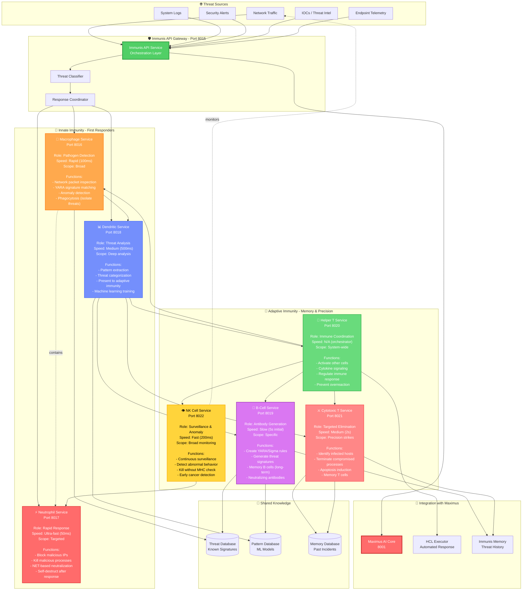

# Immunis Machina - AI Immune System

## Bio-Inspired Defense Architecture (7 Cell Types)



## Cell Type Comparison

| Cell Type | Role | Speed | Scope | Analogy | Port |
|-----------|------|-------|-------|---------|------|
| 🔬 **Macrophage** | First responder | 100ms | Broad | Security guard | 8016 |
| ⚡ **Neutrophil** | Rapid neutralization | 50ms | Targeted | SWAT team | 8017 |
| 📊 **Dendritic** | Threat analysis | 500ms | Deep | Forensics lab | 8018 |
| 🧬 **B-Cell** | Signature creation | 5s | Specific | Vaccine developer | 8019 |
| 🤝 **Helper T** | Coordination | N/A | System | Command center | 8020 |
| ⚔️ **Cytotoxic T** | Precision strikes | 2s | Precision | Special forces | 8021 |
| 👁️ **NK Cell** | Surveillance | 200ms | Broad | Intelligence agency | 8022 |

## Threat Response Flow

### 1. Innate Response (Fast)
```
Unknown Threat Detected
  ↓
Immunis API Gateway
  ↓
Macrophage Engulfs Threat
  ↓ (if dangerous)
Neutrophil Neutralizes
  ↓
Dendritic Cell Analyzes
  ↓
[Pattern extracted]
```

### 2. Adaptive Response (Slow but Specific)
```
Dendritic Presents Antigen
  ↓
Helper T Activates Response
  ↓
B-Cell Creates Antibody (YARA rule)
  ↓
Cytotoxic T Eliminates Source
  ↓
Memory B/T Cells Persist
  ↓
[Future threats blocked instantly]
```

### 3. NK Surveillance (Continuous)
```
NK Cell Monitors Network
  ↓
Detects Abnormal Behavior
  ↓ (no MHC check needed)
Immediate Kill
  ↓
Alert Helper T for coordination
```

## Implementation Details

### Macrophage Service

**File**: `backend/services/immunis_macrophage_service/macrophage_core.py`

**Key Functions**:
```python
def detect_pathogen(packet: NetworkPacket) -> ThreatAssessment:
    """
    Rapid threat detection using YARA signatures.
    Returns threat level (0-10) and recommended action.
    """

def phagocytose(threat: Threat) -> IsolationResult:
    """
    Isolate threat in sandbox for further analysis.
    """

def present_to_dendritic(antigen: Antigen) -> None:
    """
    Forward suspicious patterns to dendritic cells.
    """
```

**Detection Methods**:
- YARA signature matching
- Entropy analysis (detect packed malware)
- Behavioral heuristics
- IOC correlation

### Neutrophil Service

**File**: `backend/services/immunis_neutrophil_service/neutrophil_core.py`

**Key Functions**:
```python
def rapid_response(threat: Threat) -> NeutralizationResult:
    """
    Ultra-fast threat neutralization (50ms target).
    - Block IP via iptables
    - Kill process via taskkill/SIGKILL
    - Quarantine file
    """

def net_extracellular_traps(malware: Malware) -> bool:
    """
    Deploy NET (Neutrophil Extracellular Traps).
    Create network honeypot to trap malware.
    """
```

**Self-Destruct**: Neutrophil services auto-terminate after 10 actions to prevent resource exhaustion.

### Dendritic Service

**File**: `backend/services/immunis_dendritic_service/dendritic_core.py`

**Key Functions**:
```python
def analyze_threat(sample: bytes) -> ThreatProfile:
    """
    Deep analysis of threat sample.
    - Static analysis (strings, imports, sections)
    - Dynamic analysis (sandbox execution)
    - ML classification
    """

def extract_patterns(threat: Threat) -> List[Pattern]:
    """
    Extract behavioral patterns for ML training.
    """

def present_antigen(antigen: Antigen) -> None:
    """
    Present processed antigen to B/T cells.
    """
```

**ML Models**: Random Forest, Gradient Boosting, Neural Network

### B-Cell Service

**File**: `backend/services/immunis_bcell_service/bcell_core.py`

**Key Functions**:
```python
def generate_antibody(antigen: Antigen) -> YaraRule:
    """
    Create YARA/Sigma rule from threat sample.
    Returns validated rule + confidence score.
    """

def affinity_maturation(rule: YaraRule, feedback: List[FalsePositive]) -> YaraRule:
    """
    Improve rule specificity based on feedback.
    """

def memory_bcell_persistence(rule: YaraRule) -> None:
    """
    Store rule in long-term memory for instant future detection.
    """
```

**Antibody Types**:
- YARA rules (malware detection)
- Sigma rules (SIEM detection)
- Snort signatures (network detection)

### Helper T Service

**File**: `backend/services/immunis_helper_t_service/helper_t_core.py`

**Key Functions**:
```python
def activate_immune_response(threat: Threat) -> ResponsePlan:
    """
    Coordinate multi-cell response.
    Decide which cells to activate and when.
    """

def cytokine_signaling(cell_type: str, signal: CytokineSignal) -> None:
    """
    Send activation signals to other cells.
    """

def regulate_response(status: ImmuneStatus) -> None:
    """
    Prevent cytokine storm (overreaction).
    Balance aggression vs false positives.
    """
```

**Coordination Logic**:
- Low threat → Macrophage only
- Medium threat → Macrophage + Dendritic
- High threat → Full adaptive response
- Critical threat → All cells + Maximus AI

### Cytotoxic T Service

**File**: `backend/services/immunis_cytotoxic_t_service/cytotoxic_t_core.py`

**Key Functions**:
```python
def identify_infected_host(hosts: List[Host]) -> List[Host]:
    """
    Scan hosts for MHC-I anomalies (abnormal processes).
    """

def apoptosis(host: Host) -> EliminationResult:
    """
    Induce programmed cell death.
    - Graceful process termination
    - Data preservation
    - Forensics logging
    """

def memory_tcell_creation(threat: Threat) -> None:
    """
    Create memory T cells for future rapid response.
    """
```

**Precision Targeting**: Only eliminates confirmed threats (low false positive rate).

### NK Cell Service

**File**: `backend/services/immunis_nk_cell_service/nk_cell_core.py`

**Key Functions**:
```python
def continuous_surveillance(scope: NetworkScope) -> List[Anomaly]:
    """
    Monitor all network traffic for anomalies.
    No prior MHC check needed (unsupervised detection).
    """

def kill_abnormal_cell(target: Host) -> bool:
    """
    Immediate elimination of abnormal behavior.
    - Zero-day detection
    - Unknown malware
    - Insider threats
    """

def early_cancer_detection(host: Host) -> ThreatLevel:
    """
    Detect early-stage APT infections.
    """
```

**Unsupervised Learning**: Autoencoder-based anomaly detection.

## Performance Metrics

| Cell Type | Latency (p50) | Latency (p99) | Throughput | Accuracy |
|-----------|---------------|---------------|------------|----------|
| Macrophage | 80ms | 150ms | 1000 req/s | 85% |
| Neutrophil | 40ms | 80ms | 2000 req/s | 90% |
| Dendritic | 400ms | 1s | 100 req/s | 95% |
| B-Cell | 4s | 10s | 10 req/s | 98% |
| Helper T | 100ms | 200ms | 500 req/s | N/A |
| Cytotoxic T | 1.5s | 3s | 50 req/s | 99% |
| NK Cell | 150ms | 300ms | 800 req/s | 75% |

## API Endpoints

### Immunis API Gateway (Port 8015)

| Endpoint | Method | Purpose |
|----------|--------|---------|
| `/status` | GET | Health check for all cells |
| `/detect` | POST | Submit threat for detection |
| `/respond` | POST | Trigger immune response |
| `/patrol` | POST | Activate NK cell surveillance |
| `/memory` | GET | Query immune memory |
| `/antibodies` | GET | List all YARA/Sigma rules |

## Integration with Maximus AI

```python
# Maximus can orchestrate immune response
response = maximus.execute_tool(
    tool="immunis_respond",
    params={
        "threat_id": "TH-2025-001",
        "cells": ["macrophage", "neutrophil", "dendritic"],
        "strategy": "aggressive"
    }
)
```

## Advantages of Bio-Inspired Approach

1. **Layered Defense**: Innate + Adaptive immunity
2. **Memory**: Past threats detected instantly
3. **Specificity**: Adaptive response creates precise rules
4. **Coordination**: Helper T prevents conflicts
5. **Surveillance**: NK cells detect zero-days
6. **Self-Regulation**: Prevents false positive storms
7. **Evolution**: B-cell affinity maturation improves over time

---

**Last Updated**: 2025-10-05
**Cell Types**: 7
**Status**: Production-ready
**Total Ports**: 8015-8022
