# HCL - Homeostatic Control Loop

## Self-Regulating Security Automation

```mermaid
graph TB
    subgraph "📝 Human Input"
        USER[Security Analyst]
        HCL_SCRIPT[HCL Script<br/>Natural Language Workflow]
    end

    subgraph "🔍 HCL Monitor Service - Port 8090"
        COLLECTORS[System Collectors]
        METRICS[Prometheus Metrics]
        HEALTH_CHECKS[Health Checks]
        EVENT_STREAM[Event Stream]

        COLLECTORS --> METRICS
        HEALTH_CHECKS --> METRICS
        EVENT_STREAM --> METRICS
    end

    subgraph "🧪 HCL Analyzer Service - Port 8091"
        PARSER[HCL Parser]
        VALIDATOR[Syntax Validator]
        SEMANTIC[Semantic Analyzer]
        RISK_ASSESSOR[Risk Assessor]

        PARSER --> VALIDATOR
        VALIDATOR --> SEMANTIC
        SEMANTIC --> RISK_ASSESSOR
    end

    subgraph "🧠 HCL Planner Service - Port 8092"
        FUZZY[Fuzzy Logic Controller]
        RL_AGENT[RL Agent<br/>Q-Learning]
        RESOURCE_OPTIMIZER[Resource Optimizer]
        STRATEGY_SELECTOR[Strategy Selector]

        FUZZY --> STRATEGY_SELECTOR
        RL_AGENT --> STRATEGY_SELECTOR
        RESOURCE_OPTIMIZER --> STRATEGY_SELECTOR
    end

    subgraph "⚡ HCL Executor Service - Port 8093"
        ACTION_EXEC[Action Executor]
        K8S_CONTROLLER[K8s Controller]
        API_CALLER[API Caller]
        SAFETY_GUARD[Safety Guard]

        ACTION_EXEC --> SAFETY_GUARD
        SAFETY_GUARD --> K8S_CONTROLLER
        SAFETY_GUARD --> API_CALLER
    end

    subgraph "📚 HCL Knowledge Base - Port 8094"
        PLAYBOOKS[Security Playbooks]
        POLICIES[Security Policies]
        PAST_RUNS[Execution History]
        LESSONS[Lessons Learned]

        PLAYBOOKS --> PAST_RUNS
        POLICIES --> PAST_RUNS
        PAST_RUNS --> LESSONS
    end

    subgraph "🎯 Execution Targets"
        IMMUNIS[Immunis Cells]
        OFFENSIVE[Offensive Tools]
        MAXIMUS[Maximus AI]
        INFRASTRUCTURE[Infrastructure<br/>Kubernetes/Docker]
        SIEM[SIEM Systems]
    end

    subgraph "💾 Data Layer"
        TIMESERIES[(InfluxDB<br/>Time-series Metrics)]
        KNOWLEDGE_GRAPH[(Neo4j<br/>Knowledge Graph)]
        STATE_STORE[(Redis<br/>Execution State)]
    end

    %% Main flow (MAPE-K cycle)
    USER --> HCL_SCRIPT
    HCL_SCRIPT --> PARSER

    %% Monitor phase
    COLLECTORS --> TIMESERIES
    METRICS --> PARSER

    %% Analyze phase
    PARSER --> SEMANTIC
    RISK_ASSESSOR --> FUZZY
    RISK_ASSESSOR --> KNOWLEDGE_GRAPH

    %% Plan phase
    STRATEGY_SELECTOR --> PLAYBOOKS
    STRATEGY_SELECTOR --> RL_AGENT
    RL_AGENT --> STATE_STORE

    %% Execute phase
    ACTION_EXEC --> IMMUNIS
    ACTION_EXEC --> OFFENSIVE
    ACTION_EXEC --> MAXIMUS
    K8S_CONTROLLER --> INFRASTRUCTURE
    API_CALLER --> SIEM

    %% Knowledge phase
    LESSONS --> FUZZY
    LESSONS --> RL_AGENT
    PAST_RUNS --> KNOWLEDGE_GRAPH

    %% Feedback loop
    API_CALLER -.execution results.-> COLLECTORS
    K8S_CONTROLLER -.execution results.-> COLLECTORS

    %% Cross-service communication
    RISK_ASSESSOR --> STRATEGY_SELECTOR
    STRATEGY_SELECTOR --> ACTION_EXEC
    ACTION_EXEC -.telemetry.-> COLLECTORS

    %% Styling
    style HCL_SCRIPT fill:#ffd43b,stroke:#fab005,stroke-width:3px,color:#000
    style PARSER fill:#748ffc,stroke:#4c6ef5,stroke-width:2px,color:#fff
    style FUZZY fill:#ff6b6b,stroke:#e03131,stroke-width:2px,color:#fff
    style RL_AGENT fill:#da77f2,stroke:#9c36b5,stroke-width:2px,color:#fff
    style ACTION_EXEC fill:#51cf66,stroke:#2f9e44,stroke-width:2px,color:#fff
    style SAFETY_GUARD fill:#ffa94d,stroke:#fd7e14,stroke-width:3px,color:#fff
    style PLAYBOOKS fill:#339af0,stroke:#1971c2,stroke-width:2px,color:#fff
```



## MAPE-K Architecture

HCL implements the IBM Autonomic Computing **MAPE-K** loop:

| Phase | Service | Port | Function | Latency |
|-------|---------|------|----------|---------|
| **M**onitor | HCL Monitor | 8090 | Collect system metrics | 10ms |
| **A**nalyze | HCL Analyzer | 8091 | Parse & validate HCL | 100ms |
| **P**lan | HCL Planner | 8092 | Generate execution plan | 500ms |
| **E**xecute | HCL Executor | 8093 | Execute actions | 2s |
| **K**nowledge | HCL KB | 8094 | Store playbooks & history | 50ms |

## HCL Language Syntax

### Example 1: Simple Threat Response

```hcl
// HCL script: respond_to_phishing.hcl

objective "Respond to phishing campaign" {
  description = "Automated response to phishing detection"
  priority = "high"
}

monitor {
  source = "siem"
  query = "event_type:phishing AND status:new"
  interval = "5m"
}

analyze {
  risk_level = fuzzy_logic(
    threat_intel_score > 7,
    affected_users > 10,
    contains_credentials_harvesting
  )
}

plan {
  if (risk_level == "critical") {
    strategy = "aggressive"
    resources = ["immunis_macrophage", "immunis_neutrophil", "maximus_ai"]
  } else {
    strategy = "conservative"
    resources = ["immunis_macrophage"]
  }
}

execute {
  action "block_sender_ip" {
    tool = "immunis_neutrophil"
    params = {
      ip = "${phishing_email.sender_ip}"
      duration = "24h"
    }
  }

  action "quarantine_emails" {
    tool = "siem_api"
    params = {
      query = "sender:${phishing_email.sender}"
      action = "quarantine"
    }
  }

  action "investigate_campaign" {
    tool = "maximus_investigate"
    params = {
      target = "${phishing_email.sender_domain}"
      depth = "comprehensive"
    }
  }

  action "notify_users" {
    tool = "notification_service"
    params = {
      recipients = "${affected_users}"
      message = "Phishing campaign detected - emails quarantined"
    }
  }
}

knowledge {
  save_playbook = true
  update_threat_intel = true
  generate_report = true
}
```

### Example 2: Auto-Scaling Security Services

```hcl
objective "Auto-scale Immunis cells based on threat load" {
  description = "Maintain optimal immune system capacity"
  priority = "medium"
}

monitor {
  metrics = [
    "immunis_macrophage_queue_size",
    "immunis_macrophage_cpu_usage",
    "immunis_macrophage_response_time"
  ]
  interval = "30s"
}

analyze {
  queue_size_high = queue_size > 1000
  cpu_high = cpu_usage > 80
  latency_high = response_time > 200  // ms

  scale_needed = fuzzy_logic(
    queue_size_high,
    cpu_high,
    latency_high
  )
}

plan {
  if (scale_needed == "yes") {
    current_replicas = k8s_get_replicas("immunis-macrophage")
    target_replicas = min(current_replicas * 2, 10)
  }
}

execute {
  action "scale_deployment" {
    tool = "k8s_controller"
    params = {
      deployment = "immunis-macrophage"
      replicas = target_replicas
    }
  }

  action "log_scaling_event" {
    tool = "logging_service"
    params = {
      message = "Scaled immunis-macrophage from ${current_replicas} to ${target_replicas}"
      reason = "High threat load"
    }
  }
}

knowledge {
  save_scaling_decision = true
  update_rl_model = true  // Train RL agent
}
```

### Example 3: Incident Response Workflow

```hcl
objective "Handle ransomware detection" {
  description = "Automated ransomware containment and recovery"
  priority = "critical"
}

monitor {
  source = "immunis_dendritic"
  event_type = "ransomware_detected"
}

analyze {
  encryption_activity = count_encrypted_files()
  lateral_movement = detect_lateral_movement()
  exfiltration = detect_data_exfiltration()

  severity = fuzzy_logic(
    encryption_activity > 100,
    lateral_movement == true,
    exfiltration == true
  )
}

plan {
  if (severity == "critical") {
    strategy = "full_containment"
    actions = [
      "isolate_hosts",
      "block_c2",
      "snapshot_systems",
      "notify_soc"
    ]
  }
}

execute {
  action "isolate_infected_hosts" {
    tool = "k8s_controller"
    params = {
      hosts = "${infected_hosts}"
      network_policy = "deny_all"
    }
    parallel = true
  }

  action "block_c2_server" {
    tool = "immunis_neutrophil"
    params = {
      ip = "${c2_server_ip}"
      action = "blackhole"
    }
  }

  action "create_snapshots" {
    tool = "backup_service"
    params = {
      hosts = "${infected_hosts}"
      snapshot_type = "forensic"
    }
  }

  action "activate_all_immune_cells" {
    tool = "immunis_helper_t"
    params = {
      threat_level = "critical"
      cells = ["all"]
    }
  }

  action "investigate_with_maximus" {
    tool = "maximus_investigate"
    params = {
      type = "forensics"
      targets = "${infected_hosts}"
      depth = "comprehensive"
    }
  }

  action "notify_soc_critical" {
    tool = "notification_service"
    params = {
      channel = "pagerduty"
      severity = "critical"
      message = "Ransomware outbreak - ${count(infected_hosts)} hosts affected"
    }
  }
}

knowledge {
  create_incident_report = true
  update_ransomware_signatures = true
  save_forensic_evidence = true
  trigger_post_incident_review = true
}
```

## Component Details

### 1. HCL Monitor (Port 8090)

**File**: `backend/services/hcl_monitor_service/collectors.py`

**Collectors**:
- Prometheus metrics collector
- SIEM event stream listener
- Kubernetes health checks
- Service health endpoints

**Metrics Collected**:
```python
{
    "system": {
        "cpu_usage": float,
        "memory_usage": float,
        "disk_usage": float
    },
    "services": {
        "immunis_macrophage": {
            "queue_size": int,
            "response_time_p50": float,
            "error_rate": float
        },
        # ... 60+ services
    },
    "security": {
        "threats_detected": int,
        "false_positives": int,
        "response_time": float
    }
}
```

### 2. HCL Analyzer (Port 8091)

**File**: `backend/services/hcl_analyzer_service/main.py`

**Analysis Pipeline**:
```python
def analyze_hcl(script: str) -> AnalysisResult:
    """
    1. Parse HCL syntax (using custom parser)
    2. Validate semantics (check tool availability)
    3. Assess risk (score 0-10)
    4. Detect conflicts (prevent infinite loops)
    """
```

**Risk Assessment**:
- **Low (0-3)**: Read-only operations
- **Medium (4-6)**: Network changes, restarts
- **High (7-8)**: Process termination, isolation
- **Critical (9-10)**: Data deletion, system shutdown

### 3. HCL Planner (Port 8092)

**File**: `backend/services/hcl_planner_service/main.py`

**Planning Algorithms**:

#### Fuzzy Logic Controller
```python
# backend/services/hcl_planner_service/fuzzy_controller.py

def fuzzy_inference(inputs: Dict[str, float]) -> str:
    """
    Fuzzy logic for decision making.

    Input variables:
    - threat_level (0-10)
    - resource_availability (0-100%)
    - time_constraint (seconds)

    Output:
    - strategy: "conservative", "moderate", "aggressive"
    """
```

#### RL Agent (Q-Learning)
```python
# backend/services/hcl_planner_service/rl_agent.py

class HCLRLAgent:
    """
    Q-Learning agent for optimal action selection.

    State space:
    - Current system metrics
    - Past action outcomes
    - Resource constraints

    Action space:
    - Tool selection
    - Parallelization strategy
    - Resource allocation

    Reward function:
    - +10: Successful threat mitigation
    - +5: Efficient resource usage
    - -10: False positive
    - -20: System disruption
    """
```

### 4. HCL Executor (Port 8093)

**File**: `backend/services/hcl_executor_service/action_executor.py`

**Safety Guards**:
```python
class SafetyGuard:
    """
    Prevent dangerous operations.
    """

    FORBIDDEN_ACTIONS = [
        "rm -rf /",
        "DROP DATABASE",
        "shutdown --force"
    ]

    REQUIRES_APPROVAL = [
        "offensive_web_attack",
        "data_deletion",
        "service_shutdown"
    ]

    def validate_action(self, action: Action) -> ValidationResult:
        """
        Check action against safety rules.
        - Blacklist check
        - Whitelist verification
        - Human approval (if needed)
        - Rollback capability
        """
```

**Kubernetes Controller**:
```python
# backend/services/hcl_executor_service/k8s_controller.py

def scale_deployment(name: str, replicas: int) -> K8sResult:
    """
    Scale Kubernetes deployment.
    - Get current state
    - Apply new replica count
    - Wait for rollout
    - Verify health checks
    """
```

### 5. HCL Knowledge Base (Port 8094)

**File**: `backend/services/hcl_kb_service/main.py`

**Stored Knowledge**:
- **Playbooks**: 50+ pre-built security workflows
- **Policies**: Security constraints and rules
- **Execution History**: Past 1000 executions
- **Lessons Learned**: RL training data

**Query Examples**:
```python
# Get playbook
playbook = kb.get_playbook("respond_to_phishing")

# Find similar past incidents
similar = kb.find_similar_incidents(
    threat_type="ransomware",
    severity="critical",
    top_k=5
)

# Update RL model with new data
kb.train_rl_agent(
    state=current_state,
    action=action_taken,
    reward=outcome_score
)
```

## Execution Flow

### Normal Flow
```
1. User writes HCL script
2. Monitor detects trigger condition
3. Analyzer parses and validates
4. Planner generates execution plan
5. Executor runs actions (with safety guards)
6. Results feed back to Monitor
7. Knowledge Base updated
8. Loop continues
```

### Emergency Override
```
1. Critical alert detected
2. Bypass planning (use pre-approved playbook)
3. Execute immediately
4. Notify SOC
5. Post-execution analysis
```

## Performance Characteristics

| Metric | Target | Actual |
|--------|--------|--------|
| Monitor → Analyze | <100ms | ~80ms |
| Analyze → Plan | <500ms | ~400ms |
| Plan → Execute | <2s | ~1.5s |
| End-to-end (simple) | <3s | ~2s |
| End-to-end (complex) | <10s | ~8s |
| RL decision time | <200ms | ~150ms |
| Fuzzy inference | <50ms | ~30ms |

## API Endpoints

| Endpoint | Method | Service | Purpose |
|----------|--------|---------|---------|
| `/execute` | POST | Executor | Run HCL script |
| `/plan` | POST | Planner | Generate execution plan |
| `/analyze` | POST | Analyzer | Validate HCL syntax |
| `/playbooks` | GET | KB | List available playbooks |
| `/metrics` | GET | Monitor | Current system state |
| `/history` | GET | KB | Past executions |

## Integration with Maximus AI

Maximus can generate HCL scripts from natural language:

```python
# User: "Create a workflow to block suspicious IPs"
# Maximus generates:

objective "Block suspicious IPs from threat feed" {
  description = "Automated IP blocking based on threat intelligence"
  priority = "medium"
}

monitor {
  source = "threat_intel_feed"
  query = "reputation:malicious AND confidence:high"
  interval = "10m"
}

execute {
  action "block_ips" {
    tool = "immunis_neutrophil"
    params = {
      ips = "${malicious_ips}"
      duration = "7d"
    }
  }
}
```

## Advantages

1. **Human-Readable**: Security analysts write workflows in plain language
2. **Self-Regulating**: MAPE-K loop maintains system homeostasis
3. **Learning**: RL agent improves over time
4. **Safe**: Multiple safety guards prevent accidents
5. **Auditable**: All actions logged and traceable
6. **Flexible**: Fuzzy logic handles uncertainty

---

**Last Updated**: 2025-10-05
**Services**: 5 (ports 8090-8094)
**Status**: Production-ready
**Playbooks**: 50+
