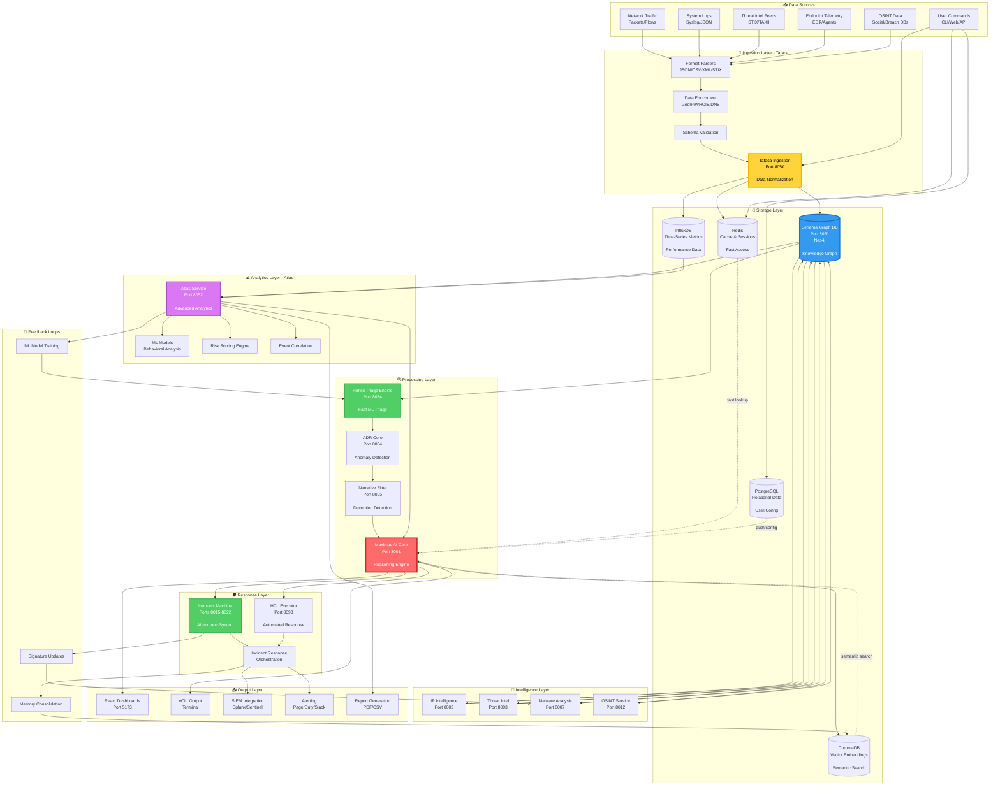

# Data Flow Architecture

## End-to-End Data Pipeline



## Data Flow Patterns

### 1. User Query Flow (CLI/Web)

```
User: "Investigate suspicious domain malicious.com"
  ↓
vCLI/React → API Gateway (8000) → Maximus AI (8001)
  ↓
Maximus checks Redis cache (8379)
  ↓ [cache miss]
Maximus queries Seriema Graph (8051)
  ↓
Seriema returns known relationships:
  - malicious.com → linked to IP 1.2.3.4
  - IP 1.2.3.4 → linked to threat actor "APT-X"
  ↓
Maximus executes tools in parallel:
  1. IP Intelligence (8002) → GeoIP, reputation
  2. Threat Intel (8003) → IOC lookups
  3. Domain Service (8014) → WHOIS, DNS
  ↓
Tools return data → Maximus synthesizes
  ↓
Maximus stores results:
  - Working memory (Redis)
  - Episodic memory (ChromaDB)
  - Knowledge graph (Seriema)
  ↓
Response to user with reasoning trace
```

**Latency**: ~2-3 seconds
**Data touched**: 5 services, 3 databases

### 2. Threat Detection Flow (Real-time)

```
Network packet arrives
  ↓
Tataca Ingestion (8050) normalizes packet
  ↓
RTE (8034) performs fast ML triage (50ms)
  ↓ [if suspicious]
RTE sends to ADR (8004) for deeper analysis
  ↓
ADR runs anomaly detection models (200ms)
  ↓ [if anomalous]
ADR forwards to Narrative Filter (8035)
  ↓
Narrative Filter checks for deception patterns (100ms)
  ↓ [if deceptive]
Alert sent to Immunis API (8015)
  ↓
Immunis activates immune cells:
  - Macrophage (8016) → Threat detection
  - Dendritic (8018) → Deep analysis
  - Neutrophil (8017) → Rapid response
  ↓
Immunis stores threat signature in Seriema (8051)
  ↓
HCL Executor (8093) triggers automated response playbook
  ↓
Incident created, SOC alerted (PagerDuty)
```

**Latency**: <500ms (end-to-end)
**Data touched**: 8 services, 2 databases

### 3. OSINT Investigation Flow

```
User: "vcli osint username johndoe"
  ↓
vCLI → OSINT Service (8012)
  ↓
OSINT queries multiple sources in parallel:
  1. Twitter API
  2. LinkedIn scraper
  3. GitHub API
  4. Breach databases (HIBP)
  5. Domain registration (WHOIS)
  ↓
Results normalized and enriched (Tataca 8050)
  ↓
Data stored in Seriema Graph (8051):
  - User nodes
  - Social media profiles
  - Email addresses
  - Domain connections
  - Breach exposures
  ↓
Atlas (8052) performs behavioral analytics:
  - Sentiment analysis on posts
  - Connection graph analysis
  - Risk scoring
  ↓
Maximus (8001) synthesizes findings:
  - Confidence scores
  - Threat assessment
  - Recommended actions
  ↓
Results returned to user with visual graph
  ↓
Stored in:
  - Seriema (knowledge graph)
  - ChromaDB (episodic memory)
  - PostgreSQL (investigation case)
```

**Latency**: ~10-30 seconds (depends on external APIs)
**Data touched**: 12+ services, 4 databases

### 4. Memory Consolidation Flow

```
Conversation ends (user logs out)
  ↓
Maximus extracts key facts from working memory (Redis)
  ↓
Generate embeddings using sentence-transformers
  ↓
Store in ChromaDB (Vector DB):
  - Conversation text
  - Key entities
  - Embeddings (768-dim vectors)
  ↓
Extract entities and relationships:
  - "User investigated domain X"
  - "Domain X linked to threat actor Y"
  - "Threat actor Y uses technique Z"
  ↓
Store in Seriema Graph (Neo4j):
  - Create/update nodes (User, Domain, Threat Actor)
  - Create/update relationships (INVESTIGATED, LINKED_TO, USES)
  ↓
Update semantic indices for fast retrieval
  ↓
Memory consolidation complete
```

**Latency**: ~5-10 seconds (background task)
**Data touched**: 3 services, 2 databases

### 5. ML Model Training Flow

```
Every 24 hours (cron job)
  ↓
Atlas Service (8052) triggers model retraining
  ↓
Fetch training data from Seriema Graph (8051):
  - Past 30 days of incidents
  - Labeled threats (true positives)
  - False positives (for negative examples)
  ↓
Load data into Pandas DataFrame
  ↓
Feature engineering:
  - Extract behavioral features
  - Generate graph embeddings
  - Time-series features
  ↓
Train models:
  1. Random Forest (anomaly detection)
  2. XGBoost (risk scoring)
  3. LSTM (time-series prediction)
  4. GNN (graph neural network)
  ↓
Validate models (80/20 split)
  ↓
If accuracy > 90%:
  - Deploy to RTE (8034)
  - Deploy to ADR (8004)
  ↓
Store model artifacts in S3/local storage
  ↓
Log performance metrics to InfluxDB (timeseries)
  ↓
Notify SOC of new model deployment
```

**Latency**: ~2-4 hours (full training cycle)
**Data touched**: 5 services, 3 databases

## Data Storage Strategy

| Data Type | Storage | Reason | TTL |
|-----------|---------|--------|-----|
| **User Sessions** | Redis | Fast access, ephemeral | 24h |
| **Working Memory** | Redis | In-memory speed | Session |
| **Episodic Memory** | ChromaDB | Vector similarity search | 25 conversations |
| **Semantic Memory** | Seriema (Neo4j) | Relationship queries | Permanent |
| **Time-Series Metrics** | InfluxDB | Optimized for timestamps | 90 days |
| **User/Config** | PostgreSQL | ACID compliance | Permanent |
| **Logs** | InfluxDB + S3 | Query + archival | 1 year |
| **Threat Signatures** | Seriema + Files | Graph + binary storage | Permanent |
| **ML Models** | S3/Local FS | Versioned artifacts | Latest 10 versions |

## Data Retention Policy

| Category | Retention | Archival | Reason |
|----------|-----------|----------|--------|
| User queries | 90 days | S3 Glacier (1 year) | Compliance |
| Security incidents | 1 year | S3 Glacier (7 years) | Legal/audit |
| Network logs | 30 days | S3 Glacier (90 days) | Performance |
| Threat intel | Permanent | N/A | Knowledge base |
| System metrics | 90 days | Aggregated (1 year) | Capacity planning |
| Training data | Permanent | N/A | Model improvement |

## Data Transformations

### 1. Normalization (Tataca)

```python
# Raw network packet
raw_packet = {
    "timestamp": "2025-10-05T12:34:56Z",
    "src_ip": "192.168.1.100",
    "dst_ip": "8.8.8.8",
    "protocol": "TCP",
    "payload": "..."
}

# Normalized (Tataca output)
normalized = {
    "event_type": "network_connection",
    "timestamp": 1728137696,  # Unix timestamp
    "source": {
        "ip": "192.168.1.100",
        "geo": {"country": "US", "city": "New York"},
        "reputation": 0.8
    },
    "destination": {
        "ip": "8.8.8.8",
        "service": "Google DNS",
        "reputation": 1.0
    },
    "protocol": "TCP",
    "threat_level": 0,  # Initial assessment
    "enrichment": {
        "geoip_lookup": True,
        "threat_intel_check": True,
        "dns_resolution": True
    }
}
```

### 2. Graph Transformation (Seriema)

```cypher
// Create nodes
CREATE (ip:IPAddress {address: "192.168.1.100", reputation: 0.8})
CREATE (domain:Domain {name: "malicious.com", registered: "2025-01-01"})
CREATE (actor:ThreatActor {name: "APT-X", country: "Unknown"})

// Create relationships
CREATE (ip)-[:RESOLVES_TO]->(domain)
CREATE (domain)-[:CONTROLLED_BY]->(actor)
CREATE (actor)-[:USES_TECHNIQUE]->(technique:Technique {name: "Spear Phishing"})
```

### 3. Vector Embedding (ChromaDB)

```python
# Text to embedding
text = "User investigated malicious domain malicious.com linked to APT-X"

# Generate embedding (768 dimensions)
embedding = sentence_transformer.encode(text)
# [0.123, -0.456, 0.789, ..., 0.234]

# Store in ChromaDB
chroma_db.add(
    documents=[text],
    embeddings=[embedding],
    metadata={"type": "investigation", "threat_level": 8},
    ids=["inv_001"]
)

# Semantic search
similar = chroma_db.query(
    query_embeddings=[query_embedding],
    n_results=5
)
```

## Performance Metrics

| Data Flow | Throughput | Latency (p50) | Latency (p99) |
|-----------|------------|---------------|---------------|
| User query | 100 req/s | 2s | 5s |
| Threat detection | 10,000 events/s | 50ms | 200ms |
| OSINT investigation | 10 req/s | 15s | 60s |
| Memory consolidation | 50 conversations/min | 5s | 15s |
| ML model training | 1 job/day | 2h | 4h |
| Graph query | 1,000 req/s | 10ms | 50ms |
| Vector search | 500 req/s | 80ms | 200ms |

## Data Volume Estimates

| Data Type | Daily Volume | Monthly Volume | Annual Volume |
|-----------|--------------|----------------|---------------|
| Network logs | 10 GB | 300 GB | 3.6 TB |
| System metrics | 500 MB | 15 GB | 180 GB |
| User interactions | 100 MB | 3 GB | 36 GB |
| Threat intel updates | 50 MB | 1.5 GB | 18 GB |
| Investigation reports | 200 MB | 6 GB | 72 GB |
| **TOTAL** | **~11 GB/day** | **~325 GB/month** | **~4 TB/year** |

## Data Security

1. **Encryption at Rest**: AES-256 for all databases
2. **Encryption in Transit**: TLS 1.3 for all inter-service communication
3. **Access Control**: RBAC for all data stores
4. **Audit Logging**: All data access logged to immutable log
5. **Data Masking**: PII redacted in logs and reports
6. **Backup Strategy**: Daily backups to S3, retained for 30 days

---

**Last Updated**: 2025-10-05
**Total Data Stores**: 6
**Status**: Production-ready
**Daily Ingestion**: ~11 GB
