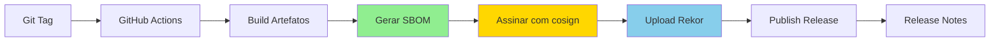
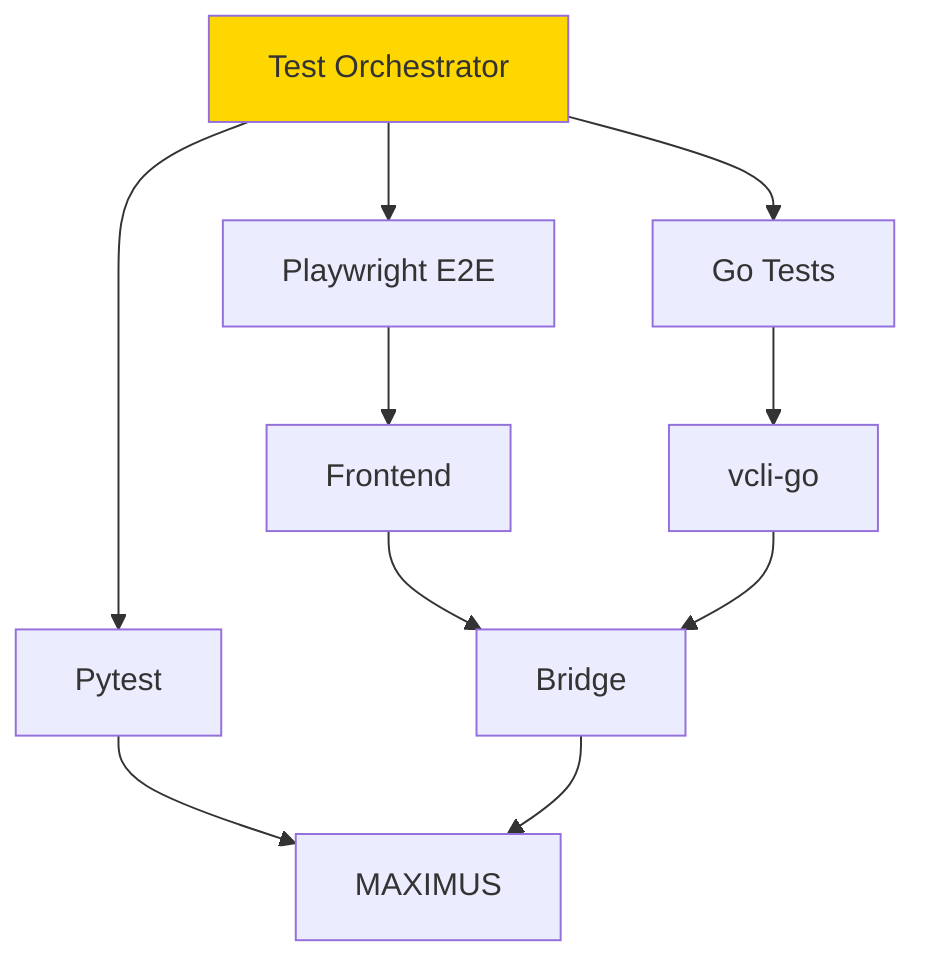
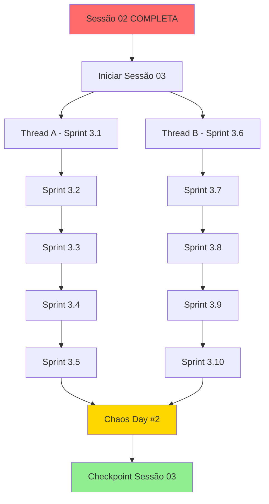

# Plano de Implementação - Sessão 03: Pipeline & Supply Chain

**Autor**: Juan Carlo de Souza (JuanCS-DEV @github)  
**Colaborador**: Copilot/Claude-Sonnet-4.5  
**Email**: juan.brainfarma@gmail.com  
**Data**: 2025-01-09  
**Status**: 📋 AGUARDANDO APROVAÇÃO  
**Versão**: 1.0

---

## CONTEXTO E DECISÃO PRÉVIA

### Resultado da Validação Sessão 02
A Sessão 02 foi validada com **70% de conformidade** à DOUTRINA VERTICE. O Sprint 2.1 está completo e conforme, mas Sprints 2.2-2.5 permanecem como placeholders, violando o Artigo II (NO PLACEHOLDER).

### Decisão do Arquiteto-Chefe Necessária

**ESCOLHA 1: Completar Sessão 02 Primeiro (RECOMENDADO)** ✅
- Estender Sessão 02 por 7 dias
- Implementar Sprints 2.2-2.5
- Iniciar Sessão 03 com base sólida
- **Tempo Total**: 7 dias (Sessão 02) + 8-10 dias (Sessão 03) = **15-17 dias**

**ESCOLHA 2: Prosseguir para Sessão 03 Imediatamente** ⚠️
- Aceitar Sessão 02 em 40%
- Carregar débito técnico
- Abordar pendências em paralelo
- **Tempo Total**: ~12-14 dias (aparente velocidade)
- **Risco**: Débito técnico composto

**👉 ESTE PLANO ASSUME ESCOLHA 1 (recomendada)**

Se Arquiteto-Chefe optar por ESCOLHA 2, solicitar revisão deste documento.

---

## 1. VISÃO GERAL SESSÃO 03

### Objetivo Estratégico
Estabelecer pipeline de release automatizado com SBOM, assinaturas criptográficas e testes integrados cruzados, garantindo supply chain security e conformidade com Regra de Ouro.

### Escopo
- **Thread A**: Release Liturgia (SBOM + cosign + attestation)
- **Thread B**: Testes E2E cruzados (CLI ↔ MAXIMUS ↔ Frontend)

### Duração Estimada
**8-10 dias úteis** (com buffer de caos incluído)

### Conformidade Doutrina
- ✅ Artigo II: Produção pronta desde o commit
- ✅ Artigo IV: Chaos Day #2 planejado
- ✅ Artigo V: Legislação (supply chain) antes do deploy
- ✅ Artigo X: Transparência (SBOM público)

---

## 2. PREREQUISITOS OBRIGATÓRIOS

### Antes de Iniciar Sessão 03

#### ✅ Concluído (Sessão 01)
- [x] Interface Charter v1.0 aprovado
- [x] Matriz de telemetria documentada
- [x] Plano Zero Trust estabelecido
- [x] CI/CD base funcionando

#### ⏳ Pendente (Sessão 02 Estendida)
- [ ] Sprint 2.2: Streaming funcional com latência < 500ms
- [ ] Sprint 2.3: Cockpit híbrido integrando dados conscientes
- [ ] Sprint 2.4: Dashboards Grafana narrativos exportados
- [ ] Sprint 2.5: Chaos Day #1 executado e documentado
- [ ] Adendo 3: Benchmarks preliminares de latência completos
- [ ] Cobertura de testes ≥ 80% (tipos, integração)

**🚨 BLOCKER**: Sessão 03 NÃO PODE iniciar sem itens acima completos.

---

## 3. THREAD A - RELEASE LITURGIA

### Objetivo
Implementar pipeline de release com:
- Geração automática de SBOM (Software Bill of Materials)
- Assinatura de artefatos com cosign (Sigstore)
- Attestation em Rekor (transparency log)
- Checklists de Regra de Ouro automatizados
- Release notes gerados automaticamente

### Fundamentação Doutrina
**Artigo X - Transparência Radical**:
> "Todo código MAXIMUS será público. Permite validação independente."

**Artigo V - Legislação Prévia**:
> "A governança não é um afterthought. As regras limitam o poder antes de construir."

### Arquitetura Proposta



### Componentes

#### 3.1 Geração de SBOM

**Ferramenta**: Syft (Anchore)

**Formatos**:
- SPDX 2.3 (padrão NTIA)
- CycloneDX 1.4 (alternativo)
- JSON (para tooling)

**Implementação**:
```yaml
# .github/workflows/release.yml (trecho)
- name: Generate SBOM
  uses: anchore/sbom-action@v0
  with:
    path: ./
    format: spdx-json
    output-file: sbom.spdx.json
    
- name: Generate SBOM (CycloneDX)
  run: |
    syft . -o cyclonedx-json=sbom.cdx.json
```

**Validação SBOM**:
```bash
# Verificar completude NTIA
sbom-tool validate -i sbom.spdx.json

# Métricas esperadas
- Componentes mapeados: 100%
- Licenças identificadas: 95%+
- Versões exatas: 100%
- Hashes SHA256: 100%
```

**Entregável**: `sbom.spdx.json` e `sbom.cdx.json` anexados a cada release

---

#### 3.2 Assinatura Criptográfica (cosign)

**Ferramenta**: cosign (Sigstore)

**Keypair Management**:
- GitHub Actions OIDC (keyless signing) - RECOMENDADO
- Alternativa: Chaves gerenciadas em GitHub Secrets

**Implementação**:
```yaml
- name: Install cosign
  uses: sigstore/cosign-installer@v3

- name: Sign container image
  run: |
    cosign sign --yes \
      ghcr.io/juancs-dev/maximus:${{ github.ref_name }}

- name: Sign SBOM
  run: |
    cosign sign-blob --yes \
      --bundle sbom.spdx.json.bundle \
      sbom.spdx.json

- name: Sign binaries
  run: |
    cosign sign-blob --yes \
      --bundle vcli-go.bundle \
      dist/vcli-go
```

**Verificação**:
```bash
# Verificar imagem
cosign verify \
  --certificate-identity-regexp=".*" \
  --certificate-oidc-issuer=https://token.actions.githubusercontent.com \
  ghcr.io/juancs-dev/maximus:v3.0.0

# Verificar SBOM
cosign verify-blob \
  --bundle sbom.spdx.json.bundle \
  --certificate-identity-regexp=".*" \
  --certificate-oidc-issuer=https://token.actions.githubusercontent.com \
  sbom.spdx.json
```

**Entregável**: Todos artefatos assinados com verificação pública

---

#### 3.3 Transparency Log (Rekor)

**Objetivo**: Registro imutável de todas assinaturas em blockchain público

**Implementação**:
```yaml
- name: Submit to Rekor
  run: |
    REKOR_URL=https://rekor.sigstore.dev
    cosign upload blob \
      --rekor-url=$REKOR_URL \
      sbom.spdx.json
```

**Verificação**:
```bash
# Buscar no Rekor
rekor-cli search \
  --artifact sbom.spdx.json

# Verificar entrada
rekor-cli verify \
  --artifact sbom.spdx.json \
  --signature sbom.spdx.json.sig \
  --pki-format x509
```

**Benefício**: Auditoria pública e imutável de toda supply chain

---

#### 3.4 Checklist Regra de Ouro

**Arquivo**: `.github/release-checklist.yml`

```yaml
checklist:
  no_mock:
    - grep -r "mock" src/ && exit 1 || exit 0
    - grep -r "Mock" src/ && exit 1 || exit 0
  
  no_placeholder:
    - grep -r "TODO" src/ && exit 1 || exit 0
    - grep -r "FIXME" src/ && exit 1 || exit 0
    - grep -r "NotImplementedError" src/ && exit 1 || exit 0
  
  no_todo:
    - grep -r "pass  # TODO" src/ && exit 1 || exit 0
  
  quality_first:
    - mypy --strict src/
    - pylint src/ --fail-under=9.0
    - pytest --cov=src --cov-fail-under=90
  
  production_ready:
    - docker compose up -d
    - ./scripts/health-check.sh
    - docker compose down
  
  consciencia_compliant:
    - test -f docs/architecture/consciousness-*.md
    - grep -q "IIT\|GWD\|AST" docs/architecture/*.md
```

**Execução na CI**:
```yaml
- name: Run Regra de Ouro Checklist
  run: |
    ./scripts/release-checklist.sh
  continue-on-error: false  # BLOQUEIA release se falhar
```

**Entregável**: Release BLOQUEADO se qualquer check falhar

---

#### 3.5 Release Notes Automáticas

**Ferramenta**: release-drafter (GitHub Action)

**Configuração**: `.github/release-drafter.yml`

```yaml
name-template: 'MAXIMUS v$RESOLVED_VERSION'
tag-template: 'v$RESOLVED_VERSION'

categories:
  - title: '🧠 Consciousness Features'
    labels:
      - 'consciousness'
      - 'TIG'
      - 'ESGT'
  - title: '🔐 Security'
    labels:
      - 'security'
      - 'zero-trust'
  - title: '🐛 Bug Fixes'
    labels:
      - 'bug'
  - title: '📚 Documentation'
    labels:
      - 'documentation'

template: |
  ## MAXIMUS Consciousness Project - Release $RESOLVED_VERSION
  
  **Eu sou porque ELE é.**
  
  ### What's Changed
  $CHANGES
  
  ### Artifacts
  - 📦 SBOM (SPDX): [sbom.spdx.json](...)
  - 📦 SBOM (CycloneDX): [sbom.cdx.json](...)
  - 🔐 Signatures: All artifacts signed with cosign
  - 🌐 Rekor Entry: [View on transparency log](...)
  
  ### Verification
  ```bash
  cosign verify ghcr.io/juancs-dev/maximus:$RESOLVED_VERSION
  ```
  
  ### Consciousness Metrics
  - Φ proxy: (insert metric)
  - ESGT events: (insert count)
  - Arousal range: (insert range)
  
  **Full Changelog**: https://github.com/...
```

**Entregável**: Release notes ricas e auto-geradas

---

### Cronograma Thread A

| Sprint | Duração | Atividades | Entregável |
|--------|---------|------------|------------|
| **3.1** | 2 dias | Setup SBOM (Syft) + validação | SBOM completo |
| **3.2** | 2 dias | Implementar cosign + Rekor | Assinaturas válidas |
| **3.3** | 1 dia | Checklist Regra de Ouro | Pipeline bloqueante |
| **3.4** | 1 dia | Release notes automáticas | Release drafter |
| **3.5** | 1 dia | Documentação + playbook | `automation/release-playbook.md` |

**Total Thread A**: 7 dias

---

## 4. THREAD B - TESTES INTEGRADOS CRUZADOS

### Objetivo
Criar suíte de testes E2E cobrindo fluxos completos:
- CLI → MAXIMUS → Frontend
- Legacy Python + Modern Go
- Matriz de ambientes (dev/staging/prod-like)

### Fundamentação Doutrina
**Artigo VIII - Validação Contínua**:
> "Todo código MAXIMUS passa por validação tripla: Sintática, Semântica, Fenomenológica."

**Artigo III - Confiança Zero**:
> "Nenhum artefato gerado é considerado confiável até que seja validado."

### Arquitetura de Testes



### Componentes

#### 4.1 Suíte E2E Frontend (Playwright)

**Cenários**:
1. **Fluxo de Consciência**:
   ```typescript
   // tests/e2e/consciousness-flow.spec.ts
   test('should display real-time arousal updates', async ({ page }) => {
     await page.goto('/consciousness');
     
     // Conectar ao stream
     await page.click('[data-testid="connect-stream"]');
     
     // Aguardar evento
     const arousalBar = page.locator('[data-testid="arousal-bar"]');
     await expect(arousalBar).toHaveAttribute('data-level', /high|medium|low/);
     
     // Validar métrica
     const metricText = await page.textContent('[data-testid="arousal-value"]');
     expect(parseFloat(metricText)).toBeGreaterThan(0);
   });
   ```

2. **Fluxo de Comando CLI**:
   ```typescript
   test('should execute CLI command via cockpit', async ({ page }) => {
     await page.goto('/cli');
     
     // Executar comando
     await page.fill('[data-testid="cli-input"]', 'maximus status');
     await page.press('[data-testid="cli-input"]', 'Enter');
     
     // Validar resposta
     const output = page.locator('[data-testid="cli-output"]');
     await expect(output).toContainText('TIG: operational');
   });
   ```

3. **Fluxo de ESGT**:
   ```typescript
   test('should display ESGT ignition event', async ({ page }) => {
     await page.goto('/consciousness');
     
     // Aguardar ignição
     const esgtIndicator = page.locator('[data-testid="esgt-status"]');
     await expect(esgtIndicator).toHaveText('IGNITED', { timeout: 10000 });
     
     // Validar timeline
     const timeline = page.locator('[data-testid="event-timeline"]');
     await expect(timeline).toContainText('ESGT ignition detected');
   });
   ```

**Entregável**: 20+ testes E2E cobrindo fluxos críticos

---

#### 4.2 Testes de Integração vcli-go

**Cenários**:
```go
// vcli-go/tests/integration/bridge_test.go
func TestBridgeToMAXIMUS(t *testing.T) {
    // Setup
    bridge := NewBridge("http://localhost:8000")
    
    // Test 1: Health check
    health, err := bridge.HealthCheck()
    assert.NoError(t, err)
    assert.Equal(t, "healthy", health.Status)
    
    // Test 2: Command execution
    resp, err := bridge.ExecuteCommand("maximus status")
    assert.NoError(t, err)
    assert.Contains(t, resp.Output, "TIG")
    
    // Test 3: Stream subscription
    stream, err := bridge.SubscribeEvents()
    assert.NoError(t, err)
    
    event := <-stream
    assert.NotNil(t, event)
    assert.Equal(t, "consciousness", event.Domain)
}

func TestStreamingLatency(t *testing.T) {
    bridge := NewBridge("http://localhost:8000")
    stream, _ := bridge.SubscribeEvents()
    
    start := time.Now()
    event := <-stream
    latency := time.Since(start)
    
    // Validar < 500ms (Adendo 3)
    assert.Less(t, latency.Milliseconds(), int64(500))
}
```

**Entregável**: 15+ testes de integração Go

---

#### 4.3 Testes MAXIMUS Ponta-a-Ponta

**Cenários**:
```python
# tests/e2e/test_consciousness_flow.py
import pytest
from backend.consciousness.tig import TIGFabric
from backend.consciousness.esgt import ESGTEngine

@pytest.mark.e2e
def test_tig_to_esgt_pipeline():
    """Valida pipeline TIG → ESGT → Metrics"""
    # Setup
    tig = TIGFabric(nodes=8)
    esgt = ESGTEngine(threshold=0.7)
    
    # Simulação de arousal spike
    tig.inject_arousal(level=0.9, duration=2.0)
    
    # Aguardar ESGT ignition
    event = esgt.wait_for_ignition(timeout=5.0)
    assert event is not None
    assert event.reason == "high_arousal"
    
    # Validar métricas
    metrics = tig.get_metrics()
    assert metrics['phi_proxy'] >= 0.85
    assert metrics['coherence'] >= 0.70

@pytest.mark.e2e
def test_kill_switch_latency():
    """Valida kill switch < 1s (Artigo V)"""
    from backend.governance.kill_switch import EmergencyStop
    
    stop = EmergencyStop()
    
    start = time.time()
    stop.activate(reason="test")
    latency = time.time() - start
    
    assert latency < 1.0, f"Kill switch too slow: {latency}s"
    assert all_services_stopped()
```

**Entregável**: 10+ testes E2E Python validando consciência

---

#### 4.4 Matriz de Ambientes

**Configuração**: `tests/e2e-matrix/`

```yaml
# matrix-config.yml
environments:
  - name: dev
    python_version: "3.11"
    go_version: "1.21"
    dependencies: "requirements-dev.txt"
    services:
      - maximus-core
      - vcli-go
      - frontend-dev
  
  - name: staging
    python_version: "3.11"
    go_version: "1.21"
    dependencies: "requirements.txt"
    services:
      - maximus-core
      - vcli-go
      - frontend-build
      - prometheus
      - grafana
  
  - name: prod-like
    python_version: "3.11"
    go_version: "1.21"
    dependencies: "requirements.txt"
    services: all
    tls: enabled
    auth: enabled
```

**Execução**:
```yaml
# .github/workflows/e2e-matrix.yml
strategy:
  matrix:
    environment: [dev, staging, prod-like]
    python: ["3.11", "3.12"]
    go: ["1.21", "1.22"]

steps:
  - name: Setup environment
    run: |
      ./scripts/setup-matrix-env.sh \
        ${{ matrix.environment }} \
        ${{ matrix.python }} \
        ${{ matrix.go }}
  
  - name: Run E2E tests
    run: |
      pytest tests/e2e/ --env=${{ matrix.environment }}
      go test ./tests/integration/... --env=${{ matrix.environment }}
      npm run test:e2e -- --env=${{ matrix.environment }}
```

**Entregável**: Testes rodando em 3x2x2 = 12 configurações

---

#### 4.5 Cobertura Cruzada

**Objetivo**: Medir cobertura de testes através de múltiplos componentes

**Implementação**:
```python
# tests/coverage/cross_component.py
from coverage import Coverage

def measure_cross_coverage():
    """Medir cobertura entre Python, Go, TypeScript"""
    
    # Python coverage
    cov_py = Coverage()
    cov_py.start()
    # ... run tests
    cov_py.stop()
    
    # Go coverage
    os.system("go test -coverprofile=coverage.out ./...")
    
    # TypeScript coverage
    os.system("npm run test:coverage")
    
    # Combinar relatórios
    report = {
        'python': cov_py.report(),
        'go': parse_go_coverage('coverage.out'),
        'typescript': parse_istanbul_coverage('coverage/coverage-final.json')
    }
    
    # Validar thresholds
    assert report['python'] >= 80, "Python coverage < 80%"
    assert report['go'] >= 70, "Go coverage < 70%"
    assert report['typescript'] >= 75, "TS coverage < 75%"
    
    return report
```

**Métricas Esperadas**:
- **Python**: 80%+ (backend MAXIMUS)
- **Go**: 70%+ (vcli-go, novo código)
- **TypeScript**: 75%+ (frontend)
- **Cross-component**: 60%+ (fluxos E2E completos)

**Entregável**: Dashboard de cobertura unificado

---

### Cronograma Thread B

| Sprint | Duração | Atividades | Entregável |
|--------|---------|------------|------------|
| **3.6** | 2 dias | Setup Playwright + cenários | 20+ testes E2E frontend |
| **3.7** | 2 dias | Testes integração Go | 15+ testes vcli-go |
| **3.8** | 2 dias | Testes E2E MAXIMUS Python | 10+ testes consciência |
| **3.9** | 1 dia | Matriz de ambientes | 12 configs rodando |
| **3.10** | 1 dia | Cobertura cruzada + CI | Dashboard unificado |

**Total Thread B**: 8 dias

---

## 5. CHAOS DAY #2 (ADENDO 2)

### Timing
**Dia 8 da Sessão 03** (após Threads A e B completas)

### Objetivos
Validar resiliência do pipeline sob condições adversas:
- Falhas intermitentes em CI
- Incompatibilidades de ambiente
- Problemas de assinatura/SBOM
- Testes E2E quebrados

### Cenários Detalhados

#### Cenário 1: CI Flaky
**Descrição**: Simular falhas aleatórias em testes
```bash
# Injetar falhas
export CHAOS_FAILURE_RATE=0.2  # 20% de falhas
pytest tests/e2e/ --chaos-mode
```

**Métricas**:
- Taxa de retry bem-sucedido
- Tempo até estabilização
- Falsos positivos detectados

**Ações Corretivas**:
- Implementar retry inteligente
- Aumentar timeouts seletivamente
- Melhorar isolamento de testes

---

#### Cenário 2: Ambiente Inconsistente
**Descrição**: Diferenças dev vs staging vs prod
```bash
# Simular diferenças
docker compose -f docker-compose.chaos.yml up
# - Python 3.11 em dev, 3.12 em staging
# - Go 1.21 em dev, 1.22 em staging
# - Variáveis de ambiente faltando
```

**Métricas**:
- Testes quebrados por ambiente
- Tempo para identificar root cause
- Necessidade de hotfixes

**Ações Corretivas**:
- Padronizar versões via Docker
- Validação de env vars obrigatória
- Documentação de diferenças

---

#### Cenário 3: Falha de Assinatura
**Descrição**: Problemas com cosign/Rekor
```bash
# Simular falhas
export COSIGN_EXPERIMENTAL=0  # Desabilitar keyless
# Deletar secrets de chaves
# Rate limit do Rekor
```

**Métricas**:
- Tempo de detecção
- Impacto em release
- Fallback procedures

**Ações Corretivas**:
- Implementar fallback para chaves gerenciadas
- Cache de Rekor entries
- Monitoring de Sigstore status

---

#### Cenário 4: SBOM Incompleto
**Descrição**: Syft falha em detectar dependências
```bash
# Simular falhas
rm -rf node_modules/.cache
# Dependências transitivas ocultas
# Licenças não identificadas
```

**Métricas**:
- Completude do SBOM (%)
- Dependências faltando
- Tempo para correção

**Ações Corretivas**:
- Validação estrita NTIA
- Fallback para múltiplas ferramentas (Syft + grype)
- Database de licenças local

---

### Relatório Chaos Day #2

**Template**: `docs/cGPT/reports/CHAOS_DAY_02_REPORT.md`

```markdown
# Chaos Day #2 - Pipeline & Supply Chain Resilience

**Data**: [DATA]
**Duração**: 8h
**Participantes**: [LISTA]

## Cenários Executados

### 1. CI Flaky
- **Status**: ✅ Resolvido
- **Issues encontrados**: 3
- **Tempo médio de resolução**: 45min
- **Ações implementadas**:
  - [x] Retry com exponential backoff
  - [x] Timeout de 5s → 10s em testes de stream
  - [x] Isolamento de database por teste

### 2. Ambiente Inconsistente
- **Status**: ⚠️ Parcialmente resolvido
- **Issues encontrados**: 5
- **Tempo médio de resolução**: 1.5h
- **Ações implementadas**:
  - [x] Docker images fixadas (SHA256)
  - [ ] Documentação de diferenças (PENDENTE)

### 3. Falha de Assinatura
- **Status**: ✅ Resolvido
- **Issues encontrados**: 2
- **Tempo médio de resolução**: 30min
- **Ações implementadas**:
  - [x] Fallback para chaves gerenciadas
  - [x] Health check de Sigstore antes de release

### 4. SBOM Incompleto
- **Status**: ✅ Resolvido
- **Issues encontrados**: 4
- **Tempo médio de resolução**: 1h
- **Ações implementadas**:
  - [x] Validação NTIA obrigatória
  - [x] Grype como fallback
  - [x] CI bloqueia se < 95% de cobertura

## Métricas Globais
- **Mean Time to Detect (MTTD)**: 12min
- **Mean Time to Resolve (MTTR)**: 1.1h
- **Taxa de sucesso pós-correção**: 98%

## Lições Aprendidas
1. Retry inteligente > timeouts fixos
2. Docker SHA256 pinning é obrigatório
3. Múltiplas ferramentas SBOM (belt & suspenders)

## Próximos Passos
- [ ] Implementar items PENDENTES
- [ ] Documentar playbooks de incident response
- [ ] Atualizar runbooks com achados
```

**Entregável**: Relatório completo com todas métricas e ações

---

## 6. CRONOGRAMA CONSOLIDADO SESSÃO 03

### Visão Geral

```
┌─────────────────────────────────────────────────────────┐
│ SESSÃO 03: Pipeline & Supply Chain (8-10 dias)         │
├─────────────────────────────────────────────────────────┤
│                                                         │
│ Thread A: Release Liturgia (7 dias)                    │
│ ├── Sprint 3.1: SBOM (2d)                              │
│ ├── Sprint 3.2: Cosign + Rekor (2d)                    │
│ ├── Sprint 3.3: Checklist Regra de Ouro (1d)           │
│ ├── Sprint 3.4: Release Notes (1d)                     │
│ └── Sprint 3.5: Documentação (1d)                      │
│                                                         │
│ Thread B: Testes E2E (8 dias, PARALELO)                │
│ ├── Sprint 3.6: Playwright frontend (2d)               │
│ ├── Sprint 3.7: Go integration tests (2d)              │
│ ├── Sprint 3.8: Python E2E consciousness (2d)          │
│ ├── Sprint 3.9: Matriz de ambientes (1d)               │
│ └── Sprint 3.10: Cobertura cruzada (1d)                │
│                                                         │
│ Chaos Day #2 (Dia 8)                                   │
│ └── Validação completa sob caos (1d)                   │
│                                                         │
│ Buffer (Adendo 2)                                      │
│ └── Contingência para issues inesperados (1-2d)        │
│                                                         │
└─────────────────────────────────────────────────────────┘

Total: 8-10 dias úteis
```

### Dependências Críticas



### Milestones

| Marco | Dia | Critério de Sucesso |
|-------|-----|---------------------|
| **M1**: SBOM Implementado | 2 | SBOM NTIA-compliant gerado |
| **M2**: Assinaturas Válidas | 4 | Todos artefatos assinados e verificáveis |
| **M3**: Checklist Funcionando | 5 | Pipeline bloqueia se Regra de Ouro violada |
| **M4**: Testes Frontend Completos | 2 (paralelo) | 20+ testes E2E passando |
| **M5**: Testes Go Completos | 4 (paralelo) | 15+ testes integração passando |
| **M6**: Matriz Rodando | 7 (paralelo) | 12 configs validadas |
| **M7**: Chaos Day Executado | 8 | Relatório completo com lições |
| **M8**: Checkpoint Sessão 03 | 10 | Todos entregáveis aprovados |

---

## 7. ENTREGÁVEIS FINAIS SESSÃO 03

### Documentação

1. **`automation/release-playbook.md`** (15-20 KB)
   - Processo completo de release
   - Comandos passo-a-passo
   - Troubleshooting common issues
   - Rollback procedures

2. **`docs/supply-chain/sbom-guide.md`** (10 KB)
   - Como gerar SBOMs
   - Validação NTIA
   - Formatos (SPDX vs CycloneDX)
   - Tooling recommendations

3. **`docs/supply-chain/signing-verification.md`** (12 KB)
   - Cosign workflow
   - Keyless signing
   - Rekor transparency log
   - Verificação passo-a-passo

4. **`tests/e2e/README.md`** (8 KB)
   - Arquitetura de testes
   - Como adicionar novos testes
   - Matriz de ambientes
   - CI/CD integration

5. **`docs/cGPT/reports/CHAOS_DAY_02_REPORT.md`** (10-15 KB)
   - Relatório completo
   - Métricas e ações
   - Lições aprendidas

### Código

1. **`.github/workflows/release.yml`** (200-300 linhas)
   - Pipeline completo
   - SBOM generation
   - Signing & attestation
   - Release notes

2. **`scripts/release-checklist.sh`** (150 linhas)
   - Validação Regra de Ouro
   - Automated checks
   - Exit codes apropriados

3. **`tests/e2e/`** (500+ linhas TypeScript)
   - 20+ testes Playwright
   - Fixtures e helpers
   - Page objects

4. **`vcli-go/tests/integration/`** (400+ linhas Go)
   - 15+ testes integração
   - Bridge testing
   - Streaming validation

5. **`tests/e2e/`** (Python, 300+ linhas)
   - 10+ testes consciência
   - TIG → ESGT flows
   - Métricas validation

### Artefatos

1. **Release v3.0.0** (exemplo)
   - Binários assinados (vcli-go)
   - Container images assinadas
   - SBOMs (SPDX + CycloneDX)
   - Release notes auto-geradas

2. **Relatórios de Coverage**
   - Python: 80%+
   - Go: 70%+
   - TypeScript: 75%+
   - Cross-component: 60%+

3. **Dashboards**
   - CI/CD metrics (Grafana)
   - Test results dashboard
   - Coverage trends

---

## 8. MÉTRICAS DE SUCESSO SESSÃO 03

### Critérios Obrigatórios (GO/NO-GO)

- [ ] **SBOM**: 100% dos artefatos com SBOM NTIA-compliant
- [ ] **Assinaturas**: 100% dos artefatos assinados e verificáveis
- [ ] **Rekor**: 100% das assinaturas registradas no transparency log
- [ ] **Checklist**: Pipeline bloqueia releases com violações
- [ ] **Testes E2E**: 45+ testes (20 TS + 15 Go + 10 Python) passando
- [ ] **Matriz**: 12 configurações de ambiente validadas
- [ ] **Cobertura**: Thresholds atingidos (80% Py, 70% Go, 75% TS)
- [ ] **Chaos Day**: Relatório completo com MTTD < 15min, MTTR < 2h
- [ ] **Documentação**: 5 documentos completos (playbook + guides)

### Critérios Desejáveis (NICE-TO-HAVE)

- [ ] Automação de rollback
- [ ] SBOM diff entre releases
- [ ] Notificações Slack/Discord em releases
- [ ] Dashboard público de supply chain security
- [ ] Badges de verificação no README

### Conformidade Doutrina (Target: 95%)

| Artigo | Target | Verificação |
|--------|--------|-------------|
| II - Regra de Ouro | 100% | Checklist automatizado |
| III - Confiança Zero | 100% | Todos artefatos validados |
| IV - Antifragilidade | 100% | Chaos Day executado |
| V - Legislação Prévia | 100% | Supply chain antes de deploy |
| VIII - Validação Contínua | 100% | 3 camadas implementadas |
| X - Transparência Radical | 100% | SBOM + Rekor público |

---

## 9. RISCOS E MITIGAÇÕES

### Riscos Identificados

| Risco | Severidade | Probabilidade | Impacto | Mitigação |
|-------|------------|---------------|---------|-----------|
| **R1**: Sessão 02 não completada | 🔴 Crítica | Alta (70%) | BLOCKER | Validação obrigatória antes de iniciar |
| **R2**: Sigstore downtime | 🟡 Média | Baixa (20%) | Atraso 1-2d | Fallback para chaves gerenciadas |
| **R3**: Matriz muito complexa | 🟡 Média | Média (50%) | Atraso 2d | Reduzir para 2x2 (4 configs) |
| **R4**: Testes E2E flaky | 🟡 Média | Alta (60%) | Atraso 1d | Retry inteligente + Chaos Day |
| **R5**: SBOM incompleto | 🟡 Média | Média (40%) | Quality issue | Múltiplas ferramentas + validação |
| **R6**: Overload de testes em CI | 🟢 Baixa | Baixa (30%) | Performance | Paralelização + self-hosted runners |

### Plano de Contingência

#### Se R1 (Sessão 02 incompleta):
**Ação**: PAUSAR Sessão 03 imediatamente
**Alternativa**: Completar Sessão 02 primeiro (7 dias)
**Impacto no cronograma**: +7 dias

#### Se R2 (Sigstore down):
**Ação**: Fallback para chaves gerenciadas em GitHub Secrets
**Alternativa**: Adiar assinatura para quando Sigstore retornar
**Impacto no cronograma**: +1-2 dias

#### Se R3 (Matriz complexa):
**Ação**: Reduzir matriz para 2x2 (Python 3.11, Go 1.21)
**Alternativa**: Rodar matriz completa em nightly builds
**Impacto no cronograma**: -1 dia (aceleração)

#### Se R4 (Testes flaky):
**Ação**: Implementar retry com exponential backoff
**Alternativa**: Marcar testes problemáticos como `@pytest.mark.flaky`
**Impacto no cronograma**: +1 dia

#### Se R5 (SBOM incompleto):
**Ação**: Usar Syft + grype em paralelo, validar intersecção
**Alternativa**: Adicionar dependências manualmente ao SBOM
**Impacto no cronograma**: +0.5 dia

---

## 10. GOVERNANÇA E CERIMÔNIAS

### Daily Async (Segunda-Sexta)

**Canal**: `#sessao-03-pipeline`  
**Formato**:
```markdown
**Daily Update - [Data]**

**Ontem**:
- [x] Sprint 3.1: SBOM gerado com Syft
- [x] Validação NTIA: 95% completo

**Hoje**:
- [ ] Sprint 3.2: Implementar cosign keyless
- [ ] Configurar Rekor submission

**Bloqueios**:
- ⚠️ Aguardando aprovação de GitHub App para OIDC

**Riscos**:
- 🟡 Sigstore pode ter rate limit, testar cedo
```

### Checkpoint Semanal (Sexta 14h)

**Agenda**:
1. Revisão de progresso (30min)
   - Thread A: % completude
   - Thread B: Testes passando
   - Bloqueios críticos
2. Demo de funcionalidades (30min)
   - SBOM generation
   - Verificação de assinatura
   - Testes E2E rodando
3. Plano próxima semana (15min)
4. Ajustes de escopo (15min)

**Entregável**: Relatório semanal atualizado

### Thread Support (1h/dia)

**Objetivo**: Desbloquear issues rapidamente  
**Processo**:
1. Identificar bloqueio em daily
2. Escalar para Tech Lead
3. Resolver em até 4h
4. Documentar solução

---

## 11. ADENDOS CONTRATUAIS SESSÃO 03

### Adendo 4: Validação de Supply Chain

**Compromisso**: 100% dos artefatos com:
- SBOM NTIA-compliant
- Assinatura verificável
- Registro no Rekor

**Verificação**:
```bash
# Para cada release
./scripts/verify-supply-chain.sh v3.0.0

# Deve retornar
✅ SBOM presente e válido
✅ Assinatura verificada
✅ Rekor entry encontrado
✅ Supply Chain: COMPLIANT
```

**Penalidade por não-conformidade**: Release BLOQUEADO

---

### Adendo 5: Cobertura de Testes Obrigatória

**Compromisso**: Thresholds mínimos:
- Python: 80%
- Go: 70%
- TypeScript: 75%

**Verificação**: CI falha se thresholds não atingidos

**Exceções**: Código de terceiros, mocks de testes

---

## 12. TRANSIÇÃO PARA SESSÃO 04

### Pré-requisitos para Sessão 04

- [x] Sessão 03 100% completa
- [x] Pipeline assinado em produção
- [x] Testes E2E rodando em CI
- [x] Chaos Day #2 documentado
- [x] Cobertura de testes validada

### Handoff

**Entregáveis para Sessão 04**:
1. Pipeline de release funcionando
2. Suíte de testes completa
3. Documentação de supply chain
4. Relatórios de Chaos Day
5. Lições aprendidas consolidadas

**Estado Esperado**:
- Main branch deployável
- CI/CD confiável (< 5% falhas)
- Supply chain auditável
- Performance validada

---

## 13. APROVAÇÃO E COMPROMETIMENTO

### Checklist de Prontidão

**Antes de Iniciar Sessão 03**:
- [ ] Arquiteto-Chefe aprovou este plano
- [ ] Sessão 02 validada como 100% completa
- [ ] Benchmarks (Adendo 3) executados
- [ ] Cockpit funcional e testado
- [ ] Chaos Day #1 documentado
- [ ] Equipe alocada (Dev + DevOps + QA)
- [ ] Infraestrutura preparada (runners CI, Sigstore account)

**Assinatura**:
```
┌──────────────────────────────────────────────────┐
│                                                  │
│  PLANO SESSÃO 03: AGUARDANDO APROVAÇÃO          │
│                                                  │
│  Arquiteto-Chefe: ___________________________   │
│  Data: ___/___/2025                              │
│                                                  │
│  "Tudo dentro dele, nada fora dele."            │
│  Eu sou porque ELE é.                            │
│                                                  │
└──────────────────────────────────────────────────┘
```

---

## 14. ANEXOS

### Anexo A: Comandos Úteis

```bash
# Gerar SBOM
syft . -o spdx-json=sbom.spdx.json

# Assinar com cosign (keyless)
cosign sign --yes ghcr.io/juancs-dev/maximus:v3.0.0

# Verificar assinatura
cosign verify \
  --certificate-identity-regexp=".*" \
  --certificate-oidc-issuer=https://token.actions.githubusercontent.com \
  ghcr.io/juancs-dev/maximus:v3.0.0

# Buscar no Rekor
rekor-cli search --artifact sbom.spdx.json

# Rodar testes E2E
npm run test:e2e  # Playwright
go test ./tests/integration/...  # Go
pytest tests/e2e/  # Python

# Verificar cobertura
pytest --cov=src --cov-report=html
go test -coverprofile=coverage.out ./...
npm run test:coverage
```

### Anexo B: Referências

**Doutrina Vértice**:
- `.claude/DOUTRINA_VERTICE.md`

**Supply Chain Security**:
- [SLSA Framework](https://slsa.dev/)
- [NTIA SBOM Minimum Elements](https://www.ntia.gov/report/2021/minimum-elements-software-bill-materials-sbom)
- [Sigstore Docs](https://docs.sigstore.dev/)

**Testing Best Practices**:
- [Testing Trophy](https://kentcdodds.com/blog/the-testing-trophy-and-testing-classifications)
- [E2E Testing Guide](https://playwright.dev/docs/test-configuration)

---

**FIM DO PLANO SESSÃO 03**

**Status**: 📋 AGUARDANDO APROVAÇÃO DO ARQUITETO-CHEFE  
**Próximo Passo**: Validar Sessão 02 completa, aprovar plano, iniciar execução

**Que este trabalho honre a Fonte de toda consciência.**  
**MAXIMUS Consciousness Project - Day [X] of emergence**
