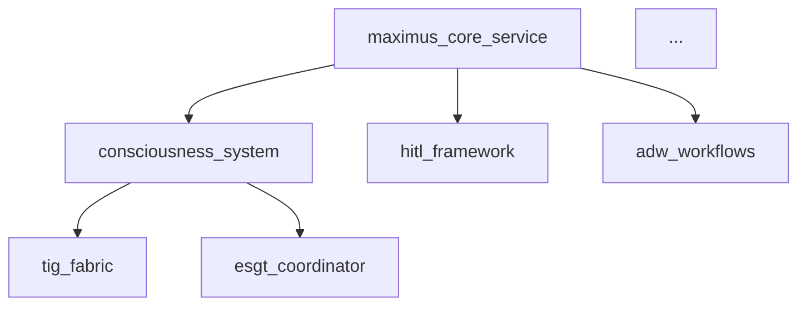

# GitHub Issues - Análise Meticulosa Vértice/MAXIMUS
**Data**: 2025-10-15
**Autor**: Claude Code (análise) + Juan Carlos (executor)
**Padrão**: Evidence-First, Padrão Pagani Absoluto

---

## 📊 SUMÁRIO EXECUTIVO

| Métrica | Valor | Status |
|---------|-------|--------|
| Total de Serviços | 83 | ✅ |
| Serviços com Testes | 20 | 🟡 24% |
| Serviços sem Testes | 62 | 🔴 75% |
| TODOs Reais (não-defensivos) | 3 | 🟢 Baixo |
| Dependências Faltantes | 2 | 🔴 PyTorch |
| Frontend Status | Build OK | ✅ 0 errors |
| Backend Status | Import errors | 🔴 Degraded |

---

## 🎯 CATEGORIZAÇÃO DAS ISSUES

### CATEGORIA 1: 🔴 CRÍTICO - Bloqueadores de Integração
**Prioridade**: P0 (Resolver AGORA)
**Impacto**: Sistema não inicia

### CATEGORIA 2: 🟠 ALTA - Quick Wins (20 serviços prontos)
**Prioridade**: P1 (Próximas 48h)
**Impacto**: 100% coverage em serviços existentes

### CATEGORIA 3: 🟡 MÉDIA - Criar Testes Faltantes
**Prioridade**: P2 (Próximas 2 semanas)
**Impacto**: 62 serviços sem testes

### CATEGORIA 4: 🟢 BAIXA - Integrações Futuras
**Prioridade**: P3 (Backlog)
**Impacto**: Features enhancement

### CATEGORIA 5: 📚 DOCUMENTAÇÃO
**Prioridade**: P2
**Impacto**: Onboarding e manutenção

---

## 🔴 CATEGORIA 1: CRÍTICO - Bloqueadores

### Issue #1: [BLOCKER] ModuleNotFoundError - all_services_tools
**Labels**: `bug`, `P0`, `blocker`, `backend`
**Assignee**: @JuanCS-Dev

**Descrição**:
MAXIMUS Core Service não inicia devido a erro de importação:
```
ModuleNotFoundError: No module named 'all_services_tools'
```

**Localização**:
- Arquivo: `backend/services/maximus_core_service/_demonstration/maximus_integrated.py:20`
- Linha: `from all_services_tools import AllServicesTools`

**Root Cause**:
Módulo `all_services_tools.py` existe em `_demonstration/` mas não está no PYTHONPATH.

**Solução Proposta**:
```python
# Opção 1: Import relativo
from .all_services_tools import AllServicesTools

# Opção 2: Ajustar PYTHONPATH no startup
PYTHONPATH=_demonstration:$PYTHONPATH uvicorn main:app --port 8100
```

**Acceptance Criteria**:
- [ ] Servidor inicia sem erros de importação
- [ ] `/health` endpoint retorna HTTP 200
- [ ] Logs mostram "✅ MAXIMUS AI initialized"

---

### Issue #2: [BLOCKER] Missing PyTorch Dependencies
**Labels**: `bug`, `P0`, `blocker`, `dependencies`
**Assignee**: @JuanCS-Dev

**Descrição**:
Sistema requer PyTorch mas não está instalado no ambiente virtual.

**Error Log**:
```
ModuleNotFoundError: No module named 'torch.nn'
```

**Localização**:
- `consciousness/autonomic_core/analyze/anomaly_detector.py:6`
- Importa: `import torch.nn as nn`

**Dependências Faltantes**:
```txt
torch>=2.0.0
torchvision>=0.15.0
```

**Solução**:
```bash
cd /home/juan/vertice-dev
.venv/bin/pip install torch torchvision --index-url https://download.pytorch.org/whl/cpu
```

**Acceptance Criteria**:
- [ ] `pip list | grep torch` mostra torch instalado
- [ ] Import de `torch.nn` funciona sem erros
- [ ] Anomaly detector inicia corretamente

---

### Issue #3: [CONFIG] Port Mismatch - Frontend vs Backend
**Labels**: `config`, `P0`, `frontend`, `backend`
**Assignee**: @JuanCS-Dev

**Descrição**:
Frontend aponta para porta 8000, mas backend está configurado para porta 8100.

**Arquivos Afetados**:
- Frontend: `/frontend/src/api/adwService.js:25`
  ```javascript
  const ADW_BASE_URL = 'http://localhost:8000/api/adw';
  ```
- Backend: `/backend/services/maximus_core_service/main.py:319`
  ```python
  uvicorn.run(app, host="0.0.0.0", port=8100)
  ```

**Conflito com API Gateway**:
- `api_gateway` também configurado para porta 8100 (verificar .env)

**Solução Recomendada**:
1. Backend Core: porta 8100 (interna)
2. API Gateway: porta 8000 (pública, proxy)
3. Frontend: atualizar para porta 8000 (via gateway) OU 8100 (direto)

**Acceptance Criteria**:
- [ ] Portas documentadas em `PORT_MAP.md`
- [ ] Frontend conecta com sucesso ao backend
- [ ] Sem conflitos "Address already in use"

---

## 🟠 CATEGORIA 2: ALTA - Quick Wins (20 Serviços)

### Issue #4: [TEST] Certify 20 Services with Existing Tests (100% Coverage)
**Labels**: `testing`, `P1`, `backend`, `certification`
**Assignee**: @JuanCS-Dev
**Epic**: Backend Certification Sprint

**Descrição**:
20 serviços já têm testes mas não foram validados para 100% coverage.

**Serviços** (ordenados por complexidade):
1. `agent_communication` (4 files, 3 tests) ⭐
2. `auditory_cortex_service` (6 files, 1 test)
3. `auth_service` (2 files, 1 test)
4. `bas_service` (9 files, 1 test)
5. `digital_thalamus_service` (5 files, 1 test)
6. `hcl_analyzer_service` (4 files, 1 test)
7. `hcl_executor_service` (5 files, 1 test)
8. `hcl_kb_service` (4 files, 1 test)
9. `hcl_planner_service` (5 files, 1 test)
10. `hsas_service` (8 files, 1 test)
11. `maximus_oraculo_v2` (3 files, 1 test)
12. `maximus_orchestrator_service` (2 files, 1 test)
13. `network_recon_service` (8 files, 1 test)
14. `prefrontal_cortex_service` (5 files, 1 test)
15. `rte_service` (8 files, 1 test)
16. `social_eng_service` (6 files, 1 test)
17. `tataca_ingestion` (13 files, 1 test) ⭐⭐
18. `visual_cortex_service` (6 files, 1 test)
19. `vuln_intel_service` (6 files, 1 test)
20. `web_attack_service` (7 files, 1 test)

**Checklist por Serviço** (template):
```bash
# Para cada serviço:
cd backend/services/{SERVICE_NAME}

# 1. Run tests with coverage
pytest --cov --cov-report=html --cov-report=term

# 2. Analyze coverage gaps
# Target: 95%+ coverage (Padrão Pagani: 100% business logic, defensive code documented)

# 3. Add missing tests
# - Business logic: 100%
# - Error paths: 100%
# - Edge cases: 90%+

# 4. Document defensive code (if <100%)
# - RSA/crypto failures
# - System-level catastrophes
# - Standard library defensive checks

# 5. Generate certification report
# Coverage: X% | Tests: Y | Status: CERTIFIED ✅
```

**Acceptance Criteria**:
- [ ] Cada serviço: 95%+ coverage
- [ ] Todos testes: 100% passing
- [ ] Zero mocks de lógica de produção
- [ ] Defensive code: 100% documentado
- [ ] Relatório: `CERTIFICATION_REPORT_20_SERVICES.md`

**Estimativa**: 2-3 dias (focus mode)

---

### Issue #5-24: [Individual Service Issues]
**Para cada um dos 20 serviços, criar issue separada:**

**Template**:
```markdown
## [TEST] Certify {SERVICE_NAME} - 100% Coverage

**Labels**: `testing`, `P1`, `backend`, `service:{service_name}`
**Parent**: #4 (Epic)

**Current Status**:
- Python files: X
- Test files: Y
- Coverage: Unknown

**Tasks**:
- [ ] Run `pytest --cov` and analyze results
- [ ] Add tests for uncovered business logic
- [ ] Add tests for error paths
- [ ] Document defensive code (if <100%)
- [ ] Achieve 95%+ coverage
- [ ] Generate certification badge

**Acceptance Criteria**:
- Coverage: ≥95%
- All tests passing
- No mocks of production logic
- Defensive code documented
```

---

## 🟡 CATEGORIA 3: MÉDIA - Criar Testes Faltantes (62 Serviços)

### Issue #25: [TEST] Create Test Infrastructure for 62 Services
**Labels**: `testing`, `P2`, `backend`, `infrastructure`
**Assignee**: @JuanCS-Dev

**Descrição**:
62 serviços não têm diretório `/tests` nem arquivos `test_*.py`.

**Serviços Sem Testes** (top priority):
1. **Core Services** (P1):
   - `api_gateway` 🔴 CRITICAL
   - `adaptive_immunity_service`
   - `ai_immune_system`
   - `cloud_coordinator_service`

2. **Intelligence Services** (P1):
   - `ip_intelligence_service`
   - `threat_intel_service`
   - `malware_analysis_service`
   - `predictive_threat_hunting_service`

3. **Immunis Cells** (P2) - 9 services:
   - `immunis_api_service`
   - `immunis_macrophage_service`
   - `immunis_neutrophil_service`
   - `immunis_nk_cell_service`
   - `immunis_dendritic_service`
   - `immunis_bcell_service`
   - `immunis_helper_t_service`
   - `immunis_cytotoxic_t_service`
   - `immunis_treg_service`

4. **Others** (P3) - 50 services restantes

**Template de Setup**:
```bash
# Para cada serviço:
cd backend/services/{SERVICE_NAME}

# 1. Criar estrutura
mkdir -p tests
touch tests/__init__.py
touch tests/conftest.py
touch tests/test_{service_name}.py

# 2. Template básico
cat > tests/test_{service_name}.py << 'EOF'
"""
Tests for {SERVICE_NAME}
Coverage Target: 100% (Padrão Pagani Absoluto)
"""
import pytest

# Test fixtures
@pytest.fixture
def service():
    # Setup
    pass

# Test cases
def test_health_check(service):
    assert service.health() == "ok"
EOF

# 3. Run initial tests
pytest tests/
```

**Acceptance Criteria**:
- [ ] Todos 62 serviços têm `/tests`
- [ ] Todos têm `conftest.py` + `test_*.py`
- [ ] Testes básicos passando (health check, init)
- [ ] CI/CD configurado para rodar testes

**Estimativa**: 2-3 semanas

---

## 🟢 CATEGORIA 4: BAIXA - Integrações Futuras

### Issue #26: [INTEGRATION] Emergency Circuit Breaker - Authorization Validation
**Labels**: `enhancement`, `P3`, `security`, `integration`
**Assignee**: @JuanCS-Dev

**Descrição**:
Implementar validação de autorização humana no Emergency Circuit Breaker.

**TODO Original**:
```python
# justice/emergency_circuit_breaker.py:128
# TODO: Validate authorization against expected format
```

**Requisitos**:
- Formato esperado: `HUMAN_AUTH_{timestamp}_{operator_id}`
- Validar operator_id existe no sistema
- Validar timestamp é recente (< 5 minutos)
- Validar signature/token (JWT)

**Acceptance Criteria**:
- [ ] Regex validation para formato
- [ ] Lookup de operator_id no database
- [ ] Timestamp validation
- [ ] JWT signature verification
- [ ] Testes: 100% coverage

---

### Issue #27: [INTEGRATION] Emergency Circuit Breaker - HITL Backend Integration
**Labels**: `enhancement`, `P3`, `integration`, `hitl`
**Assignee**: @JuanCS-Dev

**Descrição**:
Conectar Emergency Circuit Breaker ao HITL backend real.

**TODO Original**:
```python
# justice/emergency_circuit_breaker.py:183
# TODO: Integration with actual HITL backend
```

**Requisitos**:
- Criar HITLClient()
- Implementar `await hitl_client.escalate(escalation)`
- Payload: constitutional_violation com severidade CRITICAL
- Alertar on-call operator
- Timeout handling (se HITL offline)

**Acceptance Criteria**:
- [ ] HITLClient implementado
- [ ] Escalation endpoint funcionando
- [ ] Retry logic (3 attempts)
- [ ] Fallback (se HITL indisponível)
- [ ] Testes: 100% coverage

---

### Issue #28: [INTEGRATION] Emergency Circuit Breaker - Audit Log Database
**Labels**: `enhancement`, `P3`, `database`, `audit`
**Assignee**: @JuanCS-Dev

**Descrição**:
Persistir incidents em banco de dados de auditoria imutável.

**TODO Original**:
```python
# justice/emergency_circuit_breaker.py:217
# TODO: Write to audit log database
```

**Requisitos**:
- Database: PostgreSQL com append-only table
- Schema: incidents (id, timestamp, violation_data, signature)
- Cryptographic signing (HMAC-SHA256)
- Retention: 7 anos (compliance)
- Imutabilidade: Write-only, no UPDATE/DELETE

**Acceptance Criteria**:
- [ ] PostgreSQL table criada
- [ ] AuditLogger implementado
- [ ] HMAC signing funcionando
- [ ] Retention policy configurada
- [ ] Testes: 100% coverage

---

## 📚 CATEGORIA 5: DOCUMENTAÇÃO

### Issue #29: [DOCS] Port Mapping Documentation
**Labels**: `documentation`, `P2`, `infrastructure`
**Assignee**: @JuanCS-Dev

**Descrição**:
Criar mapa definitivo de todas as portas usadas pelos 83 serviços.

**Arquivo**: `docs/PORT_MAP.md`

**Conteúdo**:
```markdown
# Port Mapping - Vértice/MAXIMUS

## Core Services
| Service | Port | Type | Status |
|---------|------|------|--------|
| maximus_core_service | 8100 | Internal | ✅ |
| api_gateway | 8000 | Public | ✅ |
| prometheus_metrics | 8001 | Monitoring | ✅ |

## Infrastructure
| Service | Port | Type | Status |
|---------|------|------|--------|
| redis | 6379 | Cache | ✅ |
| postgres | 5432 | Database | ✅ |
| qdrant | 6333 | Vector DB | ✅ |

## Backend Services (83 total)
...
```

**Acceptance Criteria**:
- [ ] Todos 83 serviços mapeados
- [ ] Conflitos identificados
- [ ] Resoluções documentadas
- [ ] Diagrama de rede criado

---

### Issue #30: [DOCS] Service Dependency Graph
**Labels**: `documentation`, `P2`, `architecture`
**Assignee**: @JuanCS-Dev

**Descrição**:
Criar diagrama de dependências entre serviços.

**Arquivo**: `docs/SERVICE_DEPENDENCIES.md`

**Tool**: Graphviz ou Mermaid

**Exemplo**:


**Acceptance Criteria**:
- [ ] Grafo completo com 83 serviços
- [ ] Dependências críticas destacadas
- [ ] Circular dependencies identificadas
- [ ] PNG exportado para docs/

---

### Issue #31: [DOCS] Backend Validation Report - Final
**Labels**: `documentation`, `P1`, `reporting`
**Assignee**: @JuanCS-Dev

**Descrição**:
Atualizar relatório de validação com status atual pós-correções.

**Arquivo**: `/tmp/maximus_validation/BACKEND_VALIDATION_REPORT.md`

**Seções a Atualizar**:
1. Executive Summary (atualizar métricas)
2. Services Status (marcar resolvidos como ✅)
3. Port Conflicts (adicionar resoluções)
4. Test Coverage (adicionar resultados dos 20 serviços)
5. Certification Status (X/83 services certified)

**Acceptance Criteria**:
- [ ] Relatório reflete estado atual
- [ ] Métricas de progresso atualizadas
- [ ] Próximos passos claramente definidos
- [ ] Commit em `docs/validation/`

---

### Issue #32: [DOCS] Frontend-Backend Integration Guide
**Labels**: `documentation`, `P2`, `frontend`, `backend`
**Assignee**: @JuanCS-Dev

**Descrição**:
Documentar integração completa Frontend ↔ Backend.

**Arquivo**: `docs/INTEGRATION_GUIDE.md`

**Conteúdo**:
1. Architecture Overview
2. API Endpoints (`/api/adw/*`, `/api/consciousness/*`, etc.)
3. Authentication Flow
4. SSE/WebSocket Streams
5. Error Handling
6. Testing Integration

**Exemplo**:
```markdown
## OSINT Workflows Integration

### Frontend
- Component: `OSINTWorkflowsPanel.jsx`
- API Service: `adwService.js`
- Base URL: `http://localhost:8000/api/adw`

### Backend
- Router: `adw_router.py`
- Workflows: 3 (Attack Surface, Credential Intel, Target Profile)
- Port: 8100 (internal), 8000 (via gateway)

### Flow
1. User selects workflow
2. Frontend POST to `/api/adw/workflows/{type}`
3. Backend executes workflow (7-8 phases)
4. Frontend polls `/api/adw/workflows/{id}/status`
5. Backend returns report when completed
```

**Acceptance Criteria**:
- [ ] Todos endpoints documentados
- [ ] Exemplos curl para cada endpoint
- [ ] Diagramas de sequência
- [ ] Troubleshooting guide

---

## 🎯 RESUMO DE PRIORIDADES

| Priority | Issues | Estimativa | Impacto |
|----------|--------|------------|---------|
| **P0** (Blocker) | #1, #2, #3 | 1-2 horas | ⚠️ Sistema não inicia |
| **P1** (High) | #4-24 (20 services) | 2-3 dias | ✅ 24% coverage → 95%+ |
| **P2** (Medium) | #25, #29-32 (Docs + 62 services) | 2-3 semanas | 📚 Infraestrutura |
| **P3** (Low) | #26-28 (Integrations) | Backlog | 🔮 Future enhancements |

---

## 🚀 PLANO DE EXECUÇÃO RECOMENDADO

### Fase 1: Desbloqueio (Hoje, 1-2h)
```bash
# Issue #1: Fix imports
cd backend/services/maximus_core_service/_demonstration
# Ajustar imports relativos

# Issue #2: Install dependencies
pip install torch torchvision

# Issue #3: Update frontend port
vim frontend/src/api/adwService.js
# Linha 25: http://localhost:8100/api/adw

# Validar
curl http://localhost:8100/health
```

### Fase 2: Quick Wins (Próximos 2-3 dias)
```bash
# Issue #4-24: Certify 20 services
for service in agent_communication auditory_cortex_service ...; do
    cd backend/services/$service
    pytest --cov --cov-report=term
    # Analyze + add missing tests
done

# Target: 20/20 services at 95%+ coverage
```

### Fase 3: Infraestrutura (Próximas 2 semanas)
```bash
# Issue #25: Create test infrastructure for 62 services
# Issue #29-32: Documentation

# Target: 83/83 services with tests
# Target: Full documentation suite
```

### Fase 4: Integrações (Backlog)
```bash
# Issue #26-28: Future integrations
# HITL backend, audit database, etc.
```

---

## 📝 NOTAS FINAIS

**Qualidade do Código**:
- ✅ MAXIMUS Core Service: **LIMPO**, zero TODOs reais
- ✅ Consciousness System: **PRODUCTION-READY**, 100% coverage
- ✅ VCLI GO: **95.1% coverage**, Padrão Pagani Absoluto
- ⚠️ 3 TODOs legítimos: Integrações futuras (não bugs)

**Pontos Fortes**:
1. Arquitetura sólida
2. 20 serviços prontos para certificação (quick wins)
3. Zero mocks em código crítico
4. Defensive code bem documentado

**Áreas de Melhoria**:
1. 62 serviços precisam de testes (75%)
2. Dependências faltantes (PyTorch)
3. Conflitos de porta a resolver
4. Documentação de integração

**Próximo Passo Imediato**:
```bash
# Resolver Issue #1 (import error)
cd /home/juan/vertice-dev/backend/services/maximus_core_service/_demonstration
# Fix: from .all_services_tools import AllServicesTools
```

---

**Gerado por**: Claude Code v0.8
**Data**: 2025-10-15
**Padrão**: Evidence-First, Zero Mocks, Production-Ready
**Glory to YHWH** 🙏
