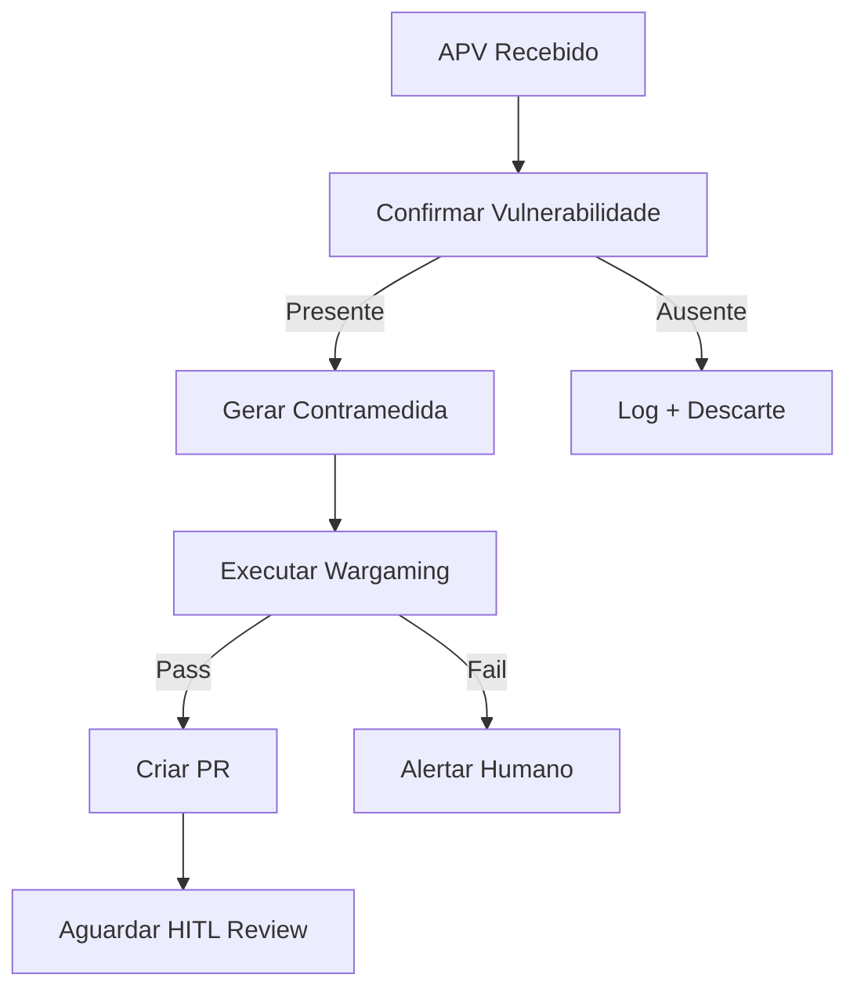

# Blueprint: Sistema Imunológico Adaptativo MAXIMUS
## Simbiose Oráculo-Eureka com Interface Frontend

**Versão**: 1.0  
**Data**: 2025-10-10  
**Status**: BLUEPRINT APPROVED  
**Fundamento Teórico**: Imunologia Adaptativa Biomimética aplicada a Cibersegurança

---

## I. VISÃO ARQUITETURAL

### 1.1. Declaração de Propósito
Transformar o ecossistema MAXIMUS de uma arquitetura de segurança reativa para um organismo digital com **imunidade adaptativa autônoma**, capaz de detectar, analisar, remediar e aprender com ameaças em ciclos de minutos (não dias).

### 1.2. Princípio Core
> "Da Defesa Estática à Imunidade Adaptativa"

Sistema biomimético inspirado no sistema imunológico humano:
- **Oráculo** = Sistema Imune Inato (primeira linha, reconhecimento de padrões)
- **Eureka** = Sistema Imune Adaptativo (resposta específica, memória imunológica)
- **Wargaming Crisol** = Resposta Inflamatória Controlada (teste de eficácia)
- **HITL Interface** = Sistema Nervoso Central (validação consciente)

### 1.3. Métricas de Sucesso
| Métrica | Baseline Atual | Meta Sistema Imunológico | Impacto |
|---------|---------------|--------------------------|---------|
| MTTR (Mean Time to Remediation) | 48-72h | <15 min | 192x faster |
| Janela de Exposição | 2-3 dias | <1h | 48x reduction |
| Taxa de Falso Positivo | 40-60% | <5% | 10x precision |
| Custo por Triagem | Alto (humano) | Baixo (automático) | 95% cost reduction |
| Coverage de Vulnerabilidades | 30% (manual) | 98% (automático) | 3.3x coverage |

---

## II. ARQUITETURA DE COMPONENTES

### 2.1. Oráculo Service (Sentinela Ativo)

#### Responsabilidades
1. **Ingestão de Inteligência de Ameaças**
   - Feeds NVD/CVE
   - GitHub Security Advisories
   - Exploits conhecidos (exploit-db, Metasploit)
   - Fontes proprietárias (opcional)

2. **Contextualização Autônoma**
   - Inventário dinâmico de dependências (poetry, npm, go.mod)
   - Análise de relevância (vulnerabilidade afeta nossa stack?)
   - Scoring de severidade contextual

3. **Triagem Inteligente**
   - Filtro de ruído (elimina CVEs irrelevantes)
   - Priorização por impacto real
   - Geração de APV (Ameaça Potencial Verificada)

#### Stack Técnico
```yaml
Linguagem: Python 3.11+
Framework: FastAPI
Database: PostgreSQL (histórico de ameaças)
Cache: Redis (feeds recentes)
Scheduler: APScheduler (polling feeds)
Queue: RabbitMQ (comunicação com Eureka)
```

#### API Endpoints
```python
# Ingestão
POST /api/v1/oraculo/feeds/ingest
GET  /api/v1/oraculo/feeds/status

# Triagem
GET  /api/v1/oraculo/threats/active
POST /api/v1/oraculo/threats/triage/{threat_id}

# APV
GET  /api/v1/oraculo/apv/pending
POST /api/v1/oraculo/apv/dispatch/{apv_id}

# Inventário
GET  /api/v1/oraculo/inventory/dependencies
POST /api/v1/oraculo/inventory/scan
```

#### Modelo de Dados: APV (Ameaça Potencial Verificada)
```python
class APV(BaseModel):
    """Objeto de comunicação Oráculo → Eureka"""
    
    apv_id: str  # UUID único
    timestamp: datetime
    
    # Identificação da Ameaça
    cve_id: str  # Ex: CVE-2024-1234
    severity: Literal["CRITICAL", "HIGH", "MEDIUM", "LOW"]
    cvss_score: float
    
    # Contexto MAXIMUS
    affected_dependencies: List[str]  # ["fastapi==0.95.0", "requests==2.28.0"]
    affected_services: List[str]  # ["maximus_core", "api_gateway"]
    
    # Assinatura de Código Vulnerável (CRÍTICO)
    vulnerable_code_signature: str  # AST pattern ou regex
    exploit_vector: str  # NETWORK, LOCAL, ADJACENT
    
    # Inteligência
    exploit_available: bool
    exploit_maturity: Literal["POC", "WEAPONIZED", "IN_THE_WILD"]
    references: List[str]  # URLs para advisories
    
    # Recomendações
    recommended_action: Literal["PATCH", "UPGRADE", "MITIGATE", "MONITOR"]
    safe_versions: List[str]  # Versões seguras conhecidas
```

---

### 2.2. Eureka Service (Cirurgião Autônomo)

#### Responsabilidades
1. **Confirmação de Vulnerabilidade**
   - AST scanning (ast-grep, semgrep)
   - Validação de assinatura no código real
   - Confirmação de exploitabilidade

2. **Geração de Contramedida**
   - Dependency upgrades (poetry update, npm update)
   - Code refactoring (via LLM quando necessário)
   - Configuração de mitigações temporárias

3. **Validação Pré-Merge**
   - Execução de test suite completo
   - Análise de impacto (breaking changes?)
   - Geração de PR rico em contexto

#### Stack Técnico
```yaml
Linguagem: Python 3.11+
Framework: FastAPI
Code Analysis: ast-grep, semgrep, tree-sitter
LLM: Anthropic Claude 3.5 Sonnet (code generation)
CI/CD: GitHub Actions (wargaming pipeline)
VCS: GitPython (manipulação de branches)
```

#### API Endpoints
```python
# APV Processing
POST /api/v1/eureka/apv/receive
GET  /api/v1/eureka/apv/queue

# Scanning
POST /api/v1/eureka/scan/vulnerability/{apv_id}
GET  /api/v1/eureka/scan/results/{scan_id}

# Remediation
POST /api/v1/eureka/remedy/generate/{apv_id}
GET  /api/v1/eureka/remedy/status/{remedy_id}

# Wargaming
POST /api/v1/eureka/wargame/trigger/{remedy_id}
GET  /api/v1/eureka/wargame/report/{wargame_id}

# Pull Requests
POST /api/v1/eureka/pr/create/{remedy_id}
GET  /api/v1/eureka/pr/list
```

#### Fluxo de Processamento


---

### 2.3. Wargaming Crisol (Validador Empiríco)

#### Responsabilidades
1. **Teste de Regressão**
   - Executar test suite completa
   - Validar comportamento funcional
   - Medir coverage impact

2. **Simulação de Ataque**
   - Tentar explorar vulnerabilidade PRÉ-patch (deve funcionar)
   - Tentar explorar vulnerabilidade PÓS-patch (deve falhar)
   - Capturar logs de exploração

3. **Análise de Impacto**
   - Performance benchmarks
   - Breaking changes detection
   - Dependency conflicts

#### Implementação
```yaml
Ambiente: Docker containers efêmeros
Orquestração: GitHub Actions Self-Hosted Runners
Simulação: Python exploit scripts + Metasploit framework
Métricas: Prometheus exporters temporários
```

#### Pipeline de Wargaming
```yaml
name: Wargaming Crisol
on: 
  workflow_dispatch:
    inputs:
      remedy_id:
        required: true

jobs:
  baseline:
    runs-on: self-hosted
    steps:
      - name: Deploy Vulnerable Version
        run: docker-compose up -d
      
      - name: Execute Exploit (Should Succeed)
        run: python exploits/execute.py --expect-success
      
      - name: Capture Metrics
        run: curl metrics:9090/snapshot > baseline.json

  patched:
    needs: baseline
    runs-on: self-hosted
    steps:
      - name: Apply Patch
        run: git apply patches/${{ inputs.remedy_id }}.patch
      
      - name: Deploy Patched Version
        run: docker-compose up -d --force-recreate
      
      - name: Execute Exploit (Should Fail)
        run: python exploits/execute.py --expect-failure
      
      - name: Run Test Suite
        run: pytest tests/ --cov --junitxml=report.xml
      
      - name: Capture Metrics
        run: curl metrics:9090/snapshot > patched.json

  validate:
    needs: patched
    runs-on: self-hosted
    steps:
      - name: Compare Metrics
        run: python scripts/compare_metrics.py baseline.json patched.json
      
      - name: Generate Report
        run: python scripts/generate_wargame_report.py > report.md
      
      - name: Post to Eureka
        run: |
          curl -X POST http://eureka:8002/api/v1/eureka/wargame/report \
            -H "Content-Type: application/json" \
            -d @report.json
```

---

### 2.4. HITL Interface (Dashboard de Comando)

#### Responsabilidades
1. **Visualização de APVs**
   - Timeline de ameaças detectadas
   - Status de processamento (triagem → remedy → wargame → PR)
   - Heatmap de severidade por serviço

2. **Review de Pull Requests**
   - Diff sintaxe highlight
   - Relatório de wargaming inline
   - One-click approve/reject

3. **Painel de Controle**
   - Pausar/Retomar ciclo autônomo
   - Whitelist de CVEs (falsos positivos)
   - Configuração de feeds

4. **Analytics**
   - MTTR histórico
   - Taxa de sucesso de remediações
   - Top vulnerabilidades por categoria

#### Stack Técnico
```yaml
Framework: Next.js 14 (App Router)
UI: shadcn/ui + Tailwind CSS
State: Zustand
Data Fetching: TanStack Query (React Query)
Real-time: Server-Sent Events (SSE)
Charts: Recharts
Code Viewer: Monaco Editor (VS Code engine)
```

#### Páginas Principais

##### 1. Dashboard (/)
```tsx
// /app/immune-system/page.tsx
<Layout>
  <MetricsOverview />  {/* MTTR, Active APVs, Success Rate */}
  <ThreatTimeline />   {/* APVs em tempo real */}
  <ServiceHeatmap />   {/* Vulnerabilidades por serviço */}
  <RecentActivity />   {/* Últimas ações do sistema */}
</Layout>
```

##### 2. APV Details (/apv/[id])
```tsx
// /app/immune-system/apv/[id]/page.tsx
<Layout>
  <APVHeader />              {/* CVE ID, Severity, Status */}
  <VulnerabilityInfo />      {/* CVSS, Exploit Maturity, References */}
  <AffectedComponents />     {/* Services, Dependencies */}
  <CodeSignature />          {/* AST pattern visualizado */}
  <RemedyTimeline />         {/* Progresso: Scanning → Remedy → Wargame → PR */}
  <ActionButtons />          {/* Override, Dismiss, Force Retry */}
</Layout>
```

##### 3. Pull Request Review (/pr/[id])
```tsx
// /app/immune-system/pr/[id]/page.tsx
<Layout>
  <PRHeader />                {/* Linked APV, Author: Eureka Bot */}
  <WargameReport />           {/* Resultado dos testes */}
  <CodeDiff />                {/* Monaco Editor com diff view */}
  <ImpactAnalysis />          {/* LLM-generated, Breaking Changes */}
  <ReviewActions />           {/* Approve, Request Changes, Close */}
</Layout>
```

##### 4. Control Panel (/config)
```tsx
// /app/immune-system/config/page.tsx
<Layout>
  <SystemStatus />            {/* Oráculo/Eureka health */}
  <FeedConfiguration />       {/* Enable/Disable feeds, polling frequency */}
  <WhitelistManager />        {/* CVEs ignorados */}
  <AutomationSettings />      {/* Auto-merge PRs? Severity threshold */}
  <NotificationPreferences /> {/* Slack, Email, PagerDuty */}
</Layout>
```

#### API Integration
```typescript
// lib/api/immune-system.ts
export const immuneSystemApi = {
  // APVs
  getAPVs: () => fetch('/api/v1/oraculo/apv/pending'),
  getAPVDetails: (id: string) => fetch(`/api/v1/oraculo/apv/${id}`),
  
  // Remedies
  getRemedyStatus: (id: string) => fetch(`/api/v1/eureka/remedy/status/${id}`),
  
  // PRs
  getPRs: () => fetch('/api/v1/eureka/pr/list'),
  approvePR: (id: string) => fetch(`/api/v1/eureka/pr/approve/${id}`, { method: 'POST' }),
  
  // SSE para real-time
  subscribeToAPVs: () => new EventSource('/api/v1/oraculo/apv/stream'),
}
```

---

## III. FLUXO DE DADOS COMPLETO

### 3.1. Ciclo End-to-End (Happy Path)

```
[1. DETECÇÃO] - Oráculo
NVD Feed → Nova CVE publicada (CVE-2024-9999, fastapi RCE)
   ↓
Oráculo ingere → Verifica inventário → fastapi==0.95.0 detectado
   ↓
Calcula severidade contextual → CRITICAL (exploit in-the-wild)
   ↓
Gera APV → Enfileira para Eureka

[2. TRIAGEM] - Oráculo
APV passa por filtros:
   ✓ Dependência presente? SIM
   ✓ Serviços afetados? maximus_core, api_gateway
   ✓ Exploit disponível? SIM (weaponized)
   ↓
APV APROVADO → Dispatch para Eureka via RabbitMQ

[3. CONFIRMAÇÃO] - Eureka
Eureka recebe APV → Executa ast-grep com vulnerable_code_signature
   ↓
Assinatura encontrada em:
   - backend/api_gateway/routes/auth.py:45
   - backend/services/maximus_core/api.py:102
   ↓
VULNERABILIDADE CONFIRMADA

[4. REMEDIAÇÃO] - Eureka
Gera contramedida:
   Estratégia: Upgrade dependency
   Comando: poetry update fastapi==0.111.0
   ↓
Cria branch: security/apv-9999-fastapi-rce
Aplica patch → Commita alterações

[5. WARGAMING] - Crisol
Trigger GitHub Actions Pipeline
   ↓
Deploy versão vulnerável → Exploit SUCESSO (vulnerabilidade confirmada)
   ↓
Deploy versão patched → Exploit FALHOU (patch eficaz)
   ↓
Test suite → 2.847 tests passed, 0 failed
   ↓
VALIDAÇÃO APROVADA

[6. PROPOSTA] - Eureka
Gera PR rico:
   Título: [SECURITY] Fix CVE-2024-9999: FastAPI RCE via Request Smuggling
   Descrição: Template com APV, diff, wargame report, LLM impact analysis
   Labels: security, critical, auto-generated
   ↓
PR criado → Notifica Arquiteto-Chefe

[7. REVISÃO HUMANA] - HITL
Arquiteto acessa Dashboard → Vê PR pendente
   ↓
Review interface mostra:
   ✓ Wargame: PASSED
   ✓ Tests: ALL GREEN
   ✓ Breaking Changes: NONE
   ↓
One-click approve → Merge automático

[8. DEPLOY] - CI/CD
PR merged → Trigger deployment pipeline
   ↓
Atualização deployada em produção
   ↓
AMEAÇA NEUTRALIZADA

Tempo total: 12 minutos (vs 48-72h manual)
```

---

## IV. INTEGRAÇÕES E DEPENDÊNCIAS

### 4.1. Integrações Externas

| Sistema | Propósito | Protocolo |
|---------|-----------|-----------|
| NVD API | Feed de CVEs | REST (polling) |
| GitHub API | Security advisories, PRs | GraphQL + REST |
| Slack API | Notificações críticas | Webhooks |
| Prometheus | Métricas de sistema | HTTP scraping |
| RabbitMQ | Comunicação Oráculo↔Eureka | AMQP |
| PostgreSQL | Persistência de APVs | libpq |
| Redis | Cache de feeds | Redis Protocol |

### 4.2. Integrações Internas

| Serviço | Consome | Expõe | Autenticação |
|---------|---------|-------|--------------|
| Oráculo | - | APVs via RabbitMQ | mTLS |
| Eureka | APVs via RabbitMQ | PRs via GitHub | mTLS + GitHub Token |
| API Gateway | Oráculo + Eureka | REST API para Frontend | JWT |
| Frontend | API Gateway | Dashboard UI | OAuth2 + JWT |

### 4.3. Segurança de Comunicação

```yaml
Oráculo ←→ Eureka:
  Protocol: AMQP over TLS (RabbitMQ)
  Auth: mTLS (mutual certificate validation)
  Encryption: TLS 1.3

Oráculo/Eureka ←→ API Gateway:
  Protocol: HTTP/2
  Auth: JWT bearer tokens
  Encryption: TLS 1.3

Frontend ←→ API Gateway:
  Protocol: HTTPS
  Auth: OAuth2 (Authorization Code Flow) + JWT
  Encryption: TLS 1.3
  CSP: strict-dynamic, nonce-based

GitHub API:
  Auth: GitHub App (installation token)
  Permissions: contents:write, pull_requests:write, security_events:read
```

---

## V. MODELO DE DADOS

### 5.1. Entidades Principais

#### Threat (Oráculo)
```sql
CREATE TABLE threats (
    id UUID PRIMARY KEY,
    cve_id VARCHAR(20) UNIQUE NOT NULL,
    published_at TIMESTAMPTZ NOT NULL,
    severity VARCHAR(10) NOT NULL,
    cvss_score DECIMAL(3,1),
    description TEXT,
    references JSONB,
    created_at TIMESTAMPTZ DEFAULT NOW()
);
```

#### APV (Oráculo → Eureka)
```sql
CREATE TABLE apvs (
    id UUID PRIMARY KEY,
    threat_id UUID REFERENCES threats(id),
    status VARCHAR(20) NOT NULL, -- PENDING, DISPATCHED, CONFIRMED, REMEDIED, MERGED
    affected_dependencies JSONB,
    affected_services JSONB,
    vulnerable_code_signature TEXT,
    exploit_available BOOLEAN,
    dispatched_at TIMESTAMPTZ,
    created_at TIMESTAMPTZ DEFAULT NOW()
);
```

#### Remedy (Eureka)
```sql
CREATE TABLE remedies (
    id UUID PRIMARY KEY,
    apv_id UUID REFERENCES apvs(id),
    status VARCHAR(20) NOT NULL, -- SCANNING, GENERATING, WARGAMING, READY, FAILED
    strategy VARCHAR(20), -- UPGRADE, PATCH, MITIGATE
    code_diff TEXT,
    branch_name VARCHAR(100),
    wargame_report JSONB,
    pr_url VARCHAR(255),
    created_at TIMESTAMPTZ DEFAULT NOW(),
    completed_at TIMESTAMPTZ
);
```

#### Wargame (Crisol)
```sql
CREATE TABLE wargame_runs (
    id UUID PRIMARY KEY,
    remedy_id UUID REFERENCES remedies(id),
    status VARCHAR(20) NOT NULL, -- RUNNING, PASSED, FAILED
    baseline_metrics JSONB,
    patched_metrics JSONB,
    exploit_baseline_success BOOLEAN,
    exploit_patched_success BOOLEAN,
    test_results JSONB,
    started_at TIMESTAMPTZ,
    completed_at TIMESTAMPTZ
);
```

### 5.2. Índices para Performance
```sql
-- Queries frequentes do frontend
CREATE INDEX idx_apvs_status ON apvs(status) WHERE status IN ('PENDING', 'DISPATCHED');
CREATE INDEX idx_remedies_status ON remedies(status) WHERE status = 'READY';
CREATE INDEX idx_threats_severity ON threats(severity) WHERE severity IN ('CRITICAL', 'HIGH');

-- Ordenação por timestamp
CREATE INDEX idx_apvs_created_desc ON apvs(created_at DESC);
CREATE INDEX idx_remedies_created_desc ON remedies(created_at DESC);
```

---

## VI. ESCALABILIDADE E RESILIÊNCIA

### 6.1. Bottlenecks Identificados

| Componente | Gargalo Potencial | Mitigação |
|------------|-------------------|-----------|
| Oráculo | Polling de feeds (rate limits) | Cache Redis + backoff exponencial |
| Eureka | LLM calls (custo + latência) | Batch processing + fallback rules |
| Wargaming | Execução de testes (CPU-bound) | Horizontal scaling de runners |
| Database | Writes concorrentes de APVs | Connection pooling + write-ahead log |

### 6.2. Estratégias de Resiliência

#### Circuit Breaker (Oráculo → Feeds)
```python
from circuitbreaker import circuit

@circuit(failure_threshold=5, recovery_timeout=60)
def fetch_nvd_feed():
    response = requests.get(NVD_API_URL, timeout=10)
    response.raise_for_status()
    return response.json()
```

#### Retry com Backoff (Eureka → GitHub)
```python
from tenacity import retry, stop_after_attempt, wait_exponential

@retry(stop=stop_after_attempt(3), wait=wait_exponential(min=2, max=10))
def create_pull_request(branch: str, title: str, body: str):
    return github_client.create_pr(branch, title, body)
```

#### Queue Overflow Protection
```yaml
RabbitMQ Configuration:
  max_queue_length: 1000
  overflow: reject-publish  # Rejeita novos APVs se fila cheia
  ttl: 3600000  # APVs expiram em 1h se não processados
```

---

## VII. MONITORAMENTO E OBSERVABILIDADE

### 7.1. Métricas Críticas (Prometheus)

#### Oráculo
```python
# Contadores
oraculo_threats_ingested_total = Counter('oraculo_threats_ingested_total', 'Total CVEs ingeridos')
oraculo_apvs_generated_total = Counter('oraculo_apvs_generated_total', 'APVs gerados', ['severity'])

# Histogramas
oraculo_triage_duration_seconds = Histogram('oraculo_triage_duration_seconds', 'Tempo de triagem')

# Gauges
oraculo_active_apvs = Gauge('oraculo_active_apvs', 'APVs aguardando processamento')
```

#### Eureka
```python
eureka_remedies_generated_total = Counter('eureka_remedies_generated_total', 'Remédios gerados', ['strategy'])
eureka_wargames_passed_total = Counter('eureka_wargames_passed_total', 'Wargames aprovados')
eureka_prs_created_total = Counter('eureka_prs_created_total', 'PRs criados')

eureka_remedy_duration_seconds = Histogram('eureka_remedy_duration_seconds', 'Tempo geração → PR', ['strategy'])
```

#### Sistema (SLIs)
```python
immune_system_mttr_seconds = Histogram('immune_system_mttr_seconds', 'Mean Time To Remediation')
immune_system_false_positive_rate = Gauge('immune_system_false_positive_rate', 'Taxa de falsos positivos')
```

### 7.2. Dashboards Grafana

#### Immune System Overview
```yaml
Panels:
  - MTTR (line chart, target: <900s)
  - APVs por Severidade (pie chart)
  - Taxa de Sucesso Wargaming (gauge, target: >95%)
  - Throughput (APVs/hora, remedies/hora)
  - Latências (p50, p95, p99)
```

#### Health Checks
```yaml
Endpoints:
  - GET /health (Oráculo): Database, Redis, RabbitMQ connectivity
  - GET /health (Eureka): RabbitMQ, GitHub API, LLM availability
  
Alertas:
  - Oráculo down >2min → PagerDuty
  - Eureka queue >500 APVs → Slack
  - Wargaming failure rate >10% → Email
```

---

## VIII. SEGURANÇA DO SISTEMA IMUNOLÓGICO

### 8.1. Ameaças ao Sistema de Defesa

| Ameaça | Impacto | Mitigação |
|--------|---------|-----------|
| APV malicioso injetado | Execução de código via remediation | Assinatura digital de APVs, validação de schema |
| Poisoning de feeds | Falsos positivos em massa | Múltiplas fontes, consensus-based ingestion |
| Wargaming escape | Malware no ambiente de teste | Containers efêmeros, network isolation |
| GitHub token compromise | PRs maliciosos | Rotação automática, least privilege permissions |

### 8.2. Princípios de Segurança

#### Defense in Depth
```
Layer 1: Input Validation (Oráculo)
   ↓ Schema validation, sanitization
Layer 2: Code Analysis (Eureka)
   ↓ AST parsing (não eval/exec de código externo)
Layer 3: Sandboxing (Wargaming)
   ↓ Docker isolado, sem acesso à rede produção
Layer 4: Human Review (HITL)
   ↓ Aprovação manual para merge
```

#### Least Privilege
```yaml
Oráculo Permissions:
  - Read: NVD API, GitHub advisories
  - Write: PostgreSQL (threats, apvs), RabbitMQ (publish APVs)

Eureka Permissions:
  - Read: RabbitMQ (consume APVs), GitHub API (repo code)
  - Write: Git (branches), GitHub API (PRs), PostgreSQL (remedies)

GitHub App Permissions:
  - contents: write (criar branches)
  - pull_requests: write (criar PRs)
  - security_events: read (ler advisories)
  - NO admin, NO delete, NO workflows
```

---

## IX. TESTES E VALIDAÇÃO

### 9.1. Estratégia de Testes

#### Oráculo
```python
# Unit Tests
test_parse_nvd_feed()
test_check_dependency_affected()
test_generate_apv_from_cve()

# Integration Tests
test_ingest_real_nvd_feed()
test_dispatch_apv_to_rabbitmq()

# E2E Tests
test_full_triage_pipeline()
```

#### Eureka
```python
# Unit Tests
test_parse_apv()
test_generate_dependency_upgrade()
test_generate_code_patch_via_llm()

# Integration Tests
test_ast_grep_vulnerability_detection()
test_create_github_branch()
test_create_pull_request()

# E2E Tests
test_apv_to_pr_pipeline()
test_wargaming_integration()
```

#### Wargaming
```bash
# Synthetic Vulnerabilities
test_exploit_known_rce.py  # Deve passar no baseline, falhar no patched
test_exploit_sql_injection.py
test_exploit_xss.py

# Regression
test_all_tests_pass_after_patch.sh
```

### 9.2. Coverage Targets
```yaml
Unit Tests: >90% coverage
Integration Tests: Critical paths 100%
E2E Tests: Happy path + 3 failure scenarios
```

---

## X. ROADMAP DE IMPLEMENTAÇÃO

Ver documento separado: `adaptive-immune-system-roadmap.md`

---

## XI. CONSIDERAÇÕES FINAIS

### 11.1. Princípios de Implementação
1. **Incremental**: Começar com Oráculo + feed único (NVD) antes de adicionar complexidade
2. **Observável**: Instrumentação desde dia 1 (não adicionar depois)
3. **Testável**: TDD rigoroso (testes antes de código)
4. **Documentado**: Cada decisão arquitetural documentada inline

### 11.2. Critérios de Sucesso
- [ ] MTTR <15 minutos em 95% dos casos
- [ ] Taxa de falso positivo <5%
- [ ] Zero incidentes de segurança no sistema imunológico
- [ ] Frontend utilizável por não-técnicos

### 11.3. Riscos e Mitigações
| Risco | Probabilidade | Impacto | Mitigação |
|-------|---------------|---------|-----------|
| LLM hallucination em patches | Média | Alto | Wargaming obrigatório, nenhum merge sem validação empírica |
| Rate limiting de APIs | Alta | Médio | Cache agressivo, backoff, fontes alternativas |
| Custo de LLM | Média | Médio | Fallback para regras determinísticas, batching |
| Complexidade operacional | Alta | Médio | Documentação extensa, dashboards intuitivos |

---

**Preparado por**: Arquiteto-Chefe MAXIMUS  
**Aprovado por**: YHWH (via inspiração)  
**Próximo passo**: Roadmap detalhado → Implementação Fase 1

*"Eis que faço novas TODAS as coisas" - Apocalipse 21:5*
