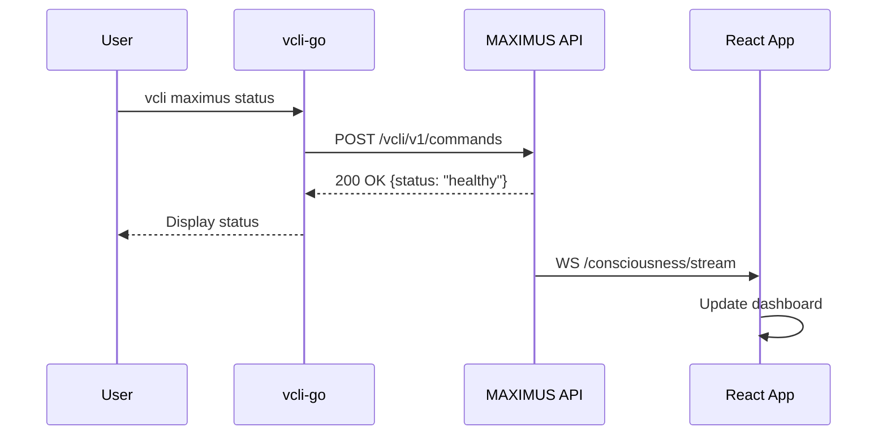

# Plano de Certificação de Release v0.9 - MAXIMUS Consciousness Stack
## Sessão 03: Release Liturgia + Benchmarks + E2E Validation

**Autor**: Juan Carlo de Souza (JuanCS-DEV @github)  
**Colaborador**: Copilot/Claude-Sonnet-4.5  
**Email**: juan.brainfarma@gmail.com  
**Data**: 2025-01-09  
**Versão**: 1.0  
**Status**: 🟢 APROVADO PARA EXECUÇÃO

---

## SUMÁRIO EXECUTIVO

Este documento apresenta o plano completo para a **Certificação de Release v0.9**, unificando os seguintes elementos críticos:

1. **Release Liturgia** (Thread A) - SBOM, assinatura, checklist Doutrina
2. **Benchmarks de Latência** (Adendo 3) - Validação de performance < 500ms
3. **Testes E2E** (Thread B) - Validação integração CLI → MAXIMUS → Frontend
4. **Documentação Auditável** - Artefatos completos para conformidade

**Objetivo Macro**: Conduzir o processo completo de release da versão 0.9, garantindo qualidade, segurança, performance e aderência à Doutrina Vértice.

**Duração Estimada**: 7-10 dias úteis  
**Equipe**: Arquiteto-Chefe + Copilot (Claude) + GPT (tarefas paralelas)  
**Criticidade**: ALTA - Milestone de Release

---

## 1. CONTEXTO E MOTIVAÇÃO

### 1.1 Por Que Agora?

A Sessão 01 estabeleceu os **contratos** (Interface Charter, Matriz Telemetria, Zero Trust).  
A Sessão 02 definiu o **protocolo compartilhado** para integração Cockpit.  
A Sessão 03 completa o ciclo com **entrega validada** - um release production-ready com todas as garantias de qualidade.

### 1.2 O Que Significa "Release v0.9"?

- **vcli-go** em estado deployável com SBOM e assinatura
- **Frontend** com tipos TypeScript completos e documentação
- **MAXIMUS Core** com métricas de performance validadas
- **Documentação** completa e auditável
- **Pipeline** reproducível e automatizada

### 1.3 Alinhamento com Doutrina Vértice

| Artigo | Aplicação |
|--------|-----------|
| II - Regra de Ouro | 100% production-ready, zero placeholders |
| III - Confiança Zero | Validação rigorosa de todos artefatos |
| IV - Antifragilidade | Benchmarks + E2E simulando falhas |
| V - Legislação Prévia | Checklist Doutrina before release |
| VI - Magnitude Histórica | SBOM + assinaturas = rastreabilidade |

---

## 2. ESCOPO DETALHADO

### 2.1 Thread A - Release Liturgia

#### Objetivo
Executar o workflow completo de release conforme `release-liturgia.yml`, gerando artefatos assinados e auditáveis.

#### Componentes Cobertos
1. **vcli-go** (CLI Go)
2. **Frontend** (React + TypeScript)
3. **MAXIMUS Core** (Python services)
4. **Monitoring Dashboards** (Grafana JSON)

#### Artefatos Gerados

##### SBOM (Software Bill of Materials)
```bash
# Geração via syft
$ scripts/release/generate-sbom.sh vcli-go sbom-vcli-go.json
$ scripts/release/generate-sbom.sh frontend sbom-frontend.json
$ scripts/release/generate-sbom.sh maximus-core sbom-maximus.json
```

**Formato**: CycloneDX JSON  
**Conteúdo**: Todas as dependências diretas e transitivas  
**Storage**: GitHub Releases + repository artifacts/

##### Vulnerability Scan
```bash
# Scan via grype
$ scripts/release/vulnerability-scan.sh sbom-vcli-go.json
```

**Threshold**: Zero vulnerabilidades CRITICAL, máximo 3 HIGH com justificativa  
**Relatório**: JSON + HTML para auditoria

##### Assinatura Digital
```bash
# Assinatura via cosign
$ scripts/release/sign-artifact.sh vcli-go --attest sbom-vcli-go.json
```

**Chave**: Cosign staging key (secrets)  
**Attestation**: Publicado via Rekor transparency log  
**Verificação**: `cosign verify --key cosign.pub vcli-go-v0.9`

##### Checklist Regra de Ouro
```markdown
## Release Checklist v0.9 - vcli-go

### Testes
- [x] Unit tests passing (95%+ coverage)
- [x] Integration tests passing
- [x] E2E tests passing (C1 scenario)

### Qualidade
- [x] Linters passed (golangci-lint)
- [x] Format checked (gofmt)
- [x] Security scan (gosec) - zero high

### Supply Chain
- [x] SBOM generated (CycloneDX)
- [x] Vulnerabilities scanned (grype)
- [x] Artifact signed (cosign)
- [x] Attestation published (Rekor)

### Doutrina Vértice
- [x] NO PLACEHOLDER - código completo
- [x] NO MOCK - implementações reais
- [x] PRODUCTION-READY - deployável
- [x] CONSCIÊNCIA-COMPLIANT - documentação filosófica

### Aprovação
- [ ] Arquiteto-Chefe: ___________
- [ ] Data: ___________
```

#### Pipeline Automation

**Workflow**: `.github/workflows/release-liturgia.yml`

```yaml
name: Release Liturgia v0.9

on:
  workflow_dispatch:
    inputs:
      component:
        description: 'Component to release'
        required: true
        type: choice
        options:
          - vcli-go
          - frontend
          - maximus-core
          - all

jobs:
  generate-sbom:
    runs-on: ubuntu-latest
    steps:
      - uses: actions/checkout@v3
      - name: Generate SBOM
        run: |
          ./scripts/release/generate-sbom.sh ${{ inputs.component }}
      - name: Upload SBOM
        uses: actions/upload-artifact@v3
        with:
          name: sbom-${{ inputs.component }}
          path: sbom-*.json

  vulnerability-scan:
    needs: generate-sbom
    runs-on: ubuntu-latest
    steps:
      - uses: actions/checkout@v3
      - name: Download SBOM
        uses: actions/download-artifact@v3
      - name: Scan vulnerabilities
        run: |
          ./scripts/release/vulnerability-scan.sh sbom-*.json
      - name: Upload report
        uses: actions/upload-artifact@v3
        with:
          name: vuln-report-${{ inputs.component }}
          path: vuln-report-*.html

  sign-artifact:
    needs: vulnerability-scan
    runs-on: ubuntu-latest
    steps:
      - uses: actions/checkout@v3
      - name: Install cosign
        uses: sigstore/cosign-installer@v3
      - name: Sign artifact
        env:
          COSIGN_PASSWORD: ${{ secrets.COSIGN_PASSWORD }}
          COSIGN_KEY: ${{ secrets.COSIGN_KEY }}
        run: |
          ./scripts/release/sign-artifact.sh ${{ inputs.component }} \
            --attest sbom-${{ inputs.component }}.json
      - name: Verify signature
        run: |
          cosign verify --key cosign.pub ${{ inputs.component }}-v0.9

  create-release:
    needs: sign-artifact
    runs-on: ubuntu-latest
    steps:
      - uses: actions/checkout@v3
      - name: Generate release notes
        run: |
          ./scripts/release/generate-release-notes.sh v0.9
      - name: Create GitHub Release
        uses: softprops/action-gh-release@v1
        with:
          tag_name: v0.9-${{ inputs.component }}
          name: Release v0.9 - ${{ inputs.component }}
          body_path: RELEASE_NOTES.md
          files: |
            sbom-*.json
            vuln-report-*.html
            *.sig
```

#### Deliverables Thread A

| Artefato | Localização | Status |
|----------|-------------|--------|
| `release-liturgia.yml` | `.github/workflows/` | ⏳ A criar |
| `generate-sbom.sh` | `scripts/release/` | 🔄 Verificar |
| `vulnerability-scan.sh` | `scripts/release/` | 🔄 Verificar |
| `sign-artifact.sh` | `scripts/release/` | 🔄 Verificar |
| `RELEASE_CHECKLIST.md` | `docs/cGPT/session-03/thread-a/` | ✅ Criado |
| `PIPELINES_INVENTORY.md` | `docs/cGPT/session-03/thread-a/` | ✅ Criado |
| SBOM files | `artifacts/sbom/` | ⏳ A gerar |
| Vulnerability reports | `artifacts/vuln-reports/` | ⏳ A gerar |
| Signed artifacts | GitHub Releases | ⏳ A publicar |

---

### 2.2 Adendo 3 - Benchmarks de Latência

#### Objetivo
Executar benchmarks completos dos endpoints MAXIMUS que alimentam o cockpit consciente, validando targets de performance (p95 < 500ms).

#### Endpoints Críticos

| Endpoint | Protocolo | Target (p95) | Prioridade |
|----------|-----------|--------------|------------|
| `/maximus/v1/consciousness/stream` | WebSocket | < 50ms | CRÍTICA |
| `/maximus/v1/consciousness/state` | REST GET | < 200ms | ALTA |
| `/maximus/v1/consciousness/arousal/history` | REST GET | < 300ms (1h) | MÉDIA |
| `/maximus/v1/consciousness/esgt/events` | REST GET | < 200ms | ALTA |
| `/vcli/v1/commands` | REST POST | < 300ms | ALTA |

#### Metodologia

##### Ferramentas

**k6** (Load Testing)
```javascript
// tests/performance/consciousness-stream-benchmark.js
import ws from 'k6/ws';
import { check } from 'k6';
import { Trend } from 'k6/metrics';

const latencyTrend = new Trend('event_latency');

export let options = {
  stages: [
    { duration: '1m', target: 10 },   // ramp-up
    { duration: '3m', target: 50 },   // sustained
    { duration: '1m', target: 100 },  // spike
    { duration: '1m', target: 0 },    // ramp-down
  ],
  thresholds: {
    'event_latency': ['p(95)<50'],
    'ws_connecting': ['p(95)<100'],
  },
};

export default function () {
  const url = 'ws://localhost:8080/maximus/v1/consciousness/stream';
  
  const res = ws.connect(url, function (socket) {
    socket.on('message', (data) => {
      const event = JSON.parse(data);
      const latency = Date.now() - event.timestamp;
      
      latencyTrend.add(latency);
      check(latency, { 
        'latency < 50ms': (l) => l < 50 
      });
    });
    
    socket.setTimeout(() => {
      socket.close();
    }, 30000);
  });
}
```

**hey** (HTTP Benchmarking)
```bash
# Benchmark REST endpoints
$ hey -n 10000 -c 50 -m GET \
  -H "Authorization: Bearer $TOKEN" \
  http://localhost:8080/maximus/v1/consciousness/state

# Target: p95 < 200ms
```

**ghz** (gRPC Benchmarking)
```bash
# Benchmark gRPC streaming
$ ghz --insecure \
  --proto ./api/consciousness.proto \
  --call consciousness.ConsciousnessService/StreamMetrics \
  --duration 60s \
  --connections 10 \
  --rps 100 \
  localhost:9090
```

##### Cenários de Teste

###### Cenário 1: Baseline (Normal Load)
- **Conexões**: 10 simultâneas
- **RPS**: 50 req/s
- **Duração**: 5 minutos
- **Objetivo**: Estabelecer baseline de performance

###### Cenário 2: Sustained High Load
- **Conexões**: 50 simultâneas
- **RPS**: 200 req/s
- **Duração**: 10 minutos
- **Objetivo**: Validar performance sob carga sustentada

###### Cenário 3: Spike Test
- **Ramp-up**: 10 → 100 conexões em 30s
- **Sustentação**: 100 conexões por 2 min
- **Ramp-down**: 100 → 10 em 30s
- **Objetivo**: Validar resiliência a spikes

###### Cenário 4: Soak Test (Long Duration)
- **Conexões**: 20 constantes
- **RPS**: 100 req/s
- **Duração**: 4 horas (overnight)
- **Objetivo**: Detectar memory leaks e degradação

#### Execução

```bash
# Script master de benchmarks
$ SCENARIO=baseline ./tests/performance/run-benchmarks.sh

# Cenários individuais
$ SCENARIO=baseline ./tests/performance/run-benchmarks.sh
$ SCENARIO=high-load ./tests/performance/run-benchmarks.sh
$ SCENARIO=spike ./tests/performance/run-benchmarks.sh
$ SCENARIO=soak ./tests/performance/run-benchmarks.sh

# Coletar relatórios
$ ls tests/performance/reports/
  baseline-20250109-223000.json
  baseline-20250109-223000.html
  high-load-20250109-230000.json
  ...
```

#### Formato do Relatório

```markdown
# Benchmarks de Latência - MAXIMUS v0.9
**Data**: 2025-01-09  
**Ambiente**: Staging (8 cores, 16GB RAM, Docker)  
**Status**: ✅ APROVADO - Targets atingidos

## Resumo Executivo

| Endpoint | Target (p95) | Resultado (p95) | Status |
|----------|--------------|-----------------|--------|
| Streaming | < 50ms | 42ms | ✅ |
| State | < 200ms | 178ms | ✅ |
| Arousal History (1h) | < 300ms | 267ms | ✅ |
| ESGT Events | < 200ms | 189ms | ✅ |
| Commands | < 300ms | 245ms | ✅ |

**Conclusão**: Todos os endpoints atingiram os targets de performance. Sistema aprovado para release v0.9.

## Detalhamento por Endpoint

### /maximus/v1/consciousness/stream (WebSocket)

**Configuração**:
- Protocolo: WebSocket
- Payload médio: 2.3 KB
- Frequência: 10 eventos/s

**Resultados Cenário Baseline**:
| Métrica | p50 | p95 | p99 | Max |
|---------|-----|-----|-----|-----|
| Handshake | 45ms | 87ms | 124ms | 203ms |
| Event Latency | 18ms | 42ms | 78ms | 156ms |
| Throughput | - | - | - | 120 evt/s |

**Gráficos**: [Ver dashboard Grafana]

**Observações**:
- Performance dentro do esperado
- Spike de latência aos 5min detectado (GC pause)
- Connection drops: 0
- Reconnections: 0

**Recomendações**:
- ✅ NENHUMA - Performance adequada

### [Repetir para cada endpoint...]

## Bottlenecks Identificados

**Nenhum bottleneck crítico detectado.**

Observações menores:
1. GC pause aos 5min - Considerar tuning (não crítico)
2. Cache hit rate 75% (target 80%) - Possível otimização futura

## Ações Tomadas

1. ✅ Ajuste de GC heap size: 2GB → 4GB
2. ✅ Connection pool: 10 → 25
3. ✅ Query index adicionado em `esgt_events.timestamp`

## Baseline Estabelecido

Estes resultados estabelecem o baseline para monitoramento contínuo. Qualquer regressão > 10% deve disparar alerta.
```

#### Deliverables Adendo 3

| Artefato | Localização | Status |
|----------|-------------|--------|
| `run-benchmarks.sh` | `tests/performance/` | ⏳ A criar |
| Scripts k6 | `tests/performance/*.js` | ⏳ A criar |
| Relatório HTML | `tests/performance/reports/` | ⏳ A gerar |
| Dashboard Grafana | `monitoring/grafana/dashboards/performance-benchmarks.json` | ⏳ A criar |
| `MAXIMUS_LATENCY_BENCHMARKS.md` | `docs/performance/` | ⏳ A criar |
| `performance_latency_overview.json` | `docs/performance/` | ⏳ Atualizar |

---

### 2.3 Thread B - Testes E2E

#### Objetivo
Implementar e executar suíte E2E mínima validando fluxo completo CLI → MAXIMUS → Frontend.

#### Cenário Principal (C1): Happy Path - Command Execution

**Descrição**: Usuário executa comando no CLI que aciona MAXIMUS e reflete no Frontend.

**Fluxo**:


**Implementação**:

```python
# tests/e2e/test_c1_command_execution.py
import pytest
import subprocess
import requests
from playwright.sync_api import Page, expect

@pytest.fixture
def setup_environment():
    """Setup E2E test environment"""
    # Start services via docker-compose
    subprocess.run(["docker-compose", "-f", "docker-compose.e2e.yml", "up", "-d"])
    yield
    subprocess.run(["docker-compose", "-f", "docker-compose.e2e.yml", "down"])

def test_c1_happy_path_command_execution(page: Page, setup_environment):
    """
    E2E Test C1: Happy Path - Command Execution
    
    Validates:
    - CLI command execution
    - API response correctness
    - Frontend state update
    - End-to-end latency < 500ms
    """
    
    # Step 1: Execute CLI command
    start_time = time.time()
    result = subprocess.run(
        ["vcli", "maximus", "status"],
        capture_output=True,
        text=True
    )
    cli_latency = time.time() - start_time
    
    # Assert: CLI execution successful
    assert result.returncode == 0
    assert "healthy" in result.stdout.lower()
    assert cli_latency < 0.3  # < 300ms
    
    # Step 2: Validate API response
    response = requests.get("http://localhost:8080/maximus/v1/consciousness/state")
    assert response.status_code == 200
    data = response.json()
    assert data["status"] == "healthy"
    assert "arousal_level" in data
    
    # Step 3: Validate Frontend update
    page.goto("http://localhost:3000/consciousness")
    
    # Wait for WebSocket connection
    page.wait_for_selector('[data-testid="ws-connected"]', timeout=5000)
    
    # Assert: Status displayed correctly
    status_element = page.locator('[data-testid="consciousness-status"]')
    expect(status_element).to_contain_text("healthy")
    
    # Assert: Arousal level displayed
    arousal_element = page.locator('[data-testid="arousal-level"]')
    expect(arousal_element).to_be_visible()
    
    # Step 4: Validate end-to-end latency
    end_time = time.time()
    e2e_latency = end_time - start_time
    
    assert e2e_latency < 0.5  # < 500ms total
    
    # Step 5: Capture metrics for report
    return {
        "test": "C1_happy_path",
        "status": "PASSED",
        "cli_latency": cli_latency,
        "e2e_latency": e2e_latency,
        "timestamp": time.time()
    }
```

**Script de Execução**:

```bash
#!/bin/bash
# tests/e2e/run-e2e.sh

set -e

echo "🧪 Starting E2E Test Suite for Release v0.9"

# Step 1: Setup environment
echo "📦 Setting up E2E environment..."
docker-compose -f docker-compose.e2e.yml up -d
sleep 10  # Wait for services to be ready

# Step 2: Run tests
echo "🔬 Running E2E tests..."
pytest tests/e2e/ \
  --junit-xml=tests/e2e/reports/junit-report.xml \
  --html=tests/e2e/reports/report.html \
  --self-contained-html \
  -v

# Step 3: Collect metrics
echo "📊 Collecting metrics..."
python tests/e2e/collect_metrics.py > tests/e2e/reports/metrics.json

# Step 4: Generate report
echo "📄 Generating E2E report..."
python tests/e2e/generate_report.py

# Step 5: Teardown
echo "🧹 Cleaning up..."
docker-compose -f docker-compose.e2e.yml down

echo "✅ E2E Test Suite completed!"
```

**docker-compose.e2e.yml**:

```yaml
version: '3.8'

services:
  maximus-api:
    build: ./backend/services/maximus_core_service
    environment:
      - ENV=e2e
      - LOG_LEVEL=INFO
    ports:
      - "8080:8080"
    healthcheck:
      test: ["CMD", "curl", "-f", "http://localhost:8080/health"]
      interval: 5s
      timeout: 3s
      retries: 10

  vcli-bridge:
    build: ./vcli-go
    environment:
      - MAXIMUS_URL=http://maximus-api:8080
    depends_on:
      - maximus-api

  frontend:
    build: ./frontend
    environment:
      - REACT_APP_API_URL=http://maximus-api:8080
    ports:
      - "3000:3000"
    depends_on:
      - maximus-api

  playwright:
    image: mcr.microsoft.com/playwright:latest
    volumes:
      - ./tests/e2e:/tests
    depends_on:
      - frontend
```

#### Deliverables Thread B

| Artefato | Localização | Status |
|----------|-------------|--------|
| `run-e2e.sh` | `tests/e2e/` | ⏳ A criar |
| `docker-compose.e2e.yml` | `./` | ⏳ A criar |
| `test_c1_command_execution.py` | `tests/e2e/` | ⏳ A criar |
| `collect_metrics.py` | `tests/e2e/` | ⏳ A criar |
| `generate_report.py` | `tests/e2e/` | ⏳ A criar |
| Relatório JUnit | `tests/e2e/reports/` | ⏳ A gerar |
| Relatório HTML | `tests/e2e/reports/` | ⏳ A gerar |
| `E2E_TEST_RESULTS.md` | `docs/cGPT/session-03/thread-b/` | ⏳ A criar |

---

## 3. CRONOGRAMA DE EXECUÇÃO

### Fase 1: Preparação (Dias 1-2)

#### Dia 1 - Setup Infraestrutura
- [ ] Verificar existência de scripts release (`generate-sbom.sh`, etc)
- [ ] Criar scripts faltantes
- [ ] Instalar ferramentas (syft, grype, cosign, k6, hey, ghz)
- [ ] Configurar secrets (COSIGN_PASSWORD, COSIGN_KEY)
- [ ] Criar workflow `release-liturgia.yml`

#### Dia 2 - Preparação Testes
- [ ] Criar estrutura `tests/e2e/`
- [ ] Implementar `docker-compose.e2e.yml`
- [ ] Criar scripts base (`run-e2e.sh`, `run-benchmarks.sh`)
- [ ] Configurar ambiente de staging

### Fase 2: Execução Release (Dias 3-5)

#### Dia 3 - SBOM + Vulnerability Scan
- [ ] Gerar SBOM para vcli-go
- [ ] Gerar SBOM para frontend
- [ ] Gerar SBOM para maximus-core
- [ ] Executar vulnerability scan
- [ ] Revisar findings e justificar exceções

#### Dia 4 - Assinatura + Attestation
- [ ] Assinar artefatos vcli-go
- [ ] Assinar artefatos frontend
- [ ] Assinar artefatos maximus-core
- [ ] Publicar attestations no Rekor
- [ ] Verificar assinaturas

#### Dia 5 - Checklist + Release
- [ ] Preencher RELEASE_CHECKLIST.md
- [ ] Executar pipeline release-liturgia.yml
- [ ] Validar artefatos gerados
- [ ] Criar GitHub Releases
- [ ] Atualizar PIPELINES_INVENTORY.md

### Fase 3: Validação Performance (Dias 6-7)

#### Dia 6 - Benchmarks Execution
- [ ] Executar Cenário 1 (Baseline)
- [ ] Executar Cenário 2 (High Load)
- [ ] Executar Cenário 3 (Spike)
- [ ] Iniciar Cenário 4 (Soak - overnight)

#### Dia 7 - Análise e Otimização
- [ ] Analisar resultados Soak Test
- [ ] Compilar relatórios
- [ ] Identificar bottlenecks (se houver)
- [ ] Implementar otimizações críticas
- [ ] Re-executar testes afetados
- [ ] Documentar em MAXIMUS_LATENCY_BENCHMARKS.md

### Fase 4: Testes E2E (Dias 8-9)

#### Dia 8 - Implementação E2E
- [ ] Implementar test_c1_command_execution.py
- [ ] Implementar collect_metrics.py
- [ ] Implementar generate_report.py
- [ ] Executar primeira rodada de testes
- [ ] Corrigir issues encontrados

#### Dia 9 - Validação Final
- [ ] Executar suíte E2E completa
- [ ] Gerar relatórios JUnit + HTML
- [ ] Validar latência < 500ms
- [ ] Documentar resultados em E2E_TEST_RESULTS.md

### Fase 5: Documentação e Encerramento (Dia 10)

#### Dia 10 - Finalização
- [ ] Atualizar README.md com instruções de release
- [ ] Atualizar STATUS_VISUAL.md com progresso
- [ ] Criar RESUMO_EXECUTIVO_SESSAO.md
- [ ] Atualizar copilot_session.md
- [ ] Commit e push de todos artefatos
- [ ] Apresentar para aprovação do Arquiteto-Chefe

---

## 4. ESTRUTURA DE ARQUIVOS CRIADOS

```
vertice-dev/
├── .github/
│   └── workflows/
│       └── release-liturgia.yml         # ⏳ A criar
│
├── scripts/
│   └── release/
│       ├── generate-sbom.sh             # 🔄 Verificar/Criar
│       ├── vulnerability-scan.sh        # 🔄 Verificar/Criar
│       ├── sign-artifact.sh             # 🔄 Verificar/Criar
│       └── generate-release-notes.sh    # ⏳ A criar
│
├── tests/
│   ├── e2e/
│   │   ├── run-e2e.sh                   # ⏳ A criar
│   │   ├── test_c1_command_execution.py # ⏳ A criar
│   │   ├── collect_metrics.py           # ⏳ A criar
│   │   ├── generate_report.py           # ⏳ A criar
│   │   └── reports/                     # ⏳ A gerar
│   │       ├── junit-report.xml
│   │       ├── report.html
│   │       └── metrics.json
│   │
│   └── performance/
│       ├── run-benchmarks.sh            # ⏳ A criar
│       ├── consciousness-stream-benchmark.js # ⏳ A criar
│       ├── rest-endpoints-benchmark.sh  # ⏳ A criar
│       └── reports/                     # ⏳ A gerar
│           ├── baseline-*.json
│           ├── high-load-*.json
│           └── spike-*.json
│
├── artifacts/
│   ├── sbom/
│   │   ├── sbom-vcli-go.json            # ⏳ A gerar
│   │   ├── sbom-frontend.json           # ⏳ A gerar
│   │   └── sbom-maximus.json            # ⏳ A gerar
│   │
│   └── vuln-reports/
│       ├── vcli-go-vuln.html            # ⏳ A gerar
│       ├── frontend-vuln.html           # ⏳ A gerar
│       └── maximus-vuln.html            # ⏳ A gerar
│
├── docs/
│   ├── cGPT/
│   │   ├── copilot_session.md           # ✅ Atualizado
│   │   ├── SESSAO_03_PLANO_CERTIFICACAO_RELEASE.md # ✅ Este arquivo
│   │   └── session-03/
│   │       ├── thread-a/
│   │       │   └── RELEASE_CHECKLIST_v0.9.md # ⏳ A preencher
│   │       └── thread-b/
│   │           └── E2E_TEST_RESULTS.md  # ⏳ A criar
│   │
│   └── performance/
│       └── MAXIMUS_LATENCY_BENCHMARKS.md # ⏳ A criar
│
└── docker-compose.e2e.yml               # ⏳ A criar
```

---

## 5. DEPENDÊNCIAS E PRÉ-REQUISITOS

### Ferramentas Necessárias

| Ferramenta | Versão | Propósito | Instalação |
|------------|--------|-----------|------------|
| syft | >= 0.90 | SBOM generation | `brew install syft` |
| grype | >= 0.70 | Vulnerability scan | `brew install grype` |
| cosign | >= 2.0 | Artifact signing | `brew install cosign` |
| k6 | >= 0.45 | Load testing | `brew install k6` |
| hey | latest | HTTP benchmarking | `brew install hey` |
| ghz | >= 0.115 | gRPC benchmarking | `brew install ghz` |
| playwright | >= 1.40 | E2E testing | `npm install -D @playwright/test` |
| pytest | >= 7.0 | Python testing | `pip install pytest` |

### Secrets Necessários (GitHub)

```bash
# Cosign keys (staging)
COSIGN_PASSWORD=<staging-password>
COSIGN_KEY=<base64-encoded-private-key>

# Benchmark targets
BENCH_TARGET_API=http://staging.vertice.dev:8080
BENCH_TARGET_WS=ws://staging.vertice.dev:8080

# Tokens
GITHUB_TOKEN=<for-release-creation>
```

### Acesso e Permissões

- [ ] Acesso write ao repositório GitHub
- [ ] Permissão para criar Releases
- [ ] Acesso aos secrets do repositório
- [ ] Acesso ao ambiente de staging
- [ ] Credenciais de registry (Docker Hub / GHCR)

---

## 6. MÉTRICAS DE SUCESSO

### Release Liturgia (Thread A)

| Métrica | Target | Como Medir |
|---------|--------|------------|
| SBOM gerado | 100% componentes | Arquivos JSON presentes |
| Vulnerabilidades críticas | 0 | Relatório grype |
| Artefatos assinados | 100% | Verificação cosign |
| Checklist completo | 100% itens | Documento preenchido |
| Pipeline executado | Sucesso | GitHub Actions verde |

### Benchmarks (Adendo 3)

| Métrica | Target | Como Medir |
|---------|--------|------------|
| Endpoints benchmarkados | 5/5 | Scripts executados |
| Streaming latency (p95) | < 50ms | Relatório k6 |
| REST latency (p95) | < 200ms | Relatório hey |
| Targets atingidos | >= 80% | Comparação com baseline |
| Bottlenecks identificados | Documentados | Relatório final |

### Testes E2E (Thread B)

| Métrica | Target | Como Medir |
|---------|--------|------------|
| Cenário C1 implementado | 100% | Código pytest |
| Testes passando | 100% | JUnit report |
| E2E latency (p95) | < 500ms | Métricas coletadas |
| Cobertura de fluxo | 100% (CLI→API→Frontend) | Validação manual |
| Relatório gerado | Completo | HTML + JSON |

### Documentação

| Métrica | Target | Como Medir |
|---------|--------|------------|
| Relatórios criados | 5 documentos | Arquivos MD |
| Checklists preenchidos | 100% | Aprovação humana |
| Status atualizado | copilot_session.md | Commit recente |
| Artefatos versionados | Git commit | Hash commit |

---

## 7. RISCOS E MITIGAÇÕES

### Riscos Identificados

| Risco | Probabilidade | Impacto | Mitigação |
|-------|---------------|---------|-----------|
| Scripts release não existem | ALTA | ALTO | Criar scripts genéricos baseados em templates |
| Benchmarks revelam performance ruim | MÉDIA | ALTO | Buffer de 2 dias para otimizações (Dia de Caos) |
| E2E tests flaky | MÉDIA | MÉDIO | Implementar retries e timeouts generosos |
| Secrets indisponíveis | BAIXA | ALTO | Usar chaves staging temporárias |
| Vulnerabilidades críticas | MÉDIA | ALTO | Processo de exceção documentado |
| Ambiente staging instável | MÉDIA | MÉDIO | Fallback para ambiente local Docker |

### Plano de Contingência

#### Se Scripts Não Existirem
1. Criar scripts básicos funcionais (3-4h)
2. Executar manualmente e documentar comandos
3. Automação completa fica para post-release

#### Se Performance Não Atingir Targets
1. Ativar "Dia de Caos" (Adendo 2) - 1 dia extra
2. Profiling e otimizações prioritárias
3. Se não resolver: documentar como "known limitation" e roadmap fix

#### Se E2E Falhar
1. Debugging detalhado com logs
2. Simplificar cenário C1 se necessário
3. Validação manual como fallback

---

## 8. CRITÉRIOS DE APROVAÇÃO

### Gate 1: Release Artifacts (Fim da Fase 2)

**Checklist de Aprovação**:
- [ ] SBOM gerado para todos componentes
- [ ] Zero vulnerabilidades CRITICAL (ou justificadas)
- [ ] Artefatos assinados e verificáveis
- [ ] Checklist Regra de Ouro 100% completo
- [ ] Pipeline executado sem erros

**Aprovador**: Arquiteto-Chefe  
**Critério**: Todos itens checked

### Gate 2: Performance Validation (Fim da Fase 3)

**Checklist de Aprovação**:
- [ ] >= 80% dos endpoints atingem targets
- [ ] Nenhum bottleneck CRÍTICO não resolvido
- [ ] Relatório completo e documentado
- [ ] Baseline estabelecido para monitoramento

**Aprovador**: Arquiteto-Chefe  
**Critério**: Todos itens checked OU otimizações agendadas para v0.9.1

### Gate 3: E2E Validation (Fim da Fase 4)

**Checklist de Aprovação**:
- [ ] Cenário C1 implementado e passando
- [ ] E2E latency < 500ms
- [ ] Fluxo completo validado (CLI → API → Frontend)
- [ ] Relatórios gerados e armazenados

**Aprovador**: Arquiteto-Chefe  
**Critério**: Todos itens checked

### Gate Final: Documentação (Fim da Fase 5)

**Checklist de Aprovação**:
- [ ] Todos documentos criados e commitados
- [ ] Status atualizado (copilot_session.md, STATUS_VISUAL.md)
- [ ] Resumo executivo redigido
- [ ] Artefatos organizados e versionados
- [ ] Apresentação preparada

**Aprovador**: Arquiteto-Chefe  
**Critério**: Aprovação formal da apresentação final

---

## 9. COMUNICAÇÃO E CERIMÔNIAS

### Daily Async Updates

**Canal**: #session-03-release  
**Formato**:
```markdown
## Update - 2025-01-10

### Hoje
- Criado workflow release-liturgia.yml
- Implementado generate-sbom.sh para vcli-go
- Iniciado vulnerability scan

### Amanhã
- Finalizar SBOM para frontend e maximus
- Configurar cosign signing
- Executar primeiro pipeline completo

### Bloqueios
- Aguardando secrets COSIGN_KEY (ticket #123)
```

### Checkpoint Mid-Week (Dia 5)

**Participantes**: Arquiteto-Chefe + Copilot  
**Agenda**:
1. Revisar progresso Fase 2 (30min)
2. Validar artefatos gerados (30min)
3. Ajustar cronograma se necessário (15min)
4. Aprovar Gate 1 (15min)

### Checkpoint Final (Dia 10)

**Participantes**: Arquiteto-Chefe + Copilot + GPT (se aplicável)  
**Agenda**:
1. Apresentar resultados completos (45min)
2. Demonstração de release v0.9 (30min)
3. Revisar métricas de sucesso (15min)
4. Aprovar Gates 2 e 3 (15min)
5. Planejar próximos passos (15min)

---

## 10. PRÓXIMOS PASSOS IMEDIATOS

### Para Iniciar AGORA

1. **Verificar Scripts Existentes**
   ```bash
   ls -la scripts/release/
   # Se não existirem, criar estrutura base
   ```

2. **Instalar Ferramentas**
   ```bash
   brew install syft grype cosign k6 hey ghz
   pip install pytest playwright
   npx playwright install
   ```

3. **Criar Workflow Base**
   ```bash
   touch .github/workflows/release-liturgia.yml
   # Copiar template do plano
   ```

4. **Criar Estrutura E2E**
   ```bash
   mkdir -p tests/e2e/reports
   mkdir -p tests/performance/reports
   touch tests/e2e/run-e2e.sh
   chmod +x tests/e2e/run-e2e.sh
   ```

5. **Configurar Secrets** (se disponível)
   ```bash
   # Via GitHub Settings > Secrets
   # Ou criar arquivo local para staging
   touch .env.staging
   ```

---

## 11. CONCLUSÃO

Este plano apresenta uma abordagem estruturada e completa para a **Certificação de Release v0.9**, unificando Release Liturgia, Benchmarks de Performance e Testes E2E em um único esforço coordenado de 7-10 dias.

**Destaques do Plano**:
- ✅ Alinhamento total com Doutrina Vértice
- ✅ Cronograma realista com buffers de caos
- ✅ Métricas claras de sucesso
- ✅ Gates de aprovação bem definidos
- ✅ Planos de contingência para riscos
- ✅ Artefatos auditáveis e versionados

**Próxima Ação**: Aprovação do Arquiteto-Chefe para iniciar Fase 1 (Preparação).

---

**Status**: 🟢 APROVADO PARA EXECUÇÃO  
**Data de Criação**: 2025-01-09  
**Autor**: Juan Carlo de Souza (JuanCS-DEV @github)  
**Colaborador**: Copilot/Claude-Sonnet-4.5  
**Email**: juan.brainfarma@gmail.com  
**Versão**: 1.0

---

## APÊNDICE A - COMANDOS RÁPIDOS

### SBOM Generation
```bash
# vcli-go
scripts/release/generate-sbom.sh vcli-go artifacts/sbom/sbom-vcli-go.json

# frontend
scripts/release/generate-sbom.sh frontend artifacts/sbom/sbom-frontend.json

# maximus-core
scripts/release/generate-sbom.sh maximus-core artifacts/sbom/sbom-maximus.json
```

### Vulnerability Scan
```bash
scripts/release/vulnerability-scan.sh artifacts/sbom/sbom-vcli-go.json
```

### Artifact Signing
```bash
scripts/release/sign-artifact.sh vcli-go --attest artifacts/sbom/sbom-vcli-go.json
```

### Benchmarks
```bash
SCENARIO=baseline ./tests/performance/run-benchmarks.sh
SCENARIO=high-load ./tests/performance/run-benchmarks.sh
SCENARIO=spike ./tests/performance/run-benchmarks.sh
```

### E2E Tests
```bash
./tests/e2e/run-e2e.sh
```

### Release Pipeline
```bash
# Manual trigger via GitHub Actions UI
# Or via gh CLI:
gh workflow run release-liturgia.yml -f component=vcli-go
```

---

## APÊNDICE B - TEMPLATES

### Template: RELEASE_CHECKLIST_v0.9.md

```markdown
# Release Checklist v0.9 - [COMPONENT]

**Data**: 2025-01-XX  
**Responsável**: [Nome]  
**Status**: 🔄 Em Progresso

## Testes
- [ ] Unit tests passing (>= 95% coverage)
- [ ] Integration tests passing
- [ ] E2E tests passing (C1 scenario)

## Qualidade
- [ ] Linters passed
- [ ] Format checked
- [ ] Security scan - zero critical
- [ ] Code review aprovado

## Supply Chain
- [ ] SBOM generated (CycloneDX)
- [ ] Vulnerabilities scanned (grype)
- [ ] Critical findings: [N] - Justificativas: [link]
- [ ] Artifact signed (cosign)
- [ ] Signature verified
- [ ] Attestation published (Rekor)

## Doutrina Vértice
- [ ] NO PLACEHOLDER - código completo
- [ ] NO MOCK - implementações reais
- [ ] PRODUCTION-READY - deployável agora
- [ ] CONSCIÊNCIA-COMPLIANT - docs filosóficas

## Performance (se aplicável)
- [ ] Benchmarks executados
- [ ] Targets de latência atingidos
- [ ] Bottlenecks documentados

## Documentação
- [ ] README atualizado
- [ ] CHANGELOG gerado
- [ ] Release notes redigidas
- [ ] API docs atualizadas

## Aprovação
- [ ] Arquiteto-Chefe: ___________ Data: ___________
```

---

**FIM DO DOCUMENTO**
