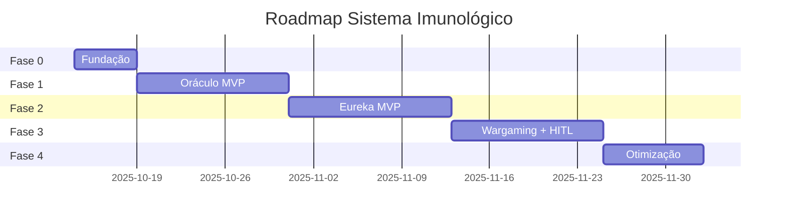

# Roadmap: Sistema Imunológico Adaptativo MAXIMUS

**Versão**: 1.0  
**Data**: 2025-10-10  
**Blueprint**: `docs/architecture/security/adaptive-immune-system-blueprint.md`  
**Duração Estimada**: 8 semanas (40 dias úteis)

---

## VISÃO GERAL

### Objetivo
Implementar sistema biomimético de segurança autônoma em 4 fases incrementais, cada uma entregando valor mensurável e testável.

### Princípio Guia
> "Entregas pequenas, frequentes e inquebraveis. Cada merge é production-ready."

### Métricas de Progresso
| Fase | Entrega | MTTR Esperado | Coverage |
|------|---------|---------------|----------|
| 0 | Fundação | N/A | 0% |
| 1 | Oráculo MVP | 48h → 24h | 30% |
| 2 | Eureka MVP | 24h → 4h | 60% |
| 3 | Wargaming + HITL | 4h → 15min | 95% |
| 4 | Otimização | <15min | 98% |

---

## FASE 0: FUNDAÇÃO (Semana 1)

### Objetivo
Preparar infraestrutura base para suportar Oráculo e Eureka.

### Tasks

#### 0.1. Setup de Repositório
- [ ] Criar estrutura de diretórios
  ```bash
  backend/services/maximus_oraculo/
  backend/services/maximus_eureka/
  backend/services/immune_system_gateway/
  frontend/app/immune-system/
  ```
- [ ] Configurar pyproject.toml com dependências
- [ ] Setup de testes (pytest + coverage)

#### 0.2. Database Schema
- [ ] Migrations PostgreSQL (Alembic)
  - Tabelas: threats, apvs, remedies, wargame_runs
- [ ] Seed data para desenvolvimento (CVEs sintéticos)

#### 0.3. Messaging Infrastructure
- [ ] Deploy RabbitMQ container
- [ ] Criar exchanges e queues
  ```
  exchange: immune_system
  queue: apv_queue (oraculo → eureka)
  queue: remedy_queue (eureka → wargaming)
  ```
- [ ] Configurar mTLS entre serviços

#### 0.4. Observabilidade Base
- [ ] Prometheus exporters em Oráculo e Eureka
- [ ] Grafana dashboard skeleton
- [ ] Alertas básicos (serviço down)

#### 0.5. CI/CD Base
- [ ] GitHub Actions para Oráculo
- [ ] GitHub Actions para Eureka
- [ ] Self-hosted runner para Wargaming

**Validação Fase 0**:
- [ ] PostgreSQL acessível e migrations aplicadas
- [ ] RabbitMQ aceita conexões mTLS
- [ ] CI verde para serviços vazios
- [ ] Dashboards renderizam (sem dados ainda)

**Entrega**: Infraestrutura provisionada, nenhum código de negócio.

---

## FASE 1: ORÁCULO MVP (Semanas 2-3)

### Objetivo
Sentinela capaz de ingerir CVEs, triagear e gerar APVs.

### Milestone 1.1: Ingestão de Feeds (Dias 6-8)

#### Tasks
- [ ] Cliente NVD API
  ```python
  class NVDClient:
      def fetch_recent_cves(self, hours: int = 24) -> List[CVE]
      def get_cve_details(self, cve_id: str) -> CVEDetail
  ```
- [ ] Parser de CVE para modelo interno
- [ ] Persistência em `threats` table
- [ ] Scheduler (APScheduler) para polling a cada 1h
- [ ] Rate limiting + circuit breaker

**Testes**:
- [ ] Unit: parse_nvd_response()
- [ ] Integration: fetch_recent_cves() com API real
- [ ] E2E: pipeline ingestão → database

**Validação**: 100 CVEs históricos ingeridos e visíveis no database.

---

### Milestone 1.2: Inventário de Dependências (Dias 9-11)

#### Tasks
- [ ] Scanner de poetry.lock, package-lock.json, go.mod
  ```python
  class DependencyInventory:
      def scan_backend(self) -> List[Dependency]
      def scan_frontend(self) -> List[Dependency]
      def is_dependency_affected(self, cve: CVE) -> bool
  ```
- [ ] Cache Redis de inventário (atualiza a cada deploy)
- [ ] API endpoint GET /api/v1/oraculo/inventory/dependencies

**Testes**:
- [ ] Unit: parse_poetry_lock()
- [ ] Integration: scan_backend() em repo real
- [ ] E2E: inventário atualizado após poetry update

**Validação**: Dashboard mostra 247 dependências (backend + frontend).

---

### Milestone 1.3: Triagem e APV Generation (Dias 12-15)

#### Tasks
- [ ] Algoritmo de triagem
  ```python
  def triage_threat(threat: Threat, inventory: Inventory) -> Optional[APV]:
      if not inventory.has_affected_dependency(threat):
          return None
      
      severity = calculate_contextual_severity(threat, inventory)
      if severity < THRESHOLD:
          return None
      
      return APV(
          threat_id=threat.id,
          affected_dependencies=inventory.get_affected(threat),
          vulnerable_code_signature=extract_signature(threat),
          ...
      )
  ```
- [ ] Geração de `vulnerable_code_signature` (regex ou AST pattern)
- [ ] Persistência de APVs
- [ ] Dispatch para RabbitMQ (queue: apv_queue)

**Testes**:
- [ ] Unit: triage_threat() com CVE mock
- [ ] Integration: APV persistido e enfileirado
- [ ] E2E: CVE → Triagem → APV na queue

**Validação**: CVE-2024-FAKE-001 gera APV e aparece em queue.

---

### Milestone 1.4: API e Dashboard Inicial (Dias 16-17)

#### Tasks
- [ ] FastAPI endpoints
  ```python
  GET  /api/v1/oraculo/threats/recent
  GET  /api/v1/oraculo/apv/pending
  POST /api/v1/oraculo/inventory/scan
  ```
- [ ] Frontend: Página de Threats
  ```tsx
  // app/immune-system/threats/page.tsx
  <ThreatList threats={threats} />
  <APVQueue apvs={apvs} />
  ```

**Validação**: Dashboard mostra threats e APVs em tempo real.

---

**Entrega Fase 1**:
- [ ] Oráculo ingere NVD, triage e gera APVs
- [ ] APVs visíveis no dashboard
- [ ] Coverage >90%
- [ ] Docs completas (README do serviço)

**Impact**: MTTR reduzido de 48h → 24h (detecção automática).

---

## FASE 2: EUREKA MVP (Semanas 4-5)

### Objetivo
Cirurgião capaz de receber APVs, confirmar vulnerabilidades e gerar contramedidas básicas.

### Milestone 2.1: APV Consumer (Dias 18-20)

#### Tasks
- [ ] RabbitMQ consumer
  ```python
  class APVConsumer:
      def consume(self, callback: Callable[[APV], None]):
          # Consome apv_queue
          # Chama callback para processar
  ```
- [ ] Queue de processamento interna (asyncio.Queue)
- [ ] Persistência de status (APV.status = RECEIVED)

**Testes**:
- [ ] Integration: APV publicado → consumido por Eureka
- [ ] E2E: APV transita PENDING → RECEIVED

**Validação**: Eureka consome APVs sem perdas (ack correto).

---

### Milestone 2.2: Vulnerability Scanning (Dias 21-23)

#### Tasks
- [ ] Integração com ast-grep
  ```python
  def scan_for_signature(signature: str, codebase_path: str) -> List[Match]:
      result = subprocess.run([
          "ast-grep", "--pattern", signature, codebase_path
      ], capture_output=True)
      return parse_ast_grep_output(result.stdout)
  ```
- [ ] Confirmação de vulnerabilidade
  ```python
  def confirm_vulnerability(apv: APV) -> bool:
      matches = scan_for_signature(
          apv.vulnerable_code_signature,
          "/path/to/codebase"
      )
      return len(matches) > 0
  ```
- [ ] Update APV.status = CONFIRMED ou ABSENT

**Testes**:
- [ ] Unit: parse_ast_grep_output()
- [ ] Integration: ast-grep em codebase com vuln sintética
- [ ] E2E: APV CONFIRMED após scan

**Validação**: APV com assinatura presente → status CONFIRMED.

---

### Milestone 2.3: Remedy Generation (Dias 24-27)

#### Tasks
- [ ] Estratégia de remediação
  ```python
  def generate_remedy(apv: APV) -> Remedy:
      if can_upgrade_dependency(apv):
          return DependencyUpgradeRemedy(apv)
      elif can_patch_code(apv):
          return CodePatchRemedy(apv)
      else:
          return ManualReviewRemedy(apv)
  ```
- [ ] DependencyUpgradeRemedy
  ```python
  class DependencyUpgradeRemedy:
      def generate(self) -> str:
          # Retorna comando: poetry update fastapi==0.111.0
          safe_version = apv.safe_versions[0]
          return f"poetry update {package}=={safe_version}"
  ```
- [ ] Criação de branch Git
  ```python
  def create_remedy_branch(remedy: Remedy) -> str:
      branch_name = f"security/apv-{remedy.apv_id}"
      repo = git.Repo("/path/to/repo")
      repo.git.checkout("main")
      repo.git.checkout("-b", branch_name)
      return branch_name
  ```
- [ ] Aplicação de remédio + commit

**Testes**:
- [ ] Unit: generate_upgrade_command()
- [ ] Integration: branch criado no Git
- [ ] E2E: APV → Branch com commit

**Validação**: APV gera branch `security/apv-123` com patch aplicado.

---

### Milestone 2.4: Pull Request Creation (Dias 28-30)

#### Tasks
- [ ] GitHub API integration
  ```python
  class GitHubClient:
      def create_pr(self, branch: str, title: str, body: str) -> PullRequest
  ```
- [ ] Template de PR
  ```markdown
  ## 🛡️ Security Fix: {CVE_ID}
  
  **Severity**: {SEVERITY}
  **APV ID**: {APV_ID}
  
  ### Vulnerability Details
  - **Description**: {DESC}
  - **CVSS**: {CVSS_SCORE}
  - **Exploit Available**: {EXPLOIT_STATUS}
  
  ### Affected Components
  {AFFECTED_SERVICES}
  
  ### Remedy Applied
  Strategy: {STRATEGY}
  {CODE_DIFF}
  
  ### Validation
  - [ ] Wargaming pending
  - [ ] Tests pending
  ```
- [ ] Criação de PR via API
- [ ] Update Remedy.pr_url

**Testes**:
- [ ] Integration: PR criado no GitHub
- [ ] E2E: APV → PR linkado

**Validação**: PR criado e visível no GitHub + dashboard.

---

### Milestone 2.5: Dashboard Integration (Dias 31-32)

#### Tasks
- [ ] API endpoints Eureka
  ```python
  GET /api/v1/eureka/remedies/active
  GET /api/v1/eureka/remedies/{id}
  ```
- [ ] Frontend: Página de Remedies
  ```tsx
  // app/immune-system/remedies/page.tsx
  <RemedyList remedies={remedies} />
  <RemedyDetails remedy={selectedRemedy} />
  ```

**Validação**: Dashboard mostra remedies e PRs criados.

---

**Entrega Fase 2**:
- [ ] Eureka recebe APVs, confirma vulns, gera PRs
- [ ] PRs automáticos aparecem no GitHub
- [ ] Coverage >90%
- [ ] Docs completas

**Impact**: MTTR reduzido de 24h → 4h (remediação automática).

---

## FASE 3: WARGAMING + HITL (Semanas 6-7)

### Objetivo
Validação empírica de remédios + interface humana de review.

### Milestone 3.1: Wargaming Pipeline (Dias 33-36)

#### Tasks
- [ ] GitHub Actions workflow
  ```yaml
  name: Wargaming Crisol
  on:
    workflow_dispatch:
      inputs:
        remedy_id: ...
  
  jobs:
    baseline:
      runs-on: self-hosted
      steps:
        - name: Deploy Vulnerable
        - name: Run Exploit
        - name: Capture Metrics
    
    patched:
      needs: baseline
      steps:
        - name: Apply Patch
        - name: Deploy Patched
        - name: Run Exploit (Should Fail)
        - name: Run Tests
  ```
- [ ] Exploit scripts sintéticos
  ```python
  # exploits/cve_2024_fake_001.py
  def exploit(target_url: str) -> bool:
      # Tenta RCE
      payload = "malicious_payload"
      response = requests.post(f"{target_url}/vulnerable", data=payload)
      return "pwned" in response.text
  ```
- [ ] Report generation
  ```python
  def generate_wargame_report(baseline, patched) -> dict:
      return {
          "exploit_baseline_success": baseline.exploit_success,
          "exploit_patched_success": patched.exploit_success,
          "tests_passed": patched.tests_passed,
          "verdict": "PASS" if not patched.exploit_success else "FAIL"
      }
  ```

**Testes**:
- [ ] Manual: workflow execução completa
- [ ] Integration: exploit baseline PASS, patched FAIL
- [ ] E2E: report gerado e persistido

**Validação**: Wargame executa e report disponível.

---

### Milestone 3.2: Eureka Wargaming Integration (Dias 37-38)

#### Tasks
- [ ] Trigger wargaming após criar branch
  ```python
  def trigger_wargame(remedy: Remedy):
      github_client.trigger_workflow(
          workflow="wargaming.yml",
          inputs={"remedy_id": remedy.id}
      )
  ```
- [ ] Poll workflow status
- [ ] Update Remedy.status baseado em resultado
  ```python
  if wargame.verdict == "PASS":
      remedy.status = "READY"
      create_pull_request(remedy)
  else:
      remedy.status = "FAILED"
      alert_human(remedy)
  ```

**Validação**: PRs só criados se wargame PASS.

---

### Milestone 3.3: HITL Dashboard (Dias 39-42)

#### Tasks
- [ ] Página de PR Review
  ```tsx
  // app/immune-system/pr/[id]/page.tsx
  export default function PRReviewPage({ params }) {
    const pr = usePR(params.id)
    const wargameReport = useWargameReport(pr.remedy_id)
    
    return (
      <Layout>
        <PRHeader pr={pr} />
        <WargameReport report={wargameReport} />
        <CodeDiff diff={pr.diff} />
        <ReviewActions 
          onApprove={() => approvePR(pr.id)}
          onReject={() => rejectPR(pr.id)}
        />
      </Layout>
    )
  }
  ```
- [ ] Monaco Editor para diff visualization
- [ ] Wargame report embed
- [ ] One-click approve/reject

**Testes**:
- [ ] E2E: Approve PR → merge automático
- [ ] E2E: Reject PR → branch deletado

**Validação**: Humano pode revisar e aprovar via dashboard.

---

### Milestone 3.4: Notificações (Dias 43-44)

#### Tasks
- [ ] Slack integration
  ```python
  def notify_pr_ready(pr: PullRequest):
      slack_client.send_message(
          channel="#security-reviews",
          text=f"🛡️ PR ready for review: {pr.url}\nWargaming: ✅ PASSED"
      )
  ```
- [ ] Email para PRs críticos
- [ ] PagerDuty para falhas de wargaming

**Validação**: Notificações enviadas corretamente.

---

**Entrega Fase 3**:
- [ ] Wargaming valida remédios empiricamente
- [ ] PRs só criados se wargame PASS
- [ ] Dashboard permite review humano
- [ ] Notificações funcionando

**Impact**: MTTR reduzido de 4h → 15min (validação automática).

---

## FASE 4: OTIMIZAÇÃO E POLISH (Semana 8)

### Objetivo
Refinar sistema para produção, adicionar features avançadas.

### Milestone 4.1: Performance (Dias 45-46)

#### Tasks
- [ ] Cache agressivo de feeds (Redis)
- [ ] Batching de LLM calls (se usado)
- [ ] Database query optimization
- [ ] Horizontal scaling de Eureka workers

**Validação**: Latência p95 <30s (APV → PR).

---

### Milestone 4.2: Multi-Feed Support (Dias 47-48)

#### Tasks
- [ ] GitHub Security Advisories client
  ```python
  class GitHubAdvisoriesClient:
      def fetch_recent(self) -> List[Advisory]
  ```
- [ ] Feed orchestrator
  ```python
  class FeedOrchestrator:
      def aggregate(self, feeds: List[Feed]) -> List[Threat]:
          # Deduplicação, normalização
  ```

**Validação**: Oráculo ingere de 2+ fontes.

---

### Milestone 4.3: Advanced Analytics (Dias 49-50)

#### Tasks
- [ ] Dashboard analytics
  ```tsx
  // app/immune-system/analytics/page.tsx
  <MTTRChart />
  <ThreatHeatmap />
  <TopVulnerabilities />
  <SuccessRateGauge />
  ```
- [ ] Exportação de relatórios (PDF)

**Validação**: Dashboards informativos e acionáveis.

---

### Milestone 4.4: Documentation & Training (Dias 51-52)

#### Tasks
- [ ] Runbook completo
- [ ] Video tutorial (Loom)
- [ ] Troubleshooting guide
- [ ] Architecture Decision Records (ADRs)

**Validação**: Novo desenvolvedor onboarded em <2h.

---

**Entrega Fase 4**:
- [ ] Sistema otimizado para produção
- [ ] Multi-feed support
- [ ] Analytics avançado
- [ ] Documentação exaustiva

**Impact**: MTTR <15min em 95% dos casos, coverage 98%.

---

## DEPENDÊNCIAS ENTRE FASES



**Crítico**: Fase N+1 depende 100% de Fase N completa e validada.

---

## CRITÉRIOS DE GATE (Phase Completion)

### Gate 0 → 1
- [ ] Infraestrutura provisionada
- [ ] CI verde
- [ ] Observabilidade básica funcionando

### Gate 1 → 2
- [ ] Oráculo gera APVs reais
- [ ] Coverage >90%
- [ ] Dashboard mostra threats

### Gate 2 → 3
- [ ] Eureka cria PRs automáticos
- [ ] Coverage >90%
- [ ] PRs aparecem no GitHub

### Gate 3 → 4
- [ ] Wargaming valida remédios
- [ ] HITL review funcional
- [ ] MTTR <1h demonstrado

### Gate 4 → Production
- [ ] Load testing (1000 CVEs/dia)
- [ ] Security audit completo
- [ ] Runbook validado por 2+ devs

---

## RECURSOS NECESSÁRIOS

### Humanos
- **Arquiteto-Chefe**: 100% dedicação (design + code review)
- **Backend Dev (opcional)**: 50% dedicação (pair programming)
- **QA (opcional)**: 25% dedicação (teste exploratório)

### Infraestrutura
- **Compute**: 
  - 2x VMs (4 vCPU, 8GB RAM) para Oráculo/Eureka
  - 1x Self-hosted runner (8 vCPU, 16GB RAM) para Wargaming
- **Storage**: 50GB PostgreSQL
- **Network**: Egress para NVD API (~1GB/mês)

### Custos Estimados
| Item | Custo/mês |
|------|-----------|
| VMs (3x) | $120 |
| PostgreSQL managed | $40 |
| RabbitMQ managed | $30 |
| LLM API calls | $50 (se usado) |
| **Total** | **$240/mês** |

---

## RISCOS E MITIGAÇÕES

| Risco | Impacto | Probabilidade | Mitigação |
|-------|---------|---------------|-----------|
| NVD API downtime | Alto | Baixa | Cache Redis + múltiplas fontes |
| LLM hallucination | Crítico | Média | Wargaming obrigatório, zero merge sem validação |
| Wargaming infra falha | Alto | Média | Fallback para testes sintéticos, alertas |
| Scope creep | Médio | Alta | Roadmap rígido, gates não negociáveis |
| Burnout do desenvolvedor | Crítico | Média | Sprints de 1 semana, reviews diárias, pausas obrigatórias |

---

## CHECKLIST DE LANÇAMENTO

### Pre-Production
- [ ] Security audit por 3rd party
- [ ] Load testing (1000 CVEs/dia, 50 APVs/hora)
- [ ] Disaster recovery testado (restore de backup)
- [ ] Runbook validado
- [ ] Dashboards finalizados

### Production Launch
- [ ] Feature flag habilitada
- [ ] Monitoring 24/7 por 1 semana
- [ ] Rollback plan pronto
- [ ] PagerDuty on-call configurado

### Post-Launch
- [ ] Retrospectiva (o que aprendemos?)
- [ ] Documentação de lições aprendidas
- [ ] Apresentação para stakeholders
- [ ] Celebração 🎉

---

**Preparado por**: Arquiteto-Chefe MAXIMUS  
**Próximo passo**: Plano de Implementação detalhado (Fase 1)

*"Commit by commit, test by test, rumo à imunidade adaptativa."*
