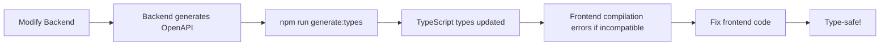

# End-to-End Type Safety

## 🎯 Purpose

Automatic TypeScript types generated from OpenAPI schema, ensuring frontend and backend stay in perfect sync.

## 📦 Setup

### 1. Install Dependencies

```bash
npm install openapi-fetch
npm install --save-dev openapi-typescript
```

### 2. Generate Types

**From local development server:**

```bash
# Start backend first
cd backend/api_gateway && python main.py

# Generate types
npm run generate:types
```

**From production:**

```bash
npm run generate:types:prod
```

### 3. Use Type-safe Client

```typescript
import { typedApiClient } from "@/api/typedClient";

const { data, error } = await typedApiClient.GET("/api/v1/health");
```

## 🚀 How It Works

### 1. OpenAPI Schema (Source of Truth)

```yaml
# backend/api_gateway generates this
openapi: 3.1.0
paths:
  /api/v1/health:
    get:
      responses:
        200:
          content:
            application/json:
              schema:
                type: object
                properties:
                  status: string
                  version: string
                  timestamp: string
```

### 2. Generated TypeScript Types

```typescript
// src/types/api.ts (auto-generated)
export interface paths {
  "/api/v1/health": {
    get: {
      responses: {
        200: {
          content: {
            "application/json": {
              status: string;
              version: string;
              timestamp: string;
            };
          };
        };
      };
    };
  };
}
```

### 3. Type-safe Client Usage

```typescript
const { data } = await typedApiClient.GET("/api/v1/health");

// TypeScript knows:
console.log(data.status); // ✅ string
console.log(data.version); // ✅ string
console.log(data.foo); // ❌ Error: Property 'foo' does not exist
```

## 📚 Usage Examples

### Basic GET Request

```typescript
import { typedApiClient } from "@/api/typedClient";

async function getHealth() {
  const { data, error, response } = await typedApiClient.GET("/api/v1/health");

  if (error) {
    // Error is typed!
    console.error(error.detail);
    console.error(error.request_id);
    return null;
  }

  // Data is typed!
  return {
    isHealthy: data.status === "healthy",
    version: data.version,
  };
}
```

### POST with Body

```typescript
async function startScan(target: string) {
  const { data, error } = await typedApiClient.POST("/api/v1/scan/start", {
    body: {
      target,
      scanType: "quick", // ← Autocomplete available!
      // foo: 'bar'       // ← TypeScript error: unknown field
    },
  });

  if (error) {
    return null;
  }

  return data.scan_id; // ← Typed!
}
```

### Query Parameters

```typescript
const { data } = await typedApiClient.GET("/api/v1/search", {
  params: {
    query: {
      q: "test",
      limit: 10, // ← TypeScript validates type
      // foo: 'bar'     // ← Error: unknown param
    },
  },
});
```

### With React Query

```typescript
import { useQuery } from '@tanstack/react-query';
import { typedApiClient } from '@/api/typedClient';

function useHealth() {
  return useQuery({
    queryKey: ['health'],
    queryFn: async () => {
      const { data, error } = await typedApiClient.GET('/api/v1/health');
      if (error) throw new Error(error.detail);
      return data; // Fully typed!
    },
  });
}

function HealthComponent() {
  const { data, isLoading } = useHealth();

  if (isLoading) return <div>Loading...</div>;

  // TypeScript knows data.status exists
  return <div>Status: {data.status}</div>;
}
```

## 🔄 Workflow

### Development Cycle



### CI/CD Integration

```yaml
# .github/workflows/type-check.yml
- name: Generate types from API
  run: |
    docker-compose up -d api_gateway
    npm run generate:types

- name: Type check frontend
  run: npm run type-check
```

## ✅ Benefits

| Before                         | After                                   |
| ------------------------------ | --------------------------------------- |
| ❌ Manual type definitions     | ✅ Auto-generated from OpenAPI          |
| ❌ Types can diverge from API  | ✅ Types always match API               |
| ❌ Runtime errors              | ✅ Compile-time errors                  |
| ❌ No autocomplete             | ✅ Full autocomplete                    |
| ❌ Breaking changes undetected | ✅ Breaking changes = TypeScript errors |

## 🎯 Type Safety Guarantees

### Endpoints

- ✅ Only valid endpoints can be called
- ✅ TypeScript error for non-existent endpoints
- ✅ Autocomplete shows all available endpoints

### Request Bodies

- ✅ Only valid fields can be sent
- ✅ TypeScript error for unknown fields
- ✅ Required fields enforced
- ✅ Field types validated

### Query Parameters

- ✅ Only valid params can be used
- ✅ Param types validated
- ✅ Required params enforced

### Responses

- ✅ Response shape known at compile time
- ✅ Accessing non-existent fields = TypeScript error
- ✅ Different status codes have different types

### Error Handling

- ✅ Error shapes typed
- ✅ Validation errors typed with field details
- ✅ Request IDs always available

## 🔧 Advanced Usage

### Custom Fetch Options

```typescript
const { data } = await typedApiClient.GET("/api/v1/health", {
  // All fetch options supported
  signal: abortController.signal,
  headers: {
    "Custom-Header": "value",
  },
});
```

### Middleware

```typescript
typedApiClient.use({
  async onRequest({ request }) {
    // Add auth token
    request.headers.set("Authorization", `Bearer ${token}`);
    return request;
  },

  async onResponse({ response }) {
    // Log errors
    if (!response.ok) {
      console.error("Request failed:", response.status);
    }
    return response;
  },
});
```

### Type Extraction

```typescript
import type { paths } from "@/types/api";

// Extract specific types
type HealthResponse =
  paths["/api/v1/health"]["get"]["responses"][200]["content"]["application/json"];

type ScanRequest =
  paths["/api/v1/scan/start"]["post"]["requestBody"]["content"]["application/json"];
```

## 📝 Maintenance

### Regenerate Types

**When to regenerate:**

- After backend API changes
- After pulling changes that modify backend
- Before deploying frontend

**How to regenerate:**

```bash
# 1. Ensure backend is running
cd backend/api_gateway && python main.py

# 2. In another terminal
cd frontend
npm run generate:types

# 3. Check git diff
git diff src/types/api.ts

# 4. Fix any TypeScript errors in frontend
npm run type-check
```

### Handling Breaking Changes

If types generation shows breaking changes:

1. **Review the diff**

   ```bash
   git diff src/types/api.ts
   ```

2. **Find usages**

   ```bash
   # TypeScript will show all errors
   npm run type-check
   ```

3. **Update frontend code**
   - Fix type errors
   - Update component props
   - Adjust API calls

4. **Test thoroughly**
   ```bash
   npm run test
   npm run test:e2e
   ```

## 🚨 Common Issues

### Types Not Updating

```bash
# Clear generated file and regenerate
rm src/types/api.ts
npm run generate:types
```

### Backend Not Running

```bash
# Error: Failed to fetch http://localhost:8000/openapi.json
cd backend/api_gateway
python main.py

# In another terminal
npm run generate:types
```

### Type Mismatch

If you see TypeScript errors after regenerating:

- This means the API changed
- Fix frontend code to match new API
- Or fix backend if change was unintentional

## 🔗 Related

- [OpenAPI Specification](https://spec.openapi.org/oas/v3.1.0)
- [openapi-typescript](https://github.com/drwpow/openapi-typescript)
- [openapi-fetch](https://github.com/drwpow/openapi-typescript/tree/main/packages/openapi-fetch)
- [P0-2: OpenAPI Implementation](../../../backend/api_gateway/README.md)

---

**DOUTRINA VÉRTICE - GAP #5 (P1)**
**Following Boris Cherny's Principle: "Types flow from the source of truth"**

**Soli Deo Gloria** 🙏
