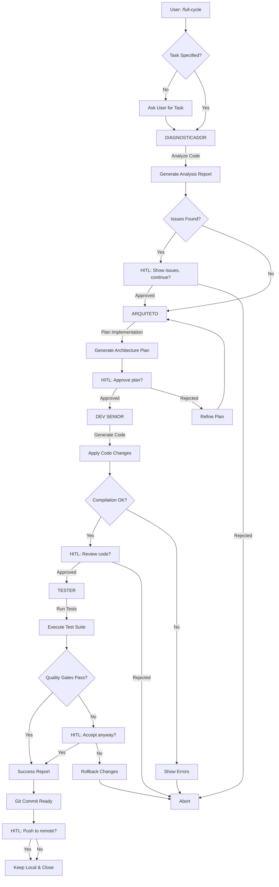

# Full-Cycle Workflow - Agent Smith v2.0

## Comando: `/full-cycle`

### Objetivo
Executar um ciclo completo de desenvolvimento autônomo combinando os 4 agents em sequência:
1. DIAGNOSTICADOR → Analisa código atual
2. ARQUITETO → Planeja implementação
3. DEV SENIOR → Implementa código
4. TESTER → Valida qualidade

### Uso no Claude Code

```plaintext
User: /full-cycle

Claude Code:
🚀 Iniciando Full-Cycle Workflow - Agent Smith

📋 Tarefa detectada: [inferida do contexto ou solicitada]
🔍 Target: [auto-detectado ou especificado]

[Execução sequencial dos 4 agents...]

✅ Full-Cycle completo!
```

### Workflow Detalhado



### Implementação Técnica

#### 1. Slash Command Handler
**Arquivo**: `.claude/commands/full-cycle.md`

```markdown
# Full-Cycle Development Workflow

Execute a complete autonomous development cycle using Agent Smith's 4 agents:

1. **DIAGNOSTICADOR** - Analyze current code quality
2. **ARQUITETO** - Plan the implementation
3. **DEV SENIOR** - Generate and apply code
4. **TESTER** - Validate with tests and quality gates

## Usage

```bash
/full-cycle [task] [--targets=PATH] [--auto-approve=false]
```

## Example

```bash
/full-cycle "Add authentication middleware" --targets=./internal/middleware/
```

## Process

The workflow will:
- Auto-detect language (Go/Python)
- Execute agents sequentially
- Request HITL approval at critical points
- Generate comprehensive reports
- Prepare git commit (requires manual push)

## HITL Checkpoints

1. After DIAGNOSTICADOR (if issues found)
2. After ARQUITETO (plan approval)
3. After DEV SENIOR (code review)
4. After TESTER (if quality gates fail)
5. Before git push (final approval)
```

#### 2. Workflow Orchestrator
**Arquivo**: `internal/agents/workflows/full_cycle.go`

```go
package workflows

import (
	"context"
	"fmt"
	"log"
	"time"

	"github.com/verticedev/vcli-go/internal/agents"
	"github.com/verticedev/vcli-go/internal/agents/arquiteto"
	"github.com/verticedev/vcli-go/internal/agents/dev_senior"
	"github.com/verticedev/vcli-go/internal/agents/diagnosticador"
	"github.com/verticedev/vcli-go/internal/agents/language"
	"github.com/verticedev/vcli-go/internal/agents/tester"
)

// FullCycleWorkflow orchestrates the 4-agent development cycle
type FullCycleWorkflow struct {
	config     agents.AgentConfig
	logger     *log.Logger
	autoApprove bool
}

// FullCycleInput represents input for the full cycle
type FullCycleInput struct {
	Task        string
	Targets     []string
	AutoApprove bool // Skip HITL (dangerous!)
	Context     map[string]interface{}
}

// FullCycleOutput represents the complete workflow output
type FullCycleOutput struct {
	StartTime time.Time
	EndTime   time.Time
	Duration  time.Duration

	// Agent outputs
	DiagnosticResult  *agents.AgentOutput
	ArchitecturePlan  *agents.AgentOutput
	Implementation    *agents.AgentOutput
	TestResults       *agents.AgentOutput

	// Workflow status
	Status            agents.AgentStatus
	StoppedAt         string // Which agent stopped the workflow
	Errors            []string

	// Git operations
	GitBranch         string
	GitCommit         string
	CommitReady       bool

	// Summary
	Summary           string
}

// NewFullCycleWorkflow creates a new full-cycle workflow
func NewFullCycleWorkflow(config agents.AgentConfig, autoApprove bool) *FullCycleWorkflow {
	return &FullCycleWorkflow{
		config:      config,
		logger:      log.New(os.Stdout, "[FULL-CYCLE] ", log.LstdFlags),
		autoApprove: autoApprove,
	}
}

// Execute runs the complete 4-agent workflow
func (w *FullCycleWorkflow) Execute(ctx context.Context, input FullCycleInput) (*FullCycleOutput, error) {
	output := &FullCycleOutput{
		StartTime: time.Now(),
		Status:    agents.StatusRunning,
		Errors:    make([]string, 0),
	}

	w.logger.Println("🚀 Starting Full-Cycle Workflow")
	w.logger.Printf("   Task: %s", input.Task)
	w.logger.Printf("   Targets: %v", input.Targets)

	// Step 0: Language Detection
	w.logger.Println("Step 0/4: Detecting language...")
	langResult, err := language.DetectSingle(input.Targets[0])
	if err != nil {
		return nil, fmt.Errorf("language detection failed: %w", err)
	}
	w.logger.Printf("   Detected: %s (%.0f%% confidence)", langResult.Primary, langResult.Confidence*100)

	// Step 1: DIAGNOSTICADOR
	w.logger.Println("Step 1/4: Running DIAGNOSTICADOR...")
	diagAgent := diagnosticador.NewDiagnosticadorAgent(w.config)
	diagOutput, err := w.runDiagnosticador(ctx, diagAgent, input)
	if err != nil {
		output.Status = agents.StatusFailed
		output.StoppedAt = "DIAGNOSTICADOR"
		return output, err
	}
	output.DiagnosticResult = diagOutput

	// HITL Checkpoint 1
	if !input.AutoApprove && w.hasIssues(diagOutput) {
		if !w.requestApproval("DIAGNOSTICADOR found issues. Continue?") {
			output.Status = agents.StatusFailed
			output.StoppedAt = "DIAGNOSTICADOR (HITL rejected)"
			return output, nil
		}
	}

	// Step 2: ARQUITETO
	w.logger.Println("Step 2/4: Running ARQUITETO...")
	arquitetoAgent := arquiteto.NewArquitetoAgent(w.config)
	archOutput, err := w.runArquiteto(ctx, arquitetoAgent, input, diagOutput)
	if err != nil {
		output.Status = agents.StatusFailed
		output.StoppedAt = "ARQUITETO"
		return output, err
	}
	output.ArchitecturePlan = archOutput

	// HITL Checkpoint 2
	if !input.AutoApprove {
		if !w.requestApproval("Approve architecture plan?") {
			output.Status = agents.StatusFailed
			output.StoppedAt = "ARQUITETO (HITL rejected)"
			return output, nil
		}
	}

	// Step 3: DEV SENIOR
	w.logger.Println("Step 3/4: Running DEV SENIOR...")
	devAgent := dev_senior.NewDevSeniorAgent(w.config)
	implOutput, err := w.runDevSenior(ctx, devAgent, input, archOutput)
	if err != nil {
		output.Status = agents.StatusFailed
		output.StoppedAt = "DEV SENIOR"
		return output, err
	}
	output.Implementation = implOutput

	// HITL Checkpoint 3
	if !input.AutoApprove {
		if !w.requestApproval("Review generated code?") {
			output.Status = agents.StatusFailed
			output.StoppedAt = "DEV SENIOR (HITL rejected)"
			return output, nil
		}
	}

	// Step 4: TESTER
	w.logger.Println("Step 4/4: Running TESTER...")
	testAgent := tester.NewTesterAgent(w.config)
	testOutput, err := w.runTester(ctx, testAgent, input, implOutput)
	if err != nil {
		output.Status = agents.StatusFailed
		output.StoppedAt = "TESTER"
		return output, err
	}
	output.TestResults = testOutput

	// HITL Checkpoint 4
	if !input.AutoApprove && !w.qualityGatesPassed(testOutput) {
		if !w.requestApproval("Quality gates failed. Accept anyway?") {
			output.Status = agents.StatusFailed
			output.StoppedAt = "TESTER (quality gates failed)"
			return output, nil
		}
	}

	// Success!
	output.Status = agents.StatusCompleted
	output.EndTime = time.Now()
	output.Duration = output.EndTime.Sub(output.StartTime)
	output.Summary = w.generateSummary(output)

	w.logger.Println("✅ Full-Cycle Workflow completed successfully!")
	w.logger.Printf("   Duration: %v", output.Duration)

	return output, nil
}

// Helper methods (simplified signatures)
func (w *FullCycleWorkflow) runDiagnosticador(ctx context.Context, agent *diagnosticador.DiagnosticadorAgent, input FullCycleInput) (*agents.AgentOutput, error) {
	// Implementation
	return nil, nil
}

func (w *FullCycleWorkflow) runArquiteto(ctx context.Context, agent *arquiteto.ArquitetoAgent, input FullCycleInput, prevOutput *agents.AgentOutput) (*agents.AgentOutput, error) {
	// Implementation
	return nil, nil
}

func (w *FullCycleWorkflow) runDevSenior(ctx context.Context, agent *dev_senior.DevSeniorAgent, input FullCycleInput, prevOutput *agents.AgentOutput) (*agents.AgentOutput, error) {
	// Implementation
	return nil, nil
}

func (w *FullCycleWorkflow) runTester(ctx context.Context, agent *tester.TesterAgent, input FullCycleInput, prevOutput *agents.AgentOutput) (*agents.AgentOutput, error) {
	// Implementation
	return nil, nil
}

func (w *FullCycleWorkflow) hasIssues(output *agents.AgentOutput) bool {
	// Check if diagnostic found issues
	return false
}

func (w *FullCycleWorkflow) qualityGatesPassed(output *agents.AgentOutput) bool {
	// Check if quality gates passed
	return false
}

func (w *FullCycleWorkflow) requestApproval(message string) bool {
	// HITL approval (would integrate with CLI or use input)
	fmt.Printf("\n⚠️  %s [y/N]: ", message)
	var response string
	fmt.Scanln(&response)
	return response == "y" || response == "Y"
}

func (w *FullCycleWorkflow) generateSummary(output *FullCycleOutput) string {
	return fmt.Sprintf("Full-Cycle completed in %v", output.Duration)
}
```

#### 3. CLI Integration
**Arquivo**: `cmd/agents/full_cycle.go`

```go
package main

import (
	"context"
	"fmt"
	"log"

	"github.com/spf13/cobra"
	"github.com/verticedev/vcli-go/internal/agents"
	"github.com/verticedev/vcli-go/internal/agents/workflows"
)

var fullCycleCmd = &cobra.Command{
	Use:   "full-cycle [task]",
	Short: "Execute complete 4-agent development cycle",
	Long: `
Execute a full autonomous development cycle:

1. DIAGNOSTICADOR - Analyze current code
2. ARQUITETO - Plan implementation
3. DEV SENIOR - Generate code
4. TESTER - Validate quality

Example:
  vcli agents full-cycle "Add authentication middleware" --targets=./internal/middleware/
`,
	Args: cobra.MinimumNArgs(1),
	Run: func(cmd *cobra.Command, args []string) {
		task := args[0]
		targets, _ := cmd.Flags().GetStringSlice("targets")
		autoApprove, _ := cmd.Flags().GetBool("auto-approve")

		if len(targets) == 0 {
			targets = []string{"."}
		}

		// Create workflow
		config := agents.AgentConfig{
			// ... load from config ...
		}
		workflow := workflows.NewFullCycleWorkflow(config, autoApprove)

		// Execute
		input := workflows.FullCycleInput{
			Task:        task,
			Targets:     targets,
			AutoApprove: autoApprove,
		}

		output, err := workflow.Execute(context.Background(), input)
		if err != nil {
			log.Fatalf("Workflow failed: %v", err)
		}

		// Print summary
		fmt.Println("\n" + output.Summary)
	},
}

func init() {
	fullCycleCmd.Flags().StringSlice("targets", []string{"."}, "Target directories/files")
	fullCycleCmd.Flags().Bool("auto-approve", false, "Skip HITL checkpoints (dangerous!)")
	agentsCmd.AddCommand(fullCycleCmd)
}
```

### Features do /full-cycle

#### 1. Auto-Detection
- ✅ Detecta linguagem automaticamente (Go/Python)
- ✅ Seleciona strategies apropriadas
- ✅ Ajusta quality gates baseado em linguagem

#### 2. HITL Checkpoints
1. **Post-DIAGNOSTICADOR**: Se encontrar issues críticos
2. **Post-ARQUITETO**: Aprovação do plano arquitetural
3. **Post-DEV SENIOR**: Review do código gerado
4. **Post-TESTER**: Se quality gates falharem
5. **Pre-Git Push**: Aprovação final antes de push

#### 3. Context Passing
Cada agent passa contexto para o próximo:
```
DIAGNOSTICADOR → issues encontrados
     ↓
ARQUITETO → considera issues no plano
     ↓
DEV SENIOR → implementa baseado no plano
     ↓
TESTER → valida implementação
```

#### 4. Rollback on Failure
Se qualquer agent falhar ou HITL rejeitar:
- Git branch mantido
- Changes staged mas não committed
- Usuário pode revisar manualmente

#### 5. Metrics & Reporting
Output final inclui:
- Duração de cada agent
- Issues encontrados e resolvidos
- Linhas de código adicionadas/removidas
- Test coverage antes/depois
- Quality gate status

### Exemplo de Output

```
🚀 Full-Cycle Workflow Started
   Task: Add rate limiting middleware
   Targets: ./internal/middleware/

Step 0/4: Detecting language...
   ✅ Detected: go (100% confidence)

Step 1/4: Running DIAGNOSTICADOR...
   ✅ Analysis complete
   - 1,234 LOC analyzed
   - 0 security findings
   - 2 recommendations

Step 2/4: Running ARQUITETO...
   ✅ Architecture plan generated
   - 1 ADR created
   - 4 implementation steps
   - Estimated: 2.5 hours

⚠️  Approve architecture plan? [y/N]: y

Step 3/4: Running DEV SENIOR...
   ✅ Code generated
   - Files created: 2
   - Files modified: 3
   - Lines added: 156
   - Compilation: OK

⚠️  Review generated code? [y/N]: y

Step 4/4: Running TESTER...
   ✅ Tests executed
   - Unit tests: 12/12 passed
   - Coverage: 87% (target: 80%)
   - Quality gates: 3/3 passed

✅ Full-Cycle Workflow completed successfully!
   Duration: 3m 45s

📋 Summary:
   - Task completed: Add rate limiting middleware
   - Code changes ready for commit
   - All quality gates passed
   - Ready to push to remote

📦 Git Status:
   Branch: feature-add-rate-limiting
   Files staged: 5
   Commit message prepared: Yes

⚠️  Push to remote? [y/N]:
```

### Estimativa de Implementação

**FASE 7: Full-Cycle Workflow**
- Workflow orchestrator: 3-4h
- HITL integration: 1-2h
- Context passing: 1h
- Error handling & rollback: 2h
- CLI integration: 1h
- Testing: 2h
- Documentation: 1h

**Total**: 11-13 horas

### Conformidade Doutrina Vértice

✅ **Autonomia**: Workflow autônomo com 4 agents
✅ **Responsabilidade**: 5 HITL checkpoints
✅ **Transparência**: Output detalhado de cada step
✅ **Segurança**: Rollback automático em falhas
✅ **Não-Maleficência**: HITL antes de git push
