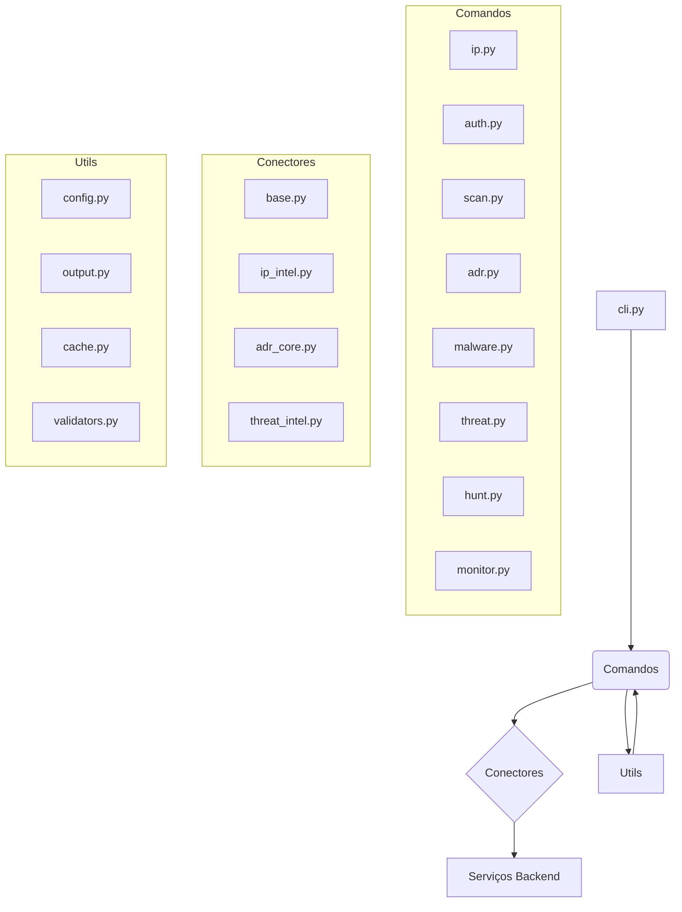

# 🏛️ Análise de Arquitetura e Design Patterns - Vértice CLI

**Data da Análise:** 2025-10-02

## 1. Visão Geral da Arquitetura

A arquitetura do Vértice CLI é baseada no framework `Typer`, com uma estrutura de comandos modulares. A CLI tenta seguir uma arquitetura em camadas, separando a apresentação (comandos), a lógica de negócios (conectores) e os utilitários. No entanto, como veremos, essa separação é frequentemente violada.

## 2. Mapeamento de Módulos e Responsabilidades

### Responsabilidades dos Módulos:

*   **`vertice/cli.py`**: Ponto de entrada da aplicação. Responsável por registrar os módulos de comando dinamicamente.
*   **`vertice/commands/*.py`**: A camada de apresentação. Cada arquivo define um grupo de comandos da CLI (ex: `ip`, `scan`). Eles são responsáveis por receber a entrada do usuário, chamar os conectores e formatar a saída.
*   **`vertice/connectors/*.py`**: A camada de acesso a dados/serviços. Responsáveis por encapsular a comunicação HTTP com os microserviços do backend.
*   **`vertice/utils/*.py`**: Módulos de utilitários compartilhados, como autenticação, configuração, formatação de saída, cache e validação.

### Análise de Acoplamento e Coesão:

*   **Alto Acoplamento:**
    *   Os módulos de **Comandos** estão fortemente acoplados ao módulo `utils/output.py`. Quase toda a lógica de formatação da UI está misturada com a lógica de execução dos comandos.
    *   Todos os módulos que precisam de autenticação estão acoplados à instância global `auth_manager` de `utils/auth.py`.
    *   Os **Conectores** estão acoplados à `BaseConnector`, o que é bom, mas a `BaseConnector` em si tem problemas (tratamento de erro via `print`).

*   **Baixa Coesão:**
    *   **`utils/output.py`** é um módulo com baixíssima coesão. Ele é um "God Module" que mistura formatação de tabelas, spinners, prompts de input, mensagens de erro e lógica de formatação específica de domínio (como `format_ip_analysis`).
    *   **`utils/auth.py`** também tem baixa coesão, misturando gerenciamento de token, lógica de permissão baseada em roles, armazenamento de arquivos e formatação de UI (`display_welcome`).

## 3. Análise de Design Patterns e Anti-Patterns

### Design Patterns Utilizados:

*   **Facade Pattern (Incorreto):** Os `Conectores` agem como uma fachada para os serviços de backend, o que é um bom padrão. No entanto, a implementação é fraca, pois eles não lidam adequadamente com erros e vazam detalhes da implementação (HTTP, URLs).
*   **Singleton/Global Instance (Problemático):** As classes `Config` e `AuthManager` são instanciadas como singletons globais. Embora simplifique o acesso, isso introduz estado global, dificulta os testes e cria acoplamento oculto.

### Anti-Patterns Identificados:

*   **God Object (Crítico):** `utils/output.py` e `utils/auth.py` são exemplos claros deste anti-pattern. Eles acumulam uma quantidade enorme de responsabilidades não relacionadas, tornando-se gargalos para manutenção e desenvolvimento.
*   **Code Duplication (Crítico):** O anti-pattern mais prevalente. A lógica de execução de comandos (instanciar conector, health check, spinner, chamada, tratamento de erro, fechar conector) é copiada e colada em quase todos os comandos nos módulos `ip.py`, `adr.py`, `malware.py`, etc. Isso torna a base de código extremamente frágil e difícil de manter.
*   **Magic Numbers:** Portas de serviço (8004, 8011, 8013, 8014, 8017) estão hardcoded nos conectores, em vez de virem de uma configuração central.
*   **Placeholder Code / Feature Toggles Inexistentes:** A maioria dos comandos (`scan`, `hunt`, `monitor`) são apenas placeholders. Isso indica um desenvolvimento "fake it till you make it" que resultou em um débito técnico massivo.

### Padrões Sugeridos:

*   **Dependency Injection:** Em vez de usar instâncias globais, a configuração e o gerenciador de autenticação deveriam ser injetados nas classes e funções que precisam deles. Isso melhoraria a testabilidade e reduziria o acoplamento.
*   **Decorator Pattern:** A lógica repetitiva de execução de comandos (autenticação, health check, spinner) é um caso de uso perfeito para um decorator. Um decorator `@with_connector(ConnectorClass)` poderia abstrair toda essa lógica repetida.
*   **Strategy Pattern:** Para a formatação de saída, em vez de ter `if json_output: ... else: ...`, poderia ser usado um Strategy Pattern, onde diferentes estratégias de formatação (`JsonFormatter`, `TableFormatter`) poderiam ser escolhidas em tempo de execução.

## 4. Análise dos Princípios SOLID

*   **S - Single Responsibility Principle (SRP) - Violado Massivamente:**
    *   `AuthManager`: Gerencia tokens, usuários, roles, arquivos E exibe UI.
    *   `output.py`: Formata JSON, tabelas, spinners, prompts, etc.
    *   Funções de comando: Recebem input, orquestram chamadas, formatam output.

*   **O - Open/Closed Principle (OCP) - Violado:**
    *   Para adicionar um novo tipo de hash em `validators.py`, é preciso modificar a função. Para adicionar um novo conector, é preciso mexer em múltiplos lugares. A duplicação de código também viola este princípio, pois uma mudança na lógica de execução de comando exige a alteração de dezenas de arquivos.

*   **L - Liskov Substitution Principle (LSP) - Geralmente Satisfeito:**
    *   As classes de conector herdam de `BaseConnector` e parecem ser substituíveis entre si, embora a funcionalidade que elas expõem seja diferente.

*   **I - Interface Segregation Principle (ISP) - Violado:**
    *   Não há interfaces claras. O módulo `output.py` é um bom exemplo. Um comando que só precisa imprimir uma mensagem de erro é forçado a depender de um módulo que também lida com tabelas, JSON, inputs, etc.

*   **D - Dependency Inversion Principle (DIP) - Violado:**
    *   Módulos de alto nível (comandos) dependem diretamente de implementações de baixo nível (conectores concretos, `print`). Eles deveriam depender de abstrações.

## 5. Análise de Clean Architecture

*   **Camadas:** A arquitetura tenta ter 3 camadas: **Presentation** (`commands`), **Business/Use Case** (a lógica dentro dos comandos) e **Data Access** (`connectors`).
*   **Separação de Concerns:** A separação é muito fraca. A camada de apresentação está cheia de lógica de formatação de UI e orquestração de chamadas, que deveriam estar em uma camada de aplicação/serviço. A lógica de negócio está espalhada e duplicada.
*   **Vazamento de Abstrações:** Os conectores vazam detalhes de implementação (HTTP). Os comandos sabem que estão lidando com uma comunicação baseada em HTTP e precisam lidar com o ciclo de vida do conector (`close()`).

## 6. Plano de Refatoração Priorizado

1.  **Extrair Lógica de Execução de Comando (Esforço: Médio, Impacto: Alto):**
    *   Criar um decorator (`@run_async_command` ou similar) que abstraia a criação do conector, health check, spinner, tratamento de erro e fechamento da conexão. Isso eliminaria 80% da duplicação de código nos arquivos de comando.

2.  **Dividir os "God Modules" (Esforço: Alto, Impacto: Alto):**
    *   Dividir `utils/output.py` em `ui/prompts.py`, `ui/formatters.py`, `ui/messaging.py`.
    *   Dividir `utils/auth.py` em `auth/token_manager.py`, `auth/rbac.py`, `auth/user_manager.py`.

3.  **Implementar Injeção de Dependência (Esforço: Médio, Impacto: Médio):**
    *   Remover as instâncias globais de `config` and `auth_manager`. Passá-las como dependências (ex: usando o próprio sistema de dependências do Typer/FastAPI).

4.  **Centralizar e Proteger Configurações (Esforço: Baixo, Impacto: Crítico):**
    *   Mover todas as configurações hardcoded (portas, URLs, roles) para o arquivo `default.yaml` e remover segredos do código-fonte.

**Estimativa de Esforço Total para Refatoração Arquitetural:** 30-40 horas.
